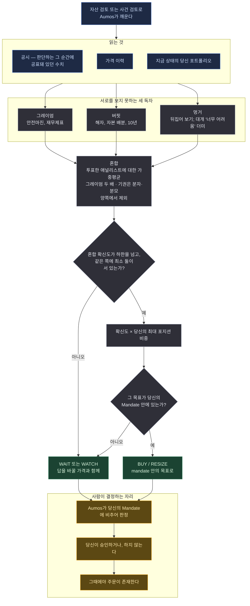

# AI Hedge Fund — Deep Value

<a href="README.md">English</a>

> 이름난 가치투자자 셋이 같은 공시를 각자 읽고, 조정자 하나가 그들이 내린 결론을 저울질해 하나의
> 판단으로 만든다.

## 한 문단 요약

이 패키지는 **이식(port)**이다 — 방법론이 우리 것이 아니다. 애널리스트 페르소나 셋을
[`virattt/ai-hedge-fund`](https://github.com/virattt/ai-hedge-fund)(MIT, © 2024 Virat Singh)에서
떼어내 Aumos에서 돌도록 재조립했다. 각자 같은 공시 수치 묶음을 **다른 둘의 답을 보지 않은 채**
읽고, 견해를 세우고, 그것을 얼마나 강하게 쥐고 있는지 말한다. 마지막 단계가 그 견해들을 평균한다 —
그레이엄의 표는 두 배로 세는데, 이는 원본 자체의 설정이지 이 이식본의 선호가 아니다 — 그 결과를
당신 자신의 규칙에 비추어 점검하고 하나의 판단을 돌려준다. 흔한 답은 안전마진이 생길 가격에 거는
WATCH다.

| | `basic-investor` | `prudent-allocator` | `ai-hedge-fund-value` |
|---|---|---|---|
| 출신 | 우리 것 | 우리 것 | **이식**, MIT |
| 출발점 | 자산 | 장부 | **공시** |
| 읽는 것 | 공시 · 뉴스 · 가격 · 장부 | 장부 · 가격 · 논지 | **공시와 가격만** |
| 읽는 사람 | 하나 | 하나 | **셋, 독립적으로** |
| 흔한 답 | WAIT, 또는 논지를 갖춘 BUY | WAIT, 또는 RESIZE | 안전마진이 생길 가격에 거는 WATCH |

## 방법론

**딥 밸류, 위원회 방식으로 — 다만 서로 상의하지 않는 위원회.**

*이 페이지가 쓰는 용어를 쉬운 말로:*

| | |
|---|---|
| **안전마진** | 사업의 가치보다 충분히 아래에서 사서, 좀 틀려도 원금이 남게 하는 것 |
| **해자(moat)** | 경쟁자가 이익을 가져가지 못하게 하는 지속적인 이유 |
| **확신도(conviction)** | 애널리스트가 견해를 얼마나 강하게 쥐고 있는지. -1에서 +1 사이의 숫자 |
| **기권(abstain)** | "의견 없음" — "내 의견은 중립이다"와 *같지 않고*, 다르게 채점된다 |
| **시점 고정(point-in-time)** | 판단하는 그 순간에 실제로 공표돼 있던 수치만 |

- **그레이엄** — 안전마진, 재무제표의 튼튼함, 이익의 안정성, 그리고 성장에 돈을 지불하는 데 대한
  깊은 의심. 고평가는 중립적 사실이 아니라 약세 사실이다. 그의 표는 **두 배**로 세는데, 원본
  자체의 설정이지 이 이식본의 선호가 아니다.
- **버핏** — 능력범위, 해자, 숫자에 드러나는 자본 배분, 10년을 들고 있어도 편안한가. 훌륭한
  가격의 평범한 회사보다 적정 가격의 훌륭한 회사.
- **멍거** — 뒤집어 보라. 무엇이 이걸 망하게 할지 찾아라. 그리고 대부분을 '너무 어려움' 더미에
  올려라.
- **혼합** — *투표한* 애널리스트들에 대한 가중평균, 그다음 당신의 mandate에 맞춘 크기 산정.
  기권은 평균의 분자와 분모 양쪽에서 제외되므로, "의견 없음"이 "의견: 중립"으로 도착하는 일은
  없다.
- **mandate 점검** — 그리고 원본의 하네스라면 대신 잘라줬을 한도를 왜 이 매니저가 스스로
  존중해야 하는지에 대한 설명.

**독립성이 방법론 전부다.** 셋째가 앞의 둘을 읽었기 때문에 수렴한 세 애널리스트는 단계만 늘어난
한 명의 애널리스트이고, 그러면 혼합은 어떤 견해를 그 견해 자신의 메아리와 저울질하게 된다. 단계
파일들이 이것을 두 번 소리 내어 적는다.

**뉴스 접근 권한도, 당신 논지에 대한 접근도 주어지지 않는다.** 이는 이식이 게을러서가 아니라
충실해서다. 원본은 가치 애널리스트들에게 렌더링된 펀더멘털 스냅샷 하나만 건네고 그 외에는 아무것도
주지 않는다. 뉴스 피드를 슬쩍 더한 이식본은 남의 이름으로 제출된 개선이 된다. 그로 인해 판단이
무언가를 잃는 곳에서는, 매니저가 자신의 불확실성 진술에 그렇게 적도록 요구받는다.

### 원본과 무엇이 다르고, 각 변경이 왜 불가피했는가

멋대로 취한 자유의 목록이 아니다. 아래 각각은 **옮겨 올 수 없었던** 것이고, 그것을 불가능하게 만든
Aumos의 규칙이다.

| 원본이 하는 것 | 이 패키지가 하는 것 | 이유 |
|---|---|---|
| 횡단면으로 크기 산정: `conviction / Σ\|convictions\| × gross_target` | `conviction × 당신의 최대 포지션 비중` | Aumos는 한 번에 한 대상에 대해 묻는다. 확신도 하나를 자기 절댓값으로 나누면 *어떤* 확신도든 답은 `1.0`이므로, 간신히 양수인 견해와 압도적인 견해가 같은 크기가 된다. 원본 스스로 이 결함을 이름 붙여 적어뒀다 |
| 상한을 넘는 목표를 조용히 잘라낸다 | mandate 안에서 제안하거나, mandate가 막았다고 설명한다 | Aumos는 자르지 않는다 — 제안을 있는 그대로 기록하고 **WAIT**으로 판정한다. 상한을 넘는 목표는 노출 일부가 아니라 판단 전체를 잃는다 |
| 전원 중립인 사이클은 비중 0을 낳고 펀드는 플랫으로 닫힌다 | 이유를 붙여 **WAIT 또는 WATCH**를 돌려준다 | 플랫으로 닫는 것은 *거래*이고, 아무도 하기로 결정하지 않은 거래다. 여기서 WAIT은 일급 판단이다 |
| 시장중립 모드에서 가장 덜 좋아하는 종목을 공매도한다 | 숏 사이드를 버리고 그렇다고 말한다 | 공매도는 mandate 제약이고 보통 꺼져 있다. 헤지로 숏을 근사하는 것은 지시를 지어내는 일이다 |
| 시점 고정 규율을 모델에게 지키라고 요청하는 프롬프트 규칙으로 적는다 | 기계장치에 대한 서술로 적는다 | Aumos가 `asOf`를 강제하고 그 이후로 찍힌 결과를 거부한다. 앞을 보지 말라고 *요청하는* 프롬프트는 시도하는 매니저를 만든다 |
| 최소 확신도 하한이 없다(원본 docstring이 스스로 "다음에 달 손잡이"라고 부른다) | `convictionFloor`, 기본값 `0.2` | 원본에서는 리스크 단계가 잘라내면서 그 결과를 잡아줬다. 자르기가 없으면 하한은 개선이기를 그만두고 요구사항이 된다 |
| 스스로 주문을 낸다 | 낼 수 없다 | 프로토콜에 요청할 수 있는 broker-write 권한이 없다. 주문은 당신의 승인을 통해서만 거래소에 닿는다 |

**이식하지 않은 것**도 그만큼 의도적이다. 원본 하네스의 노드 열한 개가 `harness.json`에 생략으로
기록돼 있고, 각각에 이유와 함께 Aumos의 무엇이 같은 질문에 대신 답하는지가 — 또는 이식이 그냥
그 능력을 잃은 곳에서는 아무것도 없다는 것이 — 적혀 있다. 거절한 노드와 놓친 노드는 반대되는
사실이고, 독자는 둘을 구별할 권리가 있다.

## 실행 흐름

한 번의 실행에 하나의 제안. 아래 어느 것도 주문을 내지 않는다.

**범례** — 🟦 읽는 것 · ⬜ 스스로 계산하는 것 · 🟩 돌려주는 것 · 🟧 사람이 결정하는 자리.

**주기.** 달력이 아니라 자산 검토나 사건 검토로 깨어나고, 가장 자주 돌려주는 WATCH가 자기 답을
바꿀 가격을 지목한다.

## 필요한 것

| | |
|---|---|
| **시장** | 미국 상장 주식과 ETF (`XNAS`, `XNYS`) |
| **데이터** | `source:passthrough` — 공시와 가격 이력. 이 기계가 자격증명을 들고 있는 벤더에 묻는다. 각 페르소나가 벤더 자신의 응답을 읽고, 오는 길에 아무것도 매핑되지 않는다 |
| **장부** | `portfolio:read` — 사업에 대한 확신이 추상적인 등급이 아니라 이 포트폴리오에 대한 판단이 되도록 |
| **설정** | 세 애널리스트의 혼합 가중치(원본의 기본값), 확신도 하한, 과반 요구 여부. 포지션 상한은 여기 **없다** — 그건 당신의 Mandate이고, 패키지가 그것을 정하게 하면 자신이 판정받는 제약과 다투게 된다 |
| **읽지 않는 것** | 뉴스도, 당신의 논지도. 둘 다 읽지 않는 원본에 이식이 충실한 결과다 |
| **당신의 승인** | **제안할 뿐 거래하지 않는다.** 모든 판단은 당신의 승인 대기열로 들어가고 사람이 승인한다 |

**설치는** 다른 패키지와 똑같다 — 카탈로그에서, 장부에 대해, 같은 권한 동의 화면으로. 설치 화면은
권한 위에 이 패키지의 **출처(provenance)**를 보여준다. 방법론을 누가 썼는지는 그것을 돌리는 데
동의하기 전에 당신이 알 권리가 있는 것이기 때문이다.

## 약한 지점

- **공시가 말하지 않는 모든 것.** 뉴스도, 경영진 코멘트도, 시장 서사도 없다. 답이 그중 하나에
  달린 곳에서는 추측하는 대신 그렇다고 말하도록 요구받는다.
- **빠르게 움직이는 이야기를 판단하는 것.** 딥 밸류는 공표된 수치를 느리게 읽는 일이고, 그
  특징적 산출물은 낼 거래가 아니라 지켜볼 가격이다.
- **성장.** 그레이엄의 두 배 가중은 패널이 성장에 돈을 지불하는 데 구조적으로 회의적이라는 뜻이고,
  나중에 옳았던 것으로 드러날 회사들에 아니라고 말할 것이다.
- **공매도할 수 없는 모든 것.** 원본은 가장 덜 좋아하는 종목을 공매도한다. 이 이식본은 그쪽을
  버리고 그렇다고 말하므로, 원래 전략의 절반은 대표되지 않는다.

**설치하지 마라** — 새 아이디어를 빠르게 원한다면, 또는 재무제표가 아니라 회사의 이야기를
변론해주는 매니저를 원한다면.

## 덧붙임

**첫 shadow 실행.** 픽스처 데이터, NVDA 실적 발표 5분 전의 `asOf`. 결과: 봉인된 WATCH, 네 번의
도구 호출 모두 허용, 해시 체인 유효. 이것이 모델이 작동한다는 증거가 아니라 *이식*이 작동한다는
증거인 이유:

> 그레이엄은 가격만으로 약세, 버핏은 재무제표나 수익성 데이터가 전혀 없어 **기권**, 멍거는 '너무
> 어려움' 더미에서 중립 — 투표한 둘에 대한 혼합 확신도 **-0.43**. 0.20 하한은 넘지만, 투표한
> 애널리스트가 0을 기준으로 양쪽에 한 명씩뿐이라 과반 요건이 발동하고 데스크는 기존 5% 포지션을
> 움직이지 않는다. […] 여기서 가장 중요한 사실 하나는 타이밍이다: 회계 1분기가 `asOf` 5분 뒤에
> 발표되고 이 판단은 그것 없이 내려졌다.
>
> · 산술: `(2.0 × -0.65 + 1.0 × 0.00) / (2.0 + 1.0) = -1.30 / 3.0 = -0.43`. 버핏은 분자와 분모
> 양쪽에서 제외된다.

거기에 담긴 네 가지는 모델이 아니라 이식이다:

- **기권과 중립의 구별이 지켜졌다.** 버핏은 투표하지 않았고 평균의 *양쪽* 모두에서 제거됐다.
  멍거의 '너무 어려움' 중립은 투표했고 희석시켰다. 원본 자신의 규칙 — *"의견 없음이 의견: 중립으로
  위장해서는 안 된다"* — 이 파이썬에서 산문으로의 번역을 견뎌낸 것이다.
- **그레이엄의 두 배 가중이 산술에 드러나 있고**, 산술이 적혀 있어서 독자가 판단이 딛고 선 숫자를
  다시 계산할 수 있다.
- **대체된 크기 산정 규칙이 도달되고 보고됐다**: `-0.065`, 그리고 공매도가 꺼져 있어 제안되지
  않았다. 원본이라면 여기서 공매도했을 것이다.
- **시점 고정 경계가 매니저 자신의 말로**, 요청받지 않은 채, 가장 기록되기를 원하는 것으로 적혀
  있다.

실행이 본 모든 것은 `asOf`로 찍힌 증거로 철해지므로, 그 주장은 기록의 말을 믿는 대신 확인할 수
있다. 그것은 픽스처 데이터에 대한 한 번의 실행이고, 이 매니저가 투자를 잘하는지에 대해서는 아무것도
말하지 않는다.

**출처 표시.** `NOTICE.md`가 보존된 MIT 고지와 '페르소나는 그 사람이 아니다'라는 진술을 싣고 있고,
`harness.json`이 무엇을 가져왔고 무엇을 여기서 썼고 무엇을 일부러 두고 왔는지를 기록하며,
`npm run check:provenance`가 둘을 서로에게 붙들어 둔다.

Aumos는 이 패키지가 실적을 쌓기 전까지 어떤 수익률도 보여주지 않는다. 포워드 트랙레코드는
연산이 아니라 달력 시간을 요구하고, 이 페이지의 어떤 것도 트랙레코드가 아니다.
