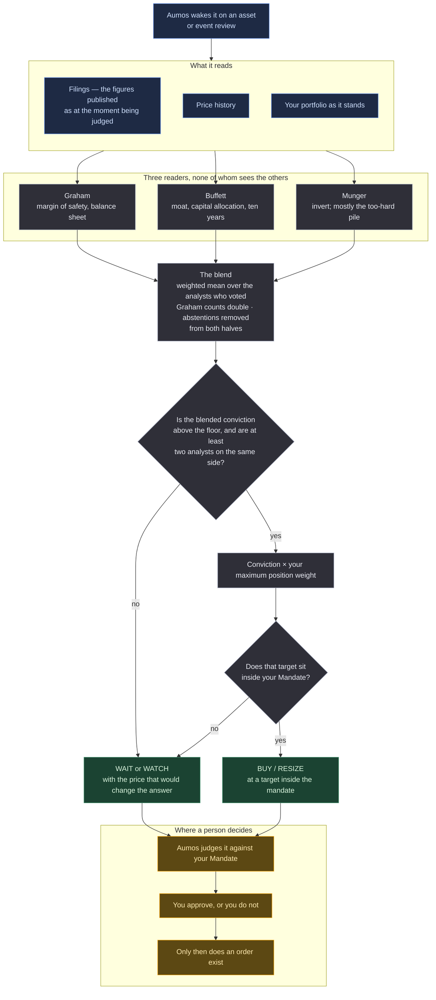

# AI Hedge Fund — Deep Value

<a href="README.ko.md">한국어</a>

> Three famous value investors read the same filings, on their own, and one arbiter weighs
> what they concluded into a single judgement.

## In one paragraph

This package is a **port** — the methodology is not ours. Three analyst personas were
lifted out of [`virattt/ai-hedge-fund`](https://github.com/virattt/ai-hedge-fund) (MIT, ©
2024 Virat Singh) and reassembled to run on Aumos. Each one reads the same set of filed
company figures **without seeing the other two's answers**, forms a view, and states how
strongly it holds it. A final stage averages those views — Graham's counts double, which
is the source's own setting and not a preference of this port — checks the result against
your own rules, and hands back one judgement. Its usual answer is WATCH, on a price that
would create a margin of safety.

| | `basic-investor` | `prudent-allocator` | `ai-hedge-fund-value` |
|---|---|---|---|
| origin | ours | ours | **ported**, MIT |
| starts from | the asset | the book | **the filings** |
| reads | filings, news, prices, the book | the book, prices, the theses | **filings and prices only** |
| readers | one | one | **three, independent** |
| its usual answer | WAIT, or BUY with a thesis | WAIT, or RESIZE | WATCH, on a price that would create a margin of safety |

## The methodology

**Deep value, by committee — but a committee that does not confer.**

*Words this page uses, in plain terms:*

| | |
|---|---|
| **Margin of safety** | buying far enough below what a business is worth that being somewhat wrong still leaves you whole |
| **Moat** | a durable reason competitors cannot take the profits away |
| **Conviction** | how strongly an analyst holds a view, as a number between -1 and +1 |
| **Abstain** | "I have no opinion" — which is *not* the same as "my opinion is neutral", and is scored differently |
| **Point-in-time** | only the figures that had actually been published at the moment being judged |

- **Graham** — margin of safety, balance-sheet strength, earnings stability, and deep
  suspicion of paying for growth. Overvaluation is a bearish fact, not a neutral one. His
  view counts **double**, which is the source's own configuration and not a preference of
  this port.
- **Buffett** — circle of competence, moat, capital allocation visible in the numbers, and
  ten-year comfort. A wonderful company at a fair price over a fair company at a wonderful
  price.
- **Munger** — invert; find what would make it fail; and put most things on the too-hard
  pile.
- **The blend** — a weighted mean over the analysts who *voted*, then sized against your
  mandate. Abstentions are excluded from both halves of the average, so "no opinion" never
  arrives as "opinion: neutral".
- **The mandate check** — and an explanation of why the manager must respect a limit the
  source's harness would have clamped for it.

**The independence is the whole methodology.** Three analysts who converge because the
third read the first two are one analyst with extra steps, and the blend would then be
weighing a view against its own echo. The stage files say so out loud, twice.

It is given **no news access and no access to your theses**, and that is the port being
faithful rather than the port being lazy. The source hands its value analysts a rendered
fundamentals snapshot and nothing else; a port that quietly added a news feed would be an
improvement filed under somebody else's name. Where that costs the judgement something,
the manager is required to say so in its stated uncertainty.

### What is different from the source, and why each change was necessary

Not a list of liberties taken. Each of these is something that **could not** be carried
across, and the Aumos rule that made it impossible.

| the source does | this package does | because |
|---|---|---|
| sizes cross-sectionally: `conviction / Σ\|convictions\| × gross_target` | `conviction × your maximum position weight` | Aumos asks about one subject at a time. Divide one conviction by its own absolute value and the answer is `1.0` for *any* conviction, so a barely-positive view and an overwhelming one size identically. The source names this exact wart itself |
| clamps a target above the cap, silently | proposes inside the mandate, or explains that the mandate stopped it | Aumos does not clamp — it records the proposal verbatim and rules it a **WAIT**. A target over the cap costs the whole judgement, not some exposure |
| an all-neutral cycle produces zero weights and the fund closes to flat | returns **WAIT or WATCH** with reasons | closing to flat is a *trade*, and one nobody decided to make. WAIT is a first-class judgement here |
| shorts its least-liked names in market-neutral mode | drops the short side and says so | shorting is a mandate constraint and is normally off. Approximating a short with a hedge would be inventing an instruction |
| states the point-in-time discipline as a prompt rule the model is asked to keep | states it as a description of machinery | Aumos enforces `asOf` and refuses a result stamped after it. A prompt that *asks* a manager not to look ahead produces a manager that tries |
| has no minimum-conviction floor (its own docstring calls this the obvious next knob) | `convictionFloor`, default `0.2` | upstream, the risk stage caught the consequence by clamping. With no clamp, the floor stops being an improvement and becomes a requirement |
| places its own orders | cannot | there is no broker-write capability in the protocol to ask for. Orders reach a venue through your approval and nowhere else |

What is **not** ported is as deliberate: eleven nodes of the source harness are recorded in
`harness.json` as omitted, each with the reason and with what in Aumos answers the same
question instead — or nothing, where the port simply loses the capability. A node declined
and a node missed are opposite facts, and a reader is entitled to tell them apart.

## How a run works

One run, one proposal. Nothing below places an order.

**Legend** — 🟦 what it reads · ⬜ what it works out on its own · 🟩 what it hands back ·
🟧 where a person decides.

**Cadence.** It is woken by an asset or event review rather than by a calendar, and the
WATCH it most often returns names the price that would change its answer.

## What it needs

| | |
|---|---|
| **Markets** | US-listed equities and ETFs (`XNAS`, `XNYS`) |
| **Data** | `source:passthrough` — filings and price history, asked of the vendors this machine holds credentials for. Each persona reads the vendor's own response; nothing is mapped on the way |
| **The book** | `portfolio:read` — so a conviction about a business becomes a judgement about this portfolio rather than a rating in the abstract |
| **Settings** | the three analyst blend weights (the source's own defaults), the conviction floor, and whether a majority is required. Position caps are **not** here — they are your Mandate, and letting a package set them would let it argue with the constraint it is judged against |
| **What it will not read** | no news, and no access to your theses. That is the port being faithful to a source that reads neither |
| **Your approval** | **it proposes and never trades.** Every judgement enters your approval queue and a person approves it |

**Installing it** is exactly like any other package — from the catalogue, against a book,
with the same capability consent screen. The install screen shows this package's
**provenance** above its capabilities, because who wrote the methodology is something you
are entitled to know before you agree to run it.

## What it is bad at

- **Anything the filings do not say.** No news, no management commentary, no market
  narrative. Where the answer turns on one of those, it is required to say so rather than
  guess.
- **Judging fast-moving stories.** Deep value is a slow reading of published figures, and
  its characteristic output is a price to watch rather than a trade to make.
- **Growth.** Graham's double weight means the panel is structurally suspicious of paying
  for it, and will say no to companies that go on to be right.
- **Anything it cannot short.** The source shorts its least-liked names; this port drops
  that side and says so, so half the original strategy is not represented.

**Do not install this** if you want new ideas quickly, or a manager that will argue a
company's story rather than its balance sheet.

## Notes

**The first shadow run.** Fixture data, `asOf` five minutes before an NVDA earnings
release. Outcome: a sealed WATCH, four tool calls all allowed, hash chain valid. What
makes it evidence that the *port* works rather than that a model works:

> Graham bearish on price alone, Buffett **abstained** for want of any balance-sheet or
> returns data, Munger neutral on the too-hard pile — blended conviction **-0.43** over
> the two who voted. That clears the 0.20 floor, but only one voting analyst sits on
> either side of zero, so the majority requirement fires and the desk does not move the
> existing 5% position. […] The single most important fact here is timing: fiscal Q1 is
> reported five minutes after `asOf` and this judgement is made without it.
>
> · Arithmetic: `(2.0 × -0.65 + 1.0 × 0.00) / (2.0 + 1.0) = -1.30 / 3.0 = -0.43`. Buffett
> is excluded from both numerator and denominator.

Four things in that are the port rather than the model:

- **The abstain/neutral distinction held.** Buffett did not vote and was removed from
  *both* halves of the average; Munger's too-hard-pile neutral did vote and diluted. That
  is the source's own rule — *"no opinion must not masquerade as opinion: neutral"* —
  surviving a translation from Python into prose.
- **Graham's double weight is visible in the arithmetic**, and the arithmetic is written
  out, so a reader can recompute the number the judgement rests on.
- **The replacement sizing rule was reached and reported**: `-0.065`, and then not
  proposed, because shorting is off. The source would have shorted here.
- **The point-in-time bound is in the manager's own words**, unprompted, as the thing it
  most wants recorded.

Everything the run saw is filed as evidence stamped at `asOf`, so the claim is checkable
rather than taken on the transcript's word. That is one run against fixture data, and it
says nothing about whether this manager invests well.

**Attribution.** `NOTICE.md` carries the retained MIT notice and the
personas-are-not-the-people statement; `harness.json` records what was taken, what was
authored here, and what was deliberately left behind, and `npm run check:provenance` holds
the two to each other.

Aumos shows no returns for this package until it has earned some. A forward track record
takes calendar time rather than compute, and nothing on this page is one.
