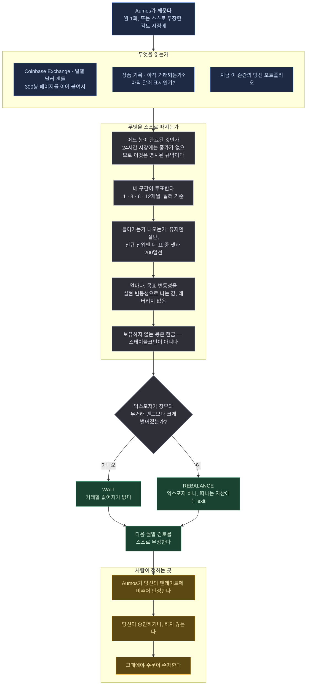

# Atlas Trend Crypto

## 한 문단 요약

크립토 현물에 대한 달러 기준 추세추종 익스포저입니다. 비트코인 자신의 가격이 오르고 있는 동안에만
보유하고, 포지션 크기는 그것이 얼마나 움직이는지로 정하며, 나머지 시간에는 현금을 듭니다. Atlas
Trend 시리즈의 세 번째이자 **형제들보다 의도적으로 덜 하는** 패키지입니다. 형제들은 다섯에서 아홉
역할의 바스켓을 돌리는데 이 패키지는 자산 하나만 듭니다. 이 패키지를 쓰기 전에 크립토 유니버스를
측정했고, 열 개의 이름을 걸친 하나의 베팅이라는 결과가 나왔기 때문입니다.

## 방법론

### 왜 바스켓이 없는가

Atlas Trend US와 KR은 각 역할을 얼마나 담을지 정하는 데 대부분의 노력을 씁니다. 그 노력이 값을
하는 이유는 그 역할들이 실제로 다른 것이기 때문입니다. 750거래일로 재보면 크립토는 그렇지
않습니다.

| | 크립토 상위 10 | Atlas Trend US 6역할 |
|---|---:|---:|
| 평균 쌍상관 | **+0.74** | +0.29 |
| 제1주성분 설명력 | **76.6%** | 47.1% |
| **유효 베팅 수** | **1.68** | 3.30 |
| 분산으로 줄인 변동성 | 17.3% | 44.7% |

코인 열 개가 **독립 베팅 1.68개**입니다. 그리고 가장 필요한 순간에 덜 붙는 것이 아니라 더 붙습니다
— 비트코인 최악 10% 날에 나머지 아홉은 평균 **−5.84%**로 비트코인 자신의 −4.09%보다 더 빠집니다.
US 바스켓에서는 VTI가 −1.74%일 때 나머지 다섯이 −0.61%입니다.

즉 역변동성으로 가중한 열 종목 바스켓은 열 개의 이름을 걸친 하나의 포지션이고, 그 가중치를 만든
기계장치는 분산되지 않은 투자자에게 분산됐다고 말하게 됩니다. **이 패키지는 자산 하나 — 선택적으로
둘 — 와 현금을 들고, 그렇다고 말합니다.**

### 신호

`BTC-USD`에 대해 직전 1·3·6·12 역월 구간의 수익률 네 개를 계산하고 각각이 한 표를 던집니다. 이미
보유 중이면 표의 절반 이상이 양수인 동안 남고, 보유하지 않았다면 네 표 중 셋이 양수이면서 동시에
200일 이동평균 위에 있을 때에만 들어옵니다. 두 기준선 사이의 간격은 여기서 특히 중요합니다. 이
자산의 변동성은 주가지수의 서너 배라 휩쏘 한 번의 청구서가 그만큼 큽니다.

익스포저는 `목표변동성 ÷ 실현변동성`이고 전액 투자에서 멈춥니다. 레버리지는 없습니다.

### 여기서 현금은 현금이지 스테이블코인이 아닙니다

주식 형제들은 단기채·CD 펀드에 파킹합니다. 그런 것이 그 시장에 존재하기 때문입니다. 크립토에는
없습니다. 스테이블코인은 **가격이 1인 신용 포지션**이고, 1이 아니게 되기 전까지만 1입니다. 이
패키지는 그것을 현금이라 부르지 않습니다. 보유하지 않는 몫은 `cash-weight`로 선언됩니다 — 그 돈이
**투자되지 않았다**는 진술입니다. 형제들과 다른 모양이고, 여기서는 이쪽이 정직합니다.

### USDT가 아니라 달러

크립토 가격 이력의 대부분은 USDT 표시이고, 그 위에서 계산된 수익률은 페그의 위험을 안에 담고
있으면서 그 사실을 말하지 않습니다. 이 패키지는 Coinbase Exchange의 `BTC-USD`를 읽습니다. 실제
달러 표시이고 그 거래소의 주력 호가창입니다. Binance에도 `BTCUSD` 페어가 있지만 USDT 페어
거래대금의 약 0.3%라, 더 깊은 시장이 더 나은 기준이 되지 못하는 경우입니다.

## 실행 흐름

한 번의 실행에 하나의 제안. 아래 어디에서도 주문이 나가지 않습니다.

**범례** — 🟦 읽는 것 · ⬜ 스스로 따지는 것 · 🟩 돌려주는 것 · 🟧 사람이 정하는 곳.

**24시간 시장에는 종가가 없습니다.** 형제들은 *"봉이 곧 캘린더"* 라고 쓸 수 있습니다. 그 시장이
닫히기 때문입니다. 이 시장은 닫히지 않으므로 **어느 봉이 완료된 것인가는 사실이 아니라 규약입니다.**
규약은 프롬프트에 명시되어 있고 매니저가 모든 판단에서 다시 말합니다. `t0`는 24시간 봉이 판단
시점에 시작하고 또 끝난 마지막 봉이며, Coinbase의 봉은 00:00 UTC에 시작합니다. 다른 규약을 가정한
독자는 같은 데이터에서 다른 숫자를 얻고, 그런 일이 일어났다는 것조차 알 방법이 없습니다.

**주기.** 월 1회라는 리듬은 이 패키지가 *요청하는* 것이지 보장할 수 있는 것이 아닙니다. 제출하는
모든 판단은 — 할 일이 없다고 결론 내린 것까지 포함해 — 다음 월말에 대한 plan을 무장합니다. 당신의
Aumos가 그 무장을 거절할 수 있고, 설치된 매니저에 저장되는 간격은 설치 화면에서 당신이 확정한
값입니다. **월 1회로 돌리고 싶다면 설치할 때 그 간격을 확인하십시오.**

## 필요한 것

`coinbase-exchange` 데이터 소스 0.1.0 이상. **입력할 자격증명이 없습니다** — 그 경로들은
공개입니다.

그 소스의 두 가지 성질이 패키지의 모양을 정합니다. 캔들이 **최신순**으로 오고 컬럼이
`[time, low, high, open, close, volume]` 로 **OHLC가 아닙니다.** 그리고 한 번에 최대 **300봉**이라
420일 창이 두 번의 호출이고, 매니저는 겹쳐 받아 확인한 뒤에 잇습니다.

공시도 뉴스도 온체인 데이터도 읽지 않습니다. 제안할 뿐 거래하지 않습니다.

## 약한 지점

- **횡보장.** 신호에 정보가 없는데 교차는 계속 일어납니다. 히스테리시스와 넓힌 무거래 밴드가
  줄이지만 없애지 못하고, 청구서는 두 형제보다 큽니다.
- **급격한 반전.** 월 1회 검토는 폭락을 한 달 뒤에 압니다. 그리고 이 자산은 한 달에 형제들의 보유
  자산이 한 해에 빠지는 것보다 더 빠집니다.
- **바닥에서 파는 것.** 변동성이 오를 때 익스포저를 줄이는 바로 그 장치가 긴 하락을 피하게 해주고,
  동시에 바닥에서도 줄입니다.
- **얇은 기록.** 비트코인의 이력은 사이클 네 번 남짓입니다. 그 표본은 *"여기서 추세추종이 통한다"*
  와 *"이 자산이 아주 크게 올랐고 아주 깊게 빠졌다"* 를 구별하지 못합니다. 시계열 모멘텀에는 수십
  년 × 여러 자산군의 증거가 있지만 **이 적용에는 없고**, 둘을 같은 증거로 취급하는 것이 이 항목이
  막으려는 실수입니다.

## 덧붙임

**Atlas Trend 세 패키지 중 무엇을 고를 것인가** — 각각이 무엇을 사고 무엇을 요구하며 왜 이 패키지에만 기계장치가 덜 있는지 — 는 [카탈로그의 매니저 인덱스](../README.md)에 정리되어 있습니다. 이 패키지는 두 형제 어느 쪽과도 겹치지 않습니다.

바스켓을 두지 않기로 한 결정의 근거는 카탈로그 이슈 #42에 데이터 출처와 방법과 함께 기록되어
있습니다. 다시 돌려보고 반박할 수 있습니다.

`config.includeEther`를 켜면 `ETH-USD`가 두 번째 채점 대상이 됩니다. 기본값은 꺼짐입니다. 둘은
상관 0.8 근처에서 움직이므로 베팅 하나가 아니라 3분의 1쯤을 더합니다. 켜면 각 자산은 자기 신호로
보유 여부가 정해지고 각각 위험 예산의 절반을 가져갑니다. 둘 사이의 가중은 없습니다 — 바스켓이 없는
것과 같은 이유입니다.

훗날 실제로 상관이 낮은 크립토 자산이 발견된다면, 그 판본이 배분 기계장치를 더하고 이유를 적으면
됩니다. 이 판본에는 그럴 근거가 없습니다.
