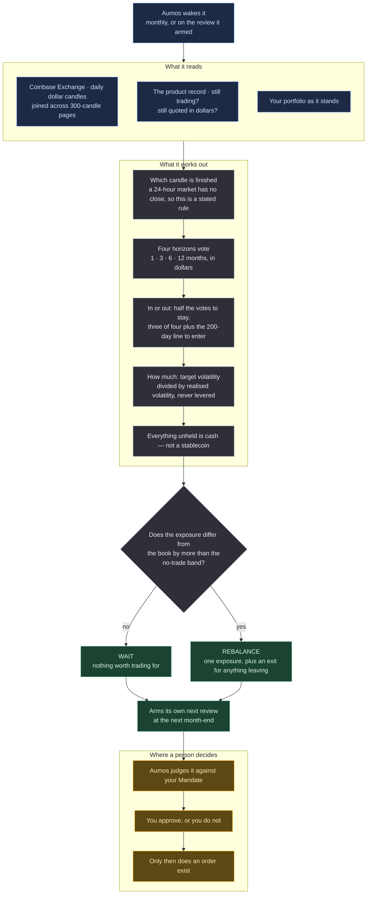

# Atlas Trend Crypto

<a href="README.ko.md">한국어</a>

## In one paragraph

A trend-following exposure to crypto spot, in dollars. It holds Bitcoin only while Bitcoin's own
price has been rising, sizes the position by how much it is moving, and holds cash the rest of the
time. It is the third of the Atlas Trend series and **the one that deliberately does less than its
siblings**: they run baskets of five to nine roles, and this one holds a single asset, because the
crypto universe was measured before this package was written and found to be one bet wearing ten
names.

## The methodology

### Why there is no basket

Atlas Trend US and KR spend most of their effort deciding how much of each role to hold. That
effort pays because those roles are genuinely different things. Measured over 750 sessions, crypto
is not:

| | crypto, 10 largest | Atlas Trend US, 6 roles |
|---|---:|---:|
| average pairwise correlation | **+0.74** | +0.29 |
| first principal component | **76.6%** | 47.1% |
| **effective number of bets** | **1.68** | 3.30 |
| volatility cut by diversifying | 17.3% | 44.7% |

Ten coins are **1.68 independent bets**. And when it matters most they move together harder, not
less: on Bitcoin's worst 10% of days the other nine average **−5.84%** against Bitcoin's own
−4.09%, where the US basket's other five average −0.61% against VTI's −1.74%.

So a ten-coin basket weighted by inverse volatility is one position wearing ten names, and the
machinery producing those weights would tell the investor they are diversified when they are not.
**This package holds one asset — optionally two — and cash, and says so.**

### The signal

Four returns on `BTC-USD`, over the last 1, 3, 6 and 12 calendar months, each casting one vote. An
asset already held stays while at least half the votes are positive; an asset not held enters only
on three of four **and** a price above its 200-day average. That gap between the thresholds matters
more here than anywhere: this asset's volatility is three to five times an equity index's, so every
whipsaw crossing is a larger bill.

The exposure is then `target volatility ÷ realised volatility`, capped at fully invested. It never
levers.

### Cash here is cash, not a stablecoin

The equity siblings park in a T-bill or CD fund because such a thing exists in those markets. In
crypto it does not. A stablecoin is a credit position with a price of one until it is not, and this
package will not call that cash. The unheld fraction is declared as a `cash-weight` — a statement
that the money is **not invested**. That is a different shape from the siblings, and the honest one
here.

### Dollars, not USDT

Most crypto price history is quoted in USDT, and a return computed on that carries the peg's own
risk inside it while saying nothing about it. This package reads `BTC-USD` from Coinbase Exchange,
quoted in actual dollars and that exchange's main book. Binance's own `BTCUSD` pair exists but
trades about 0.3% of its USDT pair's volume — which is why the deeper venue is not the better
reference here.

## How a run works

One run, one proposal. Nothing below places an order.

**Legend** — 🟦 what it reads · ⬜ what it works out on its own · 🟩 what it hands back ·
🟧 where a person decides.

**A 24-hour market has no close.** The siblings can write *"the bars are the calendar"* because
their markets shut. This one never does, so **which candle counts as finished is a convention, not
a fact.** The convention is stated in the prompt and the manager restates it in every decision:
`t0` is the last candle whose 24-hour bucket both starts and ends at or before the instant being
judged, and Coinbase buckets begin at 00:00 UTC. A reader assuming a different convention would
recompute different numbers from the same data and have no way to know it.

**Cadence.** The monthly rhythm is what this package *asks for*, not something it can guarantee.
Every decision it submits — including the ones concluding there is nothing to do — arms a plan for
the next month-end. Your Aumos may refuse an arming, and the interval stored for the installed
manager is whatever you confirm on the install screen. **If you want this run monthly, check that
interval when you install it.**

## What it needs

A `coinbase-exchange` data source at 0.1.0 or later. **There is no credential to enter** — those
paths are public.

Two properties of that source shape the package. Candles arrive **newest first** and their columns
are `[time, low, high, open, close, volume]` — not OHLC. And at most **300 candles** answer one
call, so a 420-day window is two calls that the manager overlaps and verifies before joining.

It reads no filings, no news and no on-chain data. It proposes and never trades.

## What it is bad at

- **Sideways markets.** The signal carries no information and the crossings still happen. The
  hysteresis and the wider no-trade band reduce this; nothing removes it, and the bills are larger
  here than in either sibling.
- **Sharp reversals.** A monthly review learns about a crash a month after it starts — and this
  asset falls further in a month than the siblings' holdings fall in a year.
- **Selling the low.** The same mechanic that cuts exposure into rising volatility, which is what
  avoids the long decline, also cuts it at the bottom.
- **A thin record.** Bitcoin has roughly four cycles of history. That sample cannot distinguish
  *"trend-following works here"* from *"this asset went up a great deal with very deep drawdowns."*
  Time-series momentum has decades of cross-asset evidence behind it; **this particular application
  does not**, and treating the two as the same evidence is the mistake this bullet exists to
  prevent.

## Notes

**Choosing between the three Atlas Trend packages** — what each buys, what each needs, and why this one carries less machinery than the other two — is set out in [the catalogue's manager index](../README.md). This package overlaps with neither sibling.

The measurement behind the no-basket decision is recorded in the catalogue's issue #42, with the
data sources and the method, so it can be re-run and disagreed with.

`config.includeEther` adds `ETH-USD` as a second scored asset, off by default. The two run at a
correlation near 0.8, so it adds roughly a third of a bet rather than a whole one; when it is on,
each asset is held or not on its own signal and each takes half the risk budget. There is no
weighting between them, for the same reason there is no basket.

If a future edition finds crypto assets that are genuinely decorrelated, that edition can add the
allocation machinery and say why. This one does not have the evidence to.
