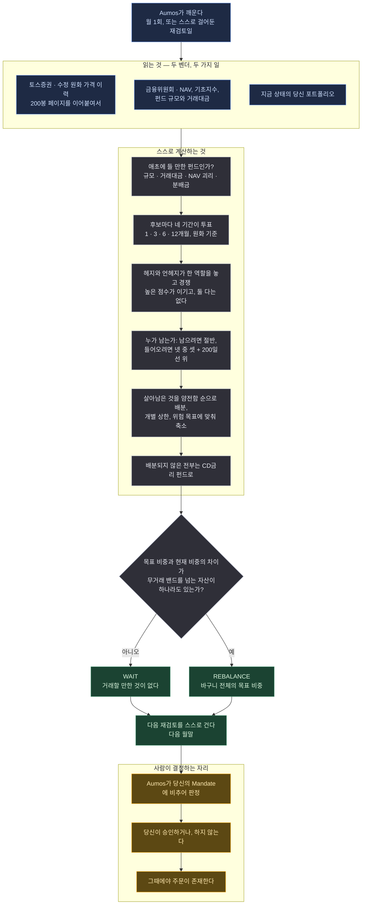

# Atlas Trend KR

<a href="README.md">English</a>

> 값이 오르고 있는 국내 상장 ETF만 들고, 각각이 얼마나 얌전한지에 비례해 크기를 정하며,
> 나머지는 CD금리 펀드에 세워둔다.

## 한 문단 요약

Atlas Trend KR은 국내 상장 ETF 다섯 역할을 지켜본다 — 한국 주식, 미국 주식, 미국 장기국채,
금, 그리고 현금을 세워둘 자리. 전부 원화로 값을 잰다. 한 달에 한 번, 각각에게 **이건 원화
기준으로 오르고 있는가?** 하나만 묻는다. 그렇다고 답한 것들만 남기고, 최근에 얼마나 심하게
움직였는지에 따라 크기를 정하고, 나머지는 전부 CD금리 펀드에 넣는다. 뉴스를 읽지 않고,
개별 기업에 대한 의견을 갖지 않으며, 대부분의 달에는 아무것도 바꾸지 말자고 제안한다.

Atlas Trend US의 한국 형제다. 철학은 같지만 별개 패키지, 별개 버전, 별개 트랙레코드다 —
미국 ETF에서 통한 규칙이 그것만으로 여기서도 통한다고 밝혀진 것은 아니고, 두 시장은 예상보다
많이 달랐다.

## 방법론

**추세 추종(trend following).** 검증하려는 주장은 하나다: 자산 자신의 가격 경로가 다음에
무슨 일이 일어날지에 대한 정보를 담고 있다. 그래서 이 매니저는 가격만 읽는다.

*이 페이지가 쓰는 용어를 쉬운 말로:*

| | |
|---|---|
| **ETF** | 주식처럼 사고파는 펀드. 한 번 사면 시장 하나를 통째로 갖는다 |
| **총수익(total return)** | 가격 변화에 분배금을 더한 것. 현금을 나눠준 펀드가 그만큼 손실을 본 것처럼 채점되지 않게 한다 |
| **TR 클래스** | 분배 대신 재투자하는 버전의 펀드. 보정할 것이 없어서 우선된다 |
| **변동성** | 가격이 하루하루 얼마나 튀는지. 손실 위험과 같은 말은 아니지만, 이 매니저가 크기를 정할 때 쓰는 기준이다 |
| **200일 이동평균** | 최근 열 달 남짓의 평균 종가. 가격이 그 위에 있으면 "상승 추세"라고 부르는 통상적 약칭이다 |
| **NAV(순자산가치)** | 펀드가 담고 있는 것들의 실제 가치. 가격은 여기서 벌어질 수 있다 |
| **(H)** | 환헤지 클래스 — 해외 자산에서 원달러 움직임을 걷어낸다. 공짜는 아니다 |

네 가지 규칙이 일을 한다.

**1 — 네 개의 기간이 투표한다.** 각 역할에 대해 최근 1·3·6·12개월의 총수익을 **원화로**
계산한다. 각각이 한 표를 던진다: 플러스인가, 아닌가. 하나가 아니라 넷을 읽는 이유는, 유별났던
한 달이 한 해를 결정하지 못하게 하기 위해서다.

**2 — 들어오는 것이 남아 있는 것보다 어렵다.** 이미 보유 중인 역할은 표의 *절반*만 플러스면
남는다. 보유하지 않은 역할은 *넷 중 셋* **그리고** 200일 이동평균 위의 가격이라야 들어온다.
두 문턱 사이의 이 간격에 이 방법론의 가치 대부분이 있다: 횡보장이 당신에게 두 번 청구하려면
두 번 건너야 하는 선이다.

**3 — 좋아하는 정도가 아니라 움직이는 정도로 크기를 정한다.** 살아남은 것들은 변동성의
*역수*로 가중된다 — 가장 얌전한 것이 가장 많은 돈을 받는다 — 그리고 어느 역할도 지배하지
못하도록 상한을 씌운다. 그다음 위험 자산 전체의 합산 변동성이 목표를 넘으면 슬리브 전체를
**축소**한다. 상관관계를 함께 계산하므로 한국 주식과 미국 주식은 실제 그대로 한 개 남짓의
거래로 취급된다. 절대 확대하지는 않는다.

**4 — 현금도 답이다.** 아무것도 자격을 얻지 못하면 제안은 CD금리 펀드 100%다. 이 시스템이
도달하도록 설계된 상태이지, 결정에 실패한 것이 아니다.

### 유니버스, 그리고 왜 여덟이 아니라 다섯 역할인가

| 역할 | 기본 | 대체 |
|---|---|---|
| 한국 주식 | `278530` KODEX 200TR | `294400` · `295040` |
| 미국 주식 | `360750` TIGER 미국S&P500 | `379800` · `360200` · `449180` (H) |
| 미국 장기국채 | `453850` ACE 미국30년국채액티브(H) | `476760` · `484790` (H) |
| 금 | `411060` ACE KRX금현물 | `0072R0` · `132030` (H) |
| 현금 | `459580` KODEX CD금리액티브(합성) | `488770` · `475630` · `357870` |

특정 시점의 국내 상장 ETF **1,164개** 전부에서 측정된 유동성과 품질로 골랐다: 순자산 1,000억
이상, 60일 평균 거래대금 하루 10억 이상, 그리고 — 절대 수치가 아니라 **역할 안에서** 비교해 —
NAV 대비 괴리와 기초지수 추적. 레버리지·인버스·커버드콜·버퍼·혼합·테마 상품은 구조적으로
제외된다.

**미국 형제가 들고 있는 노출 셋이 여기엔 없고, 그건 시장이 그렇게 만든 것이다.**
선진국(미국 제외), 신흥국, 한국 국채. 상품은 존재하지만 돈이 없다.

| 역할 | 상장 수 | 순자산 | 하루 거래대금 |
|---|---:|---:|---:|
| 한국 주식 | 76 | 70.5조 | 39,955억 |
| 미국 주식 | 49 | 69.7조 | 36,087억 |
| 현금 | 20 | 38.7조 | 6,357억 |
| 신흥국 | 47 | 3.5조 | **233억** |
| 한국 국채 | 21 | 3.6조 | **68억** |
| 선진국(미국 제외) | 15 | 1.2조 | **31억** |

선진국(미국 제외) 펀드 15개가 **다 합쳐 하루 31억** 거래된다 — 미국 주식 역할의 천분의 일
수준이다. 한국 투자자의 해외 배분은 실질적으로 미국이고, 국채로 갔어야 할 안전자산 수요는
열 배 큰 CD금리·MMF 펀드로 갔으며, 신흥국 펀드 47개는 광의 노출이 아니라 중국·인도·베트남
테마로 잘려 있다. 시장 전체로 보면 1,164개 중 346개가 섹터·테마 상품이다.

**이건 구멍이 아니라 분업이다.** 그 세 노출은 Atlas Trend US가 직접 들고 있다. 두 패키지를
같이 돌리는 투자자는 빠진 것이 없고, 이것만 돌리는 투자자는 국내 상장 ETF로 살 수 있는 것의
정직한 경계 안에 있다.

### 헤지와 언헤지는 서로 다른 두 자산이다

미국 자산을 담은 국내 상장 펀드는 환율을 자기 가격 안에 담고 있다. `449180 KODEX
미국S&P500(H)`와 `360750 TIGER 미국S&P500`은 같은 미국 주식을 담고 다른 원화 수익률을 낸다.

그래서 **두 자산으로 따로 채점하고, 절대 같이 들지 않는다** — 둘 다 들면 아무도 고르지 않은
부분 환헤지가 된다. 한 역할을 놓고 경쟁하고, 점수가 높은 쪽이 이기며, 동점이면 헤지 비용을
내지 않는 언헤지 클래스가 가져간다.

**헤지 비용은 따로 추정하지 않는다.** 그것은 원달러 금리차이고, 이미 헤지 펀드 자신의 가격
안에 들어 있다. 그 가격으로 잰 총수익 추세에는 비용이 들어 있다.

⚠️ 실제로 헤지 클래스는 훨씬 덜 거래된다 — 헤지 펀드 93개 중 18개만 유동성 기준을 넘는다.
미국 주식에서 헤지 클래스는 언헤지의 약 1/123 수준으로 거래돼 실력만으로 이기는 일이 드물다.
미국 장기국채는 반대로 헤지 클래스가 더 유동적이다.

## 실행 흐름

한 번의 실행에 하나의 제안. 아래 어느 것도 주문을 내지 않는다.

**범례** — 🟦 읽는 것 · ⬜ 스스로 계산하는 것 · 🟩 돌려주는 것 · 🟧 사람이 결정하는 자리.

**주기.** 월 1회라는 리듬은 이 패키지가 *요청하는* 것이지 보장할 수 있는 것이 아니다. 제출하는
모든 결정은 — 할 일이 없다는 결론까지 포함해 — 다음 월말에 대한 계획을 걸어둔다. 당신의
Aumos가 그 예약을 거절할 수 있고, 설치된 매니저에 저장되는 간격은 설치 화면에서 당신이 확인한
값이다. **월 1회로 돌리고 싶다면 설치할 때 그 간격을 확인하라.**

## 필요한 것

| | |
|---|---|
| **시장** | 국내 상장 ETF, 원화 |
| **데이터 소스** | `toss`와 `fsc-securities-product`, 둘 다 0.1.0 이상 |
| **키 비용** | `fsc-securities-product`는 공공데이터포털에서 자동 승인되는 키로 무료이고, 라이선스에 이용 제한이 없다 |
| **설정** | 위험 목표, 역할별 상한, 무거래 밴드, 어느 현금 펀드를 쓸지, TR 클래스를 우선할지는 당신 몫이다. 기간·투표 규칙·유니버스는 설정할 수 없다 — 그것이 방법론이기 때문이다 |
| **장부** | 당신의 포트폴리오, 그리고 지금 전액 현금 상태인지에 대한 장부 자신의 메모를 읽는다 |
| **당신의 승인** | **제안할 뿐 거래하지 않는다.** 계산한 모든 리밸런싱은 당신의 Aumos가 Mandate에 비추어 판정하고 당신이 승인하거나 거절하는 제안이다 |

공시도 뉴스도 읽지 않는다. 검증하려는 주장은 자산 자신의 가격 경로가 추세를 담고 있다는
것이다.

## 약한 지점

- **횡보장.** 신호에 정보가 없는데 교차는 계속 일어난다. 히스테리시스와 무거래 밴드가 이를
  줄이지만, 없애지는 못한다.
- **급반전.** 월 1회 검토는 폭락을 한 달 뒤에 안다. 떨어진 뒤에 팔고 회복이 시작된 뒤에 다시
  산다.
- **환율.** 네 위험 역할 중 셋이 해외 자산을 담은 국내 상장 펀드다. 그래서 이건 자산 포지션인
  만큼 원달러 포지션이기도 하다. 원화가 강세로 가면 어떤 추세도 꺾이지 않은 채로 장부가 손해를
  본다.
- **조용한 것 하나: 제대로 작동할 때가 가장 불편하다.** 전부를 CD금리 펀드로 옮기는 달은
  시장이 반등하면 바보처럼 보일 달이다.

**설치하지 마라** — 주 단위로 반응하는 매니저를 원한다면, 보유 이유를 그 회사 이야기로
설명해주기를 바란다면, 답이 불편할 때 뒤집을 생각이라면.

## 덧붙임

**Atlas Trend 세 패키지 중 무엇을 고를 것인가** — 각각이 무엇을 사고 무엇을 요구하며 어디서 겹치는지 — 는 [카탈로그의 매니저 인덱스](../README.md)에 정리되어 있습니다. `atlas-trend-us`와 함께 돌리기 전에 읽으십시오. 이 패키지의 미국 주식 역할은 국내 상장 S&P 500 펀드를 담고 그쪽은 미국 주식을 직접 담으므로, 한 장부에서는 그 노출이 어느 패키지도 고르지 않은 크기로 두 번 들어옵니다.

데이터의 한계 세 가지는 실재하고, 덮는 대신 적어둔다.

**분배금 데이터가 존재하지 않는다.** 두 벤더 어디에도 없고, 우리가 찾을 수 있었던 어떤 한국
공공 API에도 없다. 역할이 TR 클래스를 들고 있으면 이 질문은 생기지 않는다 — TR 클래스는 분배를
하지 않고, 그래서 한국 주식이 `KODEX 200`이 아니라 `KODEX 200TR`이다. 질문이 생기는 곳에서
패키지는 펀드의 NAV가 가격지수 대비 떨어지는 것을 보고 분배를 탐지하고, **고치는 대신
보고한다**: 금액을 모르는 채로 하는 보정은 사실로 분장한 추정이다.

**그 탐지기는 국내 지수 역할에서만 작동한다.** 60일로 재보면 코스피200 펀드의 일별 NAV-지수
괴리는 표준편차 4.5bp이고 분기말 분배가 뚜렷이 튄다. S&P 500 펀드는 127bp인데, 한국 종가와
미국 종가가 몇 시간과 통화 하나만큼 떨어져 있기 때문이고, 아무것도 튀지 않는다. 그 역할들에
대해서는 검사를 돌릴 수 없었다고 결정문에 적는다.

**가격 페이지를 이어붙여야 한다.** 토스증권은 한 번에 최대 200봉을 주므로 420일 창은 세 번의
호출이고, 벤더는 자신의 수정이 무엇을 기준으로 측정된 것인지 문서화하지 않는다. 패키지는
페이지를 겹쳐 받아 일치를 확인한 뒤 이어붙이고, 어긋나면 그렇게 말하며 어느 기간을 계산할 수
없었는지 보고한다.

Aumos는 이 패키지가 실적을 쌓기 전까지 어떤 수익률도 보여주지 않는다. 포워드 트랙레코드는
연산이 아니라 달력 시간을 요구하고, 이 페이지의 어떤 것도 트랙레코드가 아니다.
