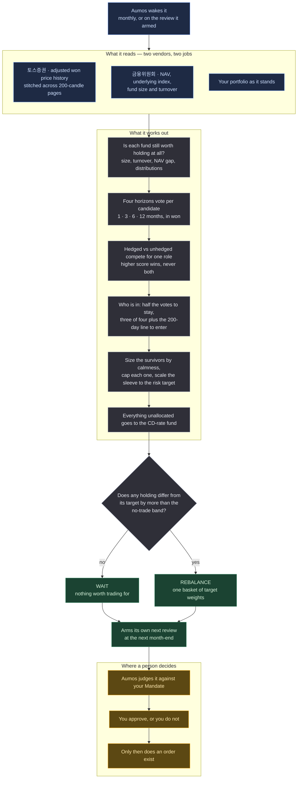

# Atlas Trend KR

<a href="README.ko.md">한국어</a>

> Owns the Korea-listed funds whose prices have been going up, in proportion to how calm
> each one is, and parks the rest in a CD-rate fund.

## In one paragraph

Atlas Trend KR watches five roles of Korea-listed ETF — Korean shares, US shares, US long
government bonds, gold, and a place to park cash — all priced in won. Once a month it asks
one question of each: **has this thing been going up, measured in won?** It keeps the ones
that have, in sizes set by how violently each has been moving lately, and puts everything
else in a CD-rate fund. It does not read the news, it does not have an opinion about any
company, and most months it proposes no change at all.

This is the Korean sibling of Atlas Trend US. Same philosophy, separate package, separate
version, separate track record — a rule that works on US ETFs has not thereby been shown
to work here, and the two markets turned out to differ more than expected.

## The methodology

**Trend following.** The claim being tested is that an asset's own price path carries
information about what it will do next — so this manager reads price and nothing else.

*Words this page uses, in plain terms:*

| | |
|---|---|
| **ETF** | a fund you buy like a share. One purchase gets you a whole market |
| **Total return** | the price change plus the distributions, so a fund that pays you cash is not scored as if it had lost that cash |
| **TR share class** | a version of a fund that reinvests rather than distributing. Nothing to adjust for, which is why it is preferred |
| **Volatility** | how much the price jumps around day to day. Not the same thing as risk of loss, but the thing this manager sizes by |
| **200-session average** | the average closing price over roughly the last ten months. A price above it is the common shorthand for "in an uptrend" |
| **NAV** | what a fund's holdings are actually worth. The price can drift from it |
| **(H)** | a currency-hedged share class — it strips the won-dollar move out of a foreign holding, at a cost |

Four rules do the work.

**1 — Four horizons vote.** For each role it computes the total return over the last 1, 3,
6 and 12 calendar months, **in won**. Each one votes: positive, or not. Reading four
horizons rather than one is what stops a single unusual month from deciding the year.

**2 — Getting in is harder than staying in.** A role the book already holds stays while at
least *half* the votes are positive. A role the book does not hold gets in only on *three
of four* **and** a price above its 200-session average. That gap between the two
thresholds is where most of this methodology's value is: it is what a sideways market has
to cross twice before it can bill you twice.

**3 — Size by how much it moves, not by how much it is liked.** What survives is weighted
by the *inverse* of its volatility — the calmest holding gets the most money — capped so
no single role dominates. Then the whole risky sleeve is scaled **down** if its combined
volatility exceeds the target, counting the correlations, so Korean equity and US equity
are treated as the one-and-a-bit trades they are. It never scales up.

**4 — Cash is an answer.** If nothing qualifies, the proposal is 100% CD-rate fund. That
is a state this system is designed to reach, not a failure to decide.

### The universe, and why it is five roles and not eight

| role | primary | alternates |
|---|---|---|
| Korean equity | `278530` KODEX 200TR | `294400` · `295040` |
| US equity | `360750` TIGER 미국S&P500 | `379800` · `360200` · `449180` (H) |
| US long Treasuries | `453850` ACE 미국30년국채액티브(H) | `476760` · `484790` (H) |
| Gold | `411060` ACE KRX금현물 | `0072R0` · `132030` (H) |
| Cash | `459580` KODEX CD금리액티브(합성) | `488770` · `475630` · `357870` |

Selected from all **1,164** Korea-listed ETFs on one date by measured liquidity and
quality: net assets at least 100 billion won, sixty-session average turnover at least 1
billion won a day, and — compared **within each role**, never against an absolute number —
premium to NAV and tracking against the underlying index. Leveraged, inverse,
covered-call, buffered, blended and thematic products are excluded by construction.

**Three exposures the US sibling holds are missing here, and it is the market's doing.**
Developed-ex-US, emerging markets and Korean government bonds. The products exist; the
money does not.

| role | listed | net assets | turnover a day |
|---|---:|---:|---:|
| Korean equity | 76 | 70.5조 | 39,955억 |
| US equity | 49 | 69.7조 | 36,087억 |
| Cash | 20 | 38.7조 | 6,357억 |
| Emerging markets | 47 | 3.5조 | **233억** |
| Korean government bonds | 21 | 3.6조 | **68억** |
| Developed ex-US | 15 | 1.2조 | **31억** |

Fifteen developed-ex-US funds trade **31억 a day between them** — about a thousandth of
the US equity role. Korean investors' overseas allocation is, in practice, America; the
safe-asset demand that would have gone to government bonds went to CD-rate and MMF funds
instead, which are ten times larger; and the 47 emerging-market funds are cut into China,
India and Vietnam themes rather than broad exposure. Across the whole market, 346 of the
1,164 funds are sector or thematic.

**This is a division of labour, not a hole.** Those three exposures are held by Atlas
Trend US directly. An investor running both packages is missing nothing; an investor
running only this one is inside the honest boundary of what Korea-listed ETFs can buy.

### Hedged and unhedged are two assets

A Korea-listed fund holding US assets carries the exchange rate inside its own price.
`449180 KODEX 미국S&P500(H)` and `360750 TIGER 미국S&P500` hold the same US equities and
earn different won returns.

So they are **scored separately, as two assets, and never held together** — holding both
is a partial currency hedge nobody chose. They compete for one role, the higher score
wins, and a tie goes to the unhedged class, which pays no hedging cost.

**Hedging cost is not estimated separately.** It is the won-dollar rate differential, and
it is already inside the hedged fund's own price. A total-return trend measured on that
price has the cost in it.

⚠️ In practice the hedged classes are much less traded — 93 hedged funds exist and 18
clear the liquidity bar. For US equity the hedged class trades at about 1/123 of the
unhedged one, so it rarely wins on merit alone. For US long Treasuries the opposite holds:
the hedged class is the more liquid of the two.

## How a run works

One run, one proposal. Nothing below places an order.

**Legend** — 🟦 what it reads · ⬜ what it works out on its own · 🟩 what it hands back ·
🟧 where a person decides.

**Cadence.** The monthly rhythm is what this package *asks for*, not something it can
guarantee. Every decision it submits — including the ones concluding there is nothing to
do — arms a plan for the next month-end. Your Aumos may refuse an arming, and the interval
stored for the installed manager is whatever you confirm on the install screen. **If you
want this run monthly, check that interval when you install it.**

## What it needs

| | |
|---|---|
| **Market** | Korea-listed ETFs, in won |
| **Data sources** | `toss` and `fsc-securities-product`, both at 0.1.0 or later |
| **What a key costs** | `fsc-securities-product` is free with an automatically approved key from Korea's public data portal, and its licence puts no restriction on use |
| **Settings** | the risk target, the per-role cap, the no-trade band, which cash fund to use and whether TR share classes are preferred are all yours to set; the horizons, the voting rule and the universe are not configurable, because they are the methodology |
| **The book** | it reads your portfolio, and the book's own note on whether it is currently all in cash |
| **Your approval** | **it proposes and never trades.** Every rebalance it computes is a proposal your Aumos judges against your Mandate and you approve or refuse |

It reads no filings and no news; the claim being tested is that an asset's own price path
carries its trend.

## What it is bad at

- **Sideways markets.** The signal carries no information and the crossings still happen.
  The hysteresis and the no-trade band reduce this; nothing removes it.
- **Sharp reversals.** A monthly review learns about a crash a month after it starts. It
  will sell after the fall and buy back after the recovery has begun.
- **The currency.** Three of the four risk roles are Korea-listed funds of foreign assets,
  so this is a won-dollar position as much as an asset position. A won rally costs the
  book without any trend turning.
- **The quiet one: it is at its most uncomfortable exactly when it is working.** The month
  it moves everything to a CD-rate fund is the month it will look foolish if the market
  rebounds.

**Do not install this** if you want a manager that reacts within the week, that will
explain a holding in terms of the company behind it, or that you expect to override when
its answer is uncomfortable.

## Notes

Three data limits are real and stated rather than papered over.

**No distribution data exists.** Not at either vendor and not in any Korean public API we
could find. Where a role holds a total-return share class the question does not arise — a
TR class pays no distribution, which is why Korean equity is `KODEX 200TR` and not `KODEX
200`. Where it does arise, the package detects a distribution by watching the fund's NAV
fall against its price index, and **reports it rather than repairing it**: without the
amount, a correction would be an estimate dressed as a fact.

**That detector only works on Korean-index roles.** Measured over sixty sessions, a
코스피200 fund's daily NAV-versus-index deviation has a standard deviation of 4.5bp and
quarter-end distributions stand out clearly; an S&P 500 fund's is 127bp, because the
Korean close and the US close are hours and a currency apart, and nothing stands out at
all. For those roles the package says in its decision that it could not run the check.

**The price pages have to be stitched.** 토스증권 returns at most 200 candles a call, so a
420-day window is three calls, and the vendor does not document what its adjustment is
measured from. The package overlaps the pages and verifies they agree before stitching;
when they disagree it says so and reports which horizons it could not compute.

Aumos shows no returns for this package until it has earned some. A forward track record
takes calendar time rather than compute, and nothing on this page is one.
