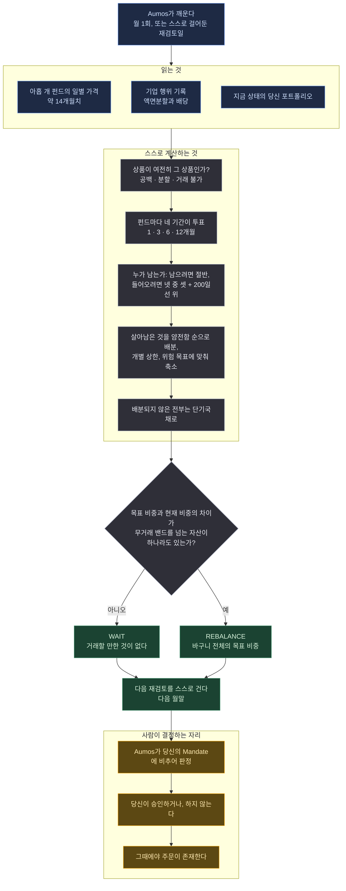

# Atlas Trend US

<a href="README.md">English</a>

> 값이 오르고 있는 펀드만 들고, 각각이 얼마나 얌전한지에 비례해 크기를 정하며,
> 나머지 기간에는 미국 단기국채에 앉아 있는다.

## 한 문단 요약

Atlas Trend US는 평범한 인덱스 펀드 아홉 개를 지켜본다 — 미국 주식, 선진국(미국 제외)
주식, 신흥국 주식, 국채, 금, 원자재, 선택 항목인 부동산 펀드, 그리고 현금을 세워둘 자리.
한 달에 한 번, 각각에게 **이건 지금 오르고 있는가?** 하나만 묻는다. 그렇다고 답한 것들만
남기고, 최근에 얼마나 심하게 움직였는지에 따라 크기를 정하고, 나머지는 전부 단기국채에
넣는다. 뉴스를 읽지 않고, 개별 기업에 대한 의견을 갖지 않으며, 대부분의 달에는 아무것도
바꾸지 말자고 제안한다.

Atlas Trend 시리즈의 첫 번째다. 형제 패키지들은 같은 철학을 다른 시장에서 돌리지만, 별개
패키지이고 별개 트랙레코드를 갖는다 — 미국 ETF에서 통한 규칙이 그것만으로 다른 어디선가도
통한다고 밝혀진 것은 아니기 때문이다.

## 방법론

**추세 추종(trend following).** 검증하려는 주장은 하나다: 자산 자신의 가격 경로가 다음에
무슨 일이 일어날지에 대한 정보를 담고 있다. 그래서 이 매니저는 가격만 읽는다.

*이 페이지가 쓰는 용어를 쉬운 말로:*

| | |
|---|---|
| **ETF** | 주식처럼 사고파는 펀드. 한 번 사면 시장 하나를 통째로 갖는다 |
| **총수익(total return)** | 가격 변화에 배당을 더한 것. 현금을 나눠준 펀드가 그만큼 손실을 본 것처럼 채점되지 않게 한다 |
| **변동성** | 가격이 하루하루 얼마나 튀는지. 손실 위험과 같은 말은 아니지만, 이 매니저가 크기를 정할 때 쓰는 기준이다 |
| **200일 이동평균** | 최근 열 달 남짓의 평균 종가. 가격이 그 위에 있으면 "상승 추세"라고 부르는 통상적 약칭이다 |
| **리밸런싱** | 의도한 비중으로 되돌리기 위해 보유 자산 사이에서 돈을 옮기는 것 |

네 가지 규칙이 일을 한다.

**1 — 네 개의 기간이 투표한다.** 각 펀드에 대해 최근 1·3·6·12개월의 총수익을 계산한다.
각각이 한 표를 던진다: 플러스인가, 아닌가. 하나가 아니라 넷을 읽는 이유는, 유별났던 한 달이
한 해를 결정하지 못하게 하기 위해서다.

**2 — 들어오는 것이 남아 있는 것보다 어렵다.** 이미 보유 중인 펀드는 표의 *절반*만 플러스면
남는다. 보유하지 않은 펀드는 *넷 중 셋* **그리고** 200일 이동평균 위의 가격이라야 들어온다.
두 문턱 사이의 이 간격에 이 방법론의 가치 대부분이 있다: 횡보장이 당신에게 두 번 청구하려면
두 번 건너야 하는 선이다.

**3 — 좋아하는 정도가 아니라 움직이는 정도로 크기를 정한다.** 살아남은 것들은 변동성의
*역수*로 가중된다 — 가장 얌전한 것이 가장 많은 돈을 받는다 — 그리고 어느 하나가 지배하지
못하도록 상한을 씌운다. 그다음 위험 자산 전체의 합산 변동성이 목표를 넘으면 슬리브 전체를
**축소**한다. 상관관계를 함께 계산하므로 세 지역의 주식은 사실상 한 개의 거래로 취급된다.
절대 확대하지는 않는다.

**4 — 현금도 답이다.** 아무것도 자격을 얻지 못하면 제안은 단기국채 100%다. 이 시스템이
도달하도록 설계된 상태이지, 결정에 실패한 것이 아니다.

### 아홉 개, 그리고 왜 이 아홉인가

경제적 노출 하나당 상품 하나. 각각 월간 리밸런싱이 시장 사건이 되지 않을 만큼 크고,
12개월 신호가 외삽이 아니라 신호가 될 만큼 상장 이력이 길어야 한다.

| 역할 | 기본 | 대체 | 왜 이것인가 |
|---|---|---|---|
| 미국 주식 | `VTI` | `ITOT`, `SPY` | 대형주만이 아니라 전체 시장. 측정하려는 추세는 지수위원회의 것이 아니라 주식시장의 것이다 |
| 선진국(미국 제외) 주식 | `VEA` | `IEFA`, `EFA` | 미국 주식과 분리한다. 둘은 몇 년씩 따로 놀고, 글로벌 펀드 하나였다면 그 차이가 상쇄돼 사라진다 |
| 신흥국 주식 | `VWO` | `IEMG`, `EEM` | 변동성이 가장 높은 주식 다리이고, 그래서 역변동성 가중이 가장 적게 들고 갈 것이다 — 옳게 |
| 중장기 미국채 | `IEF` | `TLT`, `GOVT` | 듀레이션을 완충재가 아니라 그 자체의 추세로 본다. 기본을 `TLT`가 아닌 `IEF`로 둔 것은 2022년이 장기 듀레이션은 채권의 평판을 가진 위험자산임을 확인시켜줬기 때문이다 |
| 금 | `GLD` | `IAU`, `GLDM` | 다른 두 다리 모두와 상관이 없는 구간이 의미 있을 만큼 자주 나타나는 유일한 보유 자산 |
| 광의 원자재 | `DBC` | `PDBC`, `GSG` | 인플레이션 다리. 이력 길이 때문에 `DBC`, K-1 서류를 피하고 싶으면 `PDBC` |
| 상장 부동산 *(선택)* | `VNQ` | `SCHH` | 기본은 꺼둔다. 금리 민감도가 붙은 주식 노출에 가까워서, 분산을 늘리는 속도보다 종목을 늘리는 속도가 빠르다 |
| 현금 | `BIL` | `SGOV`, `SHV` | 보유하지 않은 전부가 앉아 있는 자리 |

**대체 종목은 선호가 아니다.** 판단 시점에 기본 종목을 거래할 수 없을 때 — 기업 행위 기록이나
최근 봉의 부재가 그렇게 말할 때 — 딱 그 한 상황에서만 쓰이고, 교체 사실은 결정에 기록된다.

이 목록에서 겹침 두 개가 살아남았고, 없애는 대신 밝혀둔다: `DBC`는 자체적으로 금 비중을
갖고 있고, `VNQ`는 따로 보유하기 전에 이미 `VTI` 안에 시가총액 비중만큼 들어 있다.

## 실행 흐름

한 번의 실행에 하나의 제안. 아래 어느 것도 주문을 내지 않는다.

**범례** — 🟦 읽는 것 · ⬜ 스스로 계산하는 것 · 🟩 돌려주는 것 · 🟧 사람이 결정하는 자리.

**주기.** 월 1회라는 리듬은 이 패키지가 *요청하는* 것이지 보장할 수 있는 것이 아니다. 제출하는
모든 결정은 — 할 일이 없다는 결론까지 포함해 — 다음 월말에 대한 계획을 걸어둔다. 그래서 깨워
주기를 기다리는 대신 자기 다음 검토를 스스로 예약한다. 롤링 30일이 아니라 월말을 고르는 이유는
기간을 달력 월로 재는 이유와 같다: 롤링 간격은 월말에 대해 밀리고, 그 밀림은 눈에 보이지 않는다.
그 위에 두 가지가 여전히 있다. 당신의 Aumos가 예약을 거절할 수 있고 — 그건 Aumos 자신의 규칙이며
버전마다 달라진다 — 거절되면 매니저는 그 사실을 기록하고 검토는 Aumos의 일정으로 일어난다.
그리고 설치된 매니저에 저장되는 검토 간격은 설치 화면에서 당신이 확인한 값이다. **월 1회로
돌리고 싶다면 설치할 때 그 간격을 확인하라.**

## 필요한 것

| | |
|---|---|
| **시장** | 미국 상장 ETF, 달러 |
| **증권사 연결** | 이 펀드에 연결된 Alpaca. 같은 로그인이 봉과 기업행위를 중계하므로 별도 `alpaca` 데이터 소스 문서나 키의 두 번째 사본은 필요 없다 |
| **키 비용** | Alpaca 계정만 있으면 무료 |
| **꼭 맞춰야 할 설정 하나** | `feed` — 시장 데이터 구독이 없다면 `delayed_sip`, 있다면 `sip`. `iex`도 쓸 수는 있지만 권하지 않는다: 거래소 한 곳의 체결이고, 그 일간 종가는 무엇의 종가도 아니다 |
| **그 밖의 설정** | 위험 목표, 개별 상한, 무거래 밴드, 부동산 포함 여부는 당신 몫이다. 기간과 투표 규칙은 설정할 수 없다 — 그것이 방법론이기 때문이다 |
| **장부** | 당신의 포트폴리오, 그리고 지금 전액 현금 상태인지에 대한 장부 자신의 메모를 읽는다 |
| **당신의 승인** | **제안할 뿐 거래하지 않는다.** 계산한 모든 리밸런싱은 당신의 Aumos가 Mandate에 비추어 판정하고 당신이 승인하거나 거절하는 제안이다 |

공시도, 뉴스도, 애널리스트 추정치도, 자금 흐름도, 매크로 데이터도 읽지 않는다. 이 눈멂이
설계다: 신호가 불편할 때 헤드라인에 손을 뻗는 패키지는 이 패키지의 트랙레코드를 걸친 다른
방법론이다.

## 약한 지점

모든 방법론에는 자기가 틀리는 시장의 모양이 있다. 이것에는 둘이 있고, 서로 반대다.

- **횡보장.** 신호에 정보가 없는데 교차는 계속 일어난다. 시스템은 매번 스프레드를 내고,
  출발한 자리에 도착하기 위해 한 해 동안 아주 많이 거래한 채 끝난다. 히스테리시스와 무거래
  밴드가 이를 줄이지만, 없애지는 못한다.
- **급반전.** 월 1회 검토는 폭락을 한 달 뒤에 안다. 떨어진 뒤에 팔고 회복이 시작된 뒤에 다시
  산다. 이는 같은 뒤늦음이 긴 하락에서 자신을 빼내주는 해들을 위해 추세 추종자가 내는
  보험료다.
- **조용한 것 하나: 제대로 작동할 때가 가장 불편하다.** 전부를 단기국채로 옮기는 달은
  시장이 반등하면 바보처럼 보일 달이고, 그 방법론과 — 기록을 무의미하게 만들 — 재량적
  오버라이드 사이에 서 있는 것은 규칙의 규율뿐이다.

**설치하지 마라** — 주 단위로 반응하는 매니저를 원한다면, 보유 이유를 그 회사 이야기로
설명해주기를 바란다면, 답이 불편할 때 뒤집을 생각이라면.

## 덧붙임

**Atlas Trend 세 패키지 중 무엇을 고를 것인가** — 각각이 무엇을 사고 무엇을 요구하며 어디서 겹치는지 — 는 [카탈로그의 매니저 인덱스](../README.md)에 정리되어 있습니다. `atlas-trend-kr`와 함께 돌리기 전에 읽으십시오. 그 패키지의 미국 주식 역할은 국내 상장 S&P 500 펀드를 담으므로, 한 장부에서는 그 노출이 어느 패키지도 고르지 않은 크기로 두 번 들어옵니다.

데이터의 한계 두 가지는 실재하고, 덮는 대신 적어둔다. 이 패키지가 읽는 소스에서 **NAV
대비 괴리율은 제공되지 않는다** — 그래서 유니버스를 그 괴리가 bp 단위로 측정되는 펀드로
제한했다. 그리고 벤더의 배당 조정은 하나의 주장이므로, 패키지는 그것을 기업 행위 기록과
대조하고 **불일치를 고치는 대신 보고한다**: 설명되지 않은 공백을 가로질러 계산한 수익률은
인정된 공백보다 나쁘다.

Aumos는 이 패키지가 실적을 쌓기 전까지 어떤 수익률도 보여주지 않는다. 포워드 트랙레코드는
연산이 아니라 달력 시간을 요구하고, 이 페이지의 어떤 것도 트랙레코드가 아니다.
