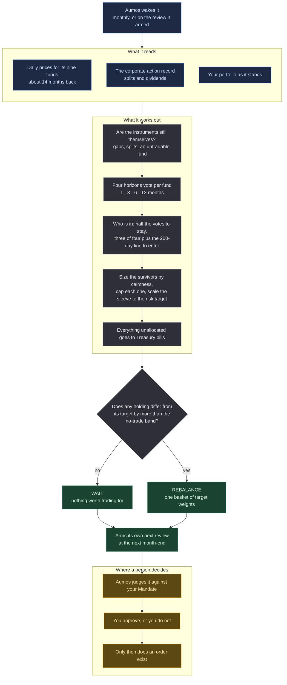

# Atlas Trend US

<a href="README.ko.md">한국어</a>

> Owns the funds whose prices have been going up, in proportion to how calm each one is,
> and sits in Treasury bills the rest of the time.

## In one paragraph

Atlas Trend US watches nine ordinary index funds — US shares, foreign shares, emerging
markets, government bonds, gold, commodities, an optional property fund, and a place to
park cash. Once a month it asks one question of each: **has this thing been going up?**
It keeps the ones that have, in sizes set by how violently each one has been moving
lately, and puts everything else in Treasury bills. It does not read the news, it does
not have an opinion about any company, and most months it proposes no change at all.

This is the first of the Atlas Trend series. Its siblings run the same philosophy in
other markets; they are separate packages with separate track records, because a rule
that works on US ETFs has not thereby been shown to work anywhere else.

## The methodology

**Trend following.** The claim being tested is that an asset's own price path carries
information about what it will do next — so this manager reads price and nothing else.

*Words this page uses, in plain terms:*

| | |
|---|---|
| **ETF** | a fund you buy like a share. One purchase gets you a whole market |
| **Total return** | the price change plus the dividends, so a fund that pays you cash is not scored as if it had lost that cash |
| **Volatility** | how much the price jumps around day to day. Not the same thing as risk of loss, but the thing this manager sizes by |
| **200-session average** | the average closing price over roughly the last ten months. A price above it is the common shorthand for "in an uptrend" |
| **Rebalance** | moving money between holdings to get back to intended proportions |

Four rules do the work.

**1 — Four horizons vote.** For each fund it computes the total return over the last 1,
3, 6 and 12 calendar months. Each one votes: positive, or not. Reading four horizons
rather than one is what stops a single unusual month from deciding the year.

**2 — Getting in is harder than staying in.** A fund the book already holds stays while
at least *half* the votes are positive. A fund the book does not hold gets in only on
*three of four* **and** a price above its 200-session average. That gap between the two
thresholds is where most of this methodology's value is: it is what a sideways market has
to cross twice before it can bill you twice.

**3 — Size by how much it moves, not by how much it is liked.** What survives is weighted
by the *inverse* of its volatility — the calmest holding gets the most money — capped so
no single fund dominates. Then the whole risky sleeve is scaled **down** if its combined
volatility exceeds the target, counting the correlations, so equities in three regions are
treated as the one trade they largely are. It never scales up.

**4 — Cash is an answer.** If nothing qualifies, the proposal is 100% Treasury bills. That
is a state this system is designed to reach, not a failure to decide.

### The nine, and why these nine

One instrument per economic exposure, each large enough that a monthly rebalance is not a
market event, and each with enough listed history that a twelve-month signal is a signal
rather than an extrapolation.

| role | primary | alternates | why this one |
|---|---|---|---|
| US equity | `VTI` | `ITOT`, `SPY` | Total market rather than large-cap only: the trend being measured should be the equity market's, not the index committee's. |
| Developed ex-US equity | `VEA` | `IEFA`, `EFA` | Separated from US equity because the two decouple for years at a time, and a single global fund would net that away. |
| Emerging market equity | `VWO` | `IEMG`, `EEM` | The highest-volatility equity leg, which the inverse-volatility weighting will hold least of — correctly. |
| Intermediate/long Treasuries | `IEF` | `TLT`, `GOVT` | Duration as its own trend, not as ballast. `IEF` over `TLT` as the default because 2022 established that long duration is a risk asset with a bond's reputation. |
| Gold | `GLD` | `IAU`, `GLDM` | The one holding whose behaviour is uncorrelated with both other legs often enough to matter. |
| Broad commodities | `DBC` | `PDBC`, `GSG` | The inflation leg. `DBC` for its length of history; `PDBC` if the investor wants to avoid a K-1. |
| Listed real estate *(optional)* | `VNQ` | `SCHH` | Off by default: it is largely an equity exposure with rate sensitivity attached, so it adds a name faster than it adds diversification. |
| Cash | `BIL` | `SGOV`, `SHV` | Where everything not held sits. |

**The alternates are not preferences.** They are used in exactly one situation — the
primary is not tradable at the instant being judged, because the corporate action record
or the absence of recent bars says so — and the substitution is reported in the decision.

Two overlaps survive this list and are disclosed rather than engineered away: `DBC`
carries a gold weighting of its own, and `VNQ` is already inside `VTI` at its market
weight before any separate holding of it.

## How a run works

One run, one proposal. Nothing below places an order.

**Legend** — 🟦 what it reads · ⬜ what it works out on its own · 🟩 what it hands back ·
🟧 where a person decides.

**Cadence.** The monthly rhythm is what this package *asks for*, not something it can
guarantee. Every decision it submits — including the ones concluding there is nothing to
do — arms a plan for the next month-end, so it schedules its own next review rather than
waiting to be woken. It picks a month-end rather than a rolling thirty days, for the same
reason it measures its horizons in calendar months: a rolling interval drifts against
month-end, and the drift is invisible. Two things still sit above it. Your Aumos may
refuse an arming — that is its own rule and it changes between versions — and when it
does, the manager records the refusal and the review happens on your Aumos's schedule.
And the interval stored for the installed manager is whatever you confirm on the install
screen. **If you want this run monthly, check that interval when you install it.**

## What it needs

| | |
|---|---|
| **Market** | US-listed ETFs, in dollars |
| **Data source** | `alpaca`, at version 0.3.0 or later. Earlier versions do not carry the corporate actions endpoint this package uses to check the vendor's own dividend adjustment |
| **What a key costs** | free with any Alpaca account |
| **One setting to get right** | `feed` — use `delayed_sip` unless you hold a market data subscription, in which case `sip`. `iex` is available and is not recommended: it is one exchange's prints, and its daily close is not the closing price of anything |
| **Other settings** | the risk target, the per-fund cap, the no-trade band and whether property is included are all yours to set; the horizons and the voting rule are not configurable, because they are the methodology |
| **The book** | it reads your portfolio, and the book's own note on whether it is currently all in cash |
| **Your approval** | **it proposes and never trades.** Every rebalance it computes is a proposal your Aumos judges against your Mandate and you approve or refuse |

It reads no filings, no news, no analyst estimates, no fund flows and no macro data. The
blindness is the design: a package that reached for a headline when the signal was
uncomfortable would be a different methodology wearing this one's track record.

## What it is bad at

Every methodology has a shape of market it is wrong in. This one has two, and they are
opposites.

- **Sideways markets.** The signal carries no information and the crossings still happen.
  The system pays the spread on each one and ends the year having traded a great deal in
  order to arrive where it started. The hysteresis and the no-trade band reduce this;
  nothing removes it.
- **Sharp reversals.** A monthly review learns about a crash a month after it starts. It
  will sell after the fall and buy back after the recovery has begun. This is the premium
  a trend follower pays for the years in which the same lateness keeps it out of a long
  decline.
- **The quiet one: it is at its most uncomfortable exactly when it is working.** The
  month it moves everything to Treasury bills is a month it will look foolish if the
  market rebounds, and the discipline of the rule is the only thing standing between the
  methodology and a discretionary override that would make its record meaningless.

**Do not install this** if you want a manager that reacts within the week, that will
explain a holding in terms of the company behind it, or that you expect to override when
its answer is uncomfortable.

## Notes

**Choosing between the three Atlas Trend packages** — what each buys, what each needs, and where they overlap — is set out in [the catalogue's manager index](../README.md). Read it before running this one alongside `atlas-trend-kr`: that package's US-equity role holds a Korea-listed S&P 500 fund, so on one book the exposure arrives twice at a size neither package chose.

Two limits of the data are real and are stated rather than papered over. **Premium and
discount to NAV are not available** from the source this package reads — which is why the
universe is restricted to funds where that gap is measured in basis points. And the
vendor's dividend adjustment is a claim, so the package checks it against the corporate
action record and **reports the discrepancy rather than repairing it**: a return computed
across an unexplained gap is worse than an admitted one.

Aumos shows no returns for this package until it has earned some. A forward track record
takes calendar time rather than compute, and nothing on this page is one.
