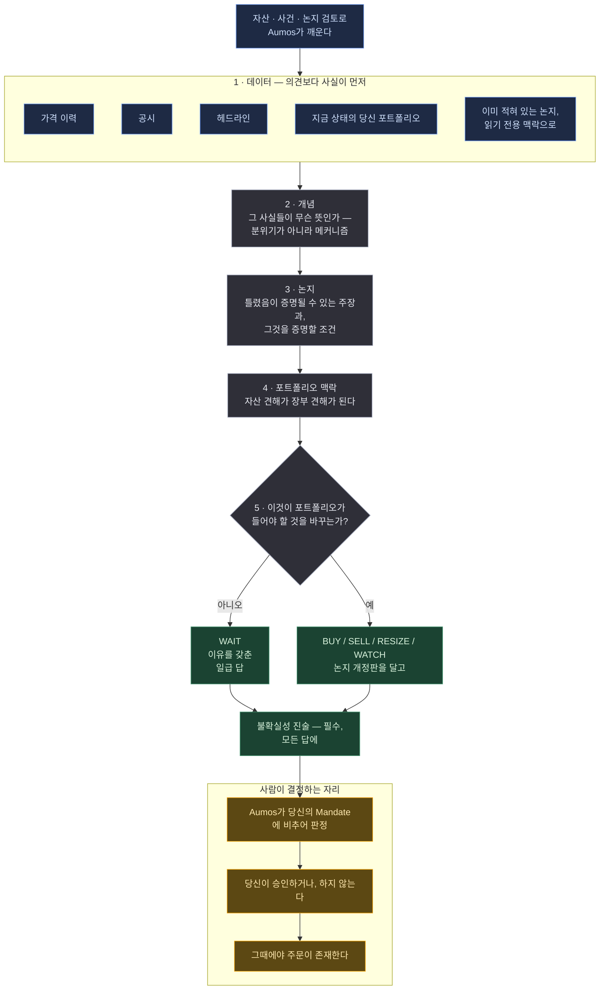

# Basic Investor

<a href="README.md">English</a>

> 무슨 일이 있었는지 읽고, 그것이 무슨 뜻인지 따지고, 틀렸음이 증명될 수 있는 주장을 적어두고,
> 그러고 나서야 당신의 포트폴리오가 바뀌어야 하는지 묻는다.

## 한 문단 요약

Basic Investor는 카탈로그에서 가장 담백한 매니저다: 애널리스트 하나가, 자산 하나를, 신중한
애널리스트가 실제로 일하는 순서대로 읽는다. 먼저 사실을 모으고 그동안에는 의견 갖기를 거부한다.
그다음 해석한다. 그다음 **논지(thesis)**를 적는다 — 미래에 대한 주장과, 그것이 틀렸음을 증명할
조건. 그리고 맨 마지막에야 그 전부가 당신이 실제로 들고 있는 포트폴리오에 무슨 뜻인지 묻는다.
흔한 답은 WAIT이거나, 그 적어둔 논지를 달고 오는 BUY다.

동시에 **레퍼런스 패키지**이기도 하다 — Aumos 테스트 스위트가 모든 커밋에서 돌리는 그 패키지 —
그래서 직접 패키지를 쓰려는 사람에게는 예제 노릇도 한다. 그쪽 내용은
[WALKTHROUGH.ko.md](WALKTHROUGH.ko.md)에 있고, 덕분에 이 페이지는 다른 모든 매니저의 페이지와
같은 것이 될 수 있다: 자기 돈을 판단할 무언가를 설치하기 전에 사람이 읽는 페이지.

## 방법론

**FinRobot의 3단계 사고 사슬에 Aumos의 두 단계를 더한 것.**

*이 페이지가 쓰는 용어를 쉬운 말로:*

| | |
|---|---|
| **논지(thesis)** | 미래에 대해 적어둔 주장. 그것이 틀렸음을 증명할 조건까지 포함한다. 등급이 아니다 |
| **사고 사슬(chain of thought)** | 추론을 정해진 단계로 밀어넣어, 사실이 다 들어오기 전에 결론에 닿지 못하게 하는 것 |
| **`asOf`** | 판단이 고정된 시각. 매니저는 그때까지 공표된 것만 볼 수 있다 |
| **WAIT** | "여기엔 포트폴리오가 들어야 할 것을 바꾸는 것이 없다" — 결정 실패가 아니라 일급 답이다 |
| **Evidence** | 매니저가 실제로 무엇을 가져왔는지의 기록. 매니저가 주장하는 것이 아니라 Aumos가 남기는 것 |

| 단계 | 무엇을 확정하는가 | 출처 |
|---|---|---|
| **1 — 데이터** | 사실, 그리고 그 외에는 아무것도. 가격·공시·헤드라인을, 어떤 해석도 허용되기 전에 모은다 | FinRobot |
| **2 — 개념** | 그 사실들이 무슨 뜻인가 — 분위기가 아니라 메커니즘 | FinRobot |
| **3 — 논지** | 틀렸음이 증명될 수 있는 미래에 대한 주장과, 그것을 증명할 조건 | FinRobot |
| **4 — 포트폴리오 맥락** | 자산에 대한 견해가 포트폴리오에 대한 견해가 된다: 장부는 이미 무엇을 들고 있고, 이것이 그걸 바꾸는가? | Aumos |
| **5 — 결정** | 하나의 행동, 하나의 목표, 그리고 이유들 | Aumos |

그중 셋은 구조가 아니라 결정이다.

**WAIT을 동급으로, 반복해서 말한다.** 내버려두면 애널리스트 모양의 프롬프트는 애널리스트 모양의
출력을 낸다: 할 일. 그래서 프롬프트는 정당화되지 않은 BUY와 잘 논증된 WAIT이 비슷하게 좋기는커녕
전혀 그렇지 않다고 소리 내어 말하고, 4단계는 *"이게 좋은 회사인가?"*가 아니라 *"이것이
포트폴리오가 들어야 할 것을 바꾸는가?"*로 닫는다 — 두 질문은 답이 다르고, 제품인 것은 앞의
하나뿐이기 때문이다.

**논지는 매니저의 것이 아니다.** 읽기 전용 맥락으로 도착해서 제안으로 돌아간다. 장기 기억은
매니저가 아니라 Aumos의 것이다: 자기 기억을 갖는 매니저는 교체될 때 포지션이 존재하는 이유를
들고 나가버린다. 논지 단계는 기존 논지를 다시 진술하는 대신 그것의 *다음 개정판*을 제안한다.
아무 변화 없는 재진술로 가득한 개정 사슬은 그것을 간직할 가치가 있게 만드는 성질 — 모든 버전
전환 뒤에 이유와 결정이 있다는 성질 — 을 잃기 때문이다.

**자기 자신에 반하는 논거를 말한다.** 불확실성 진술은 예의가 아니라 답의 필수 요소다.

## 실행 흐름

한 번의 실행에 하나의 제안. 아래 어느 것도 주문을 내지 않는다.

**범례** — 🟦 읽는 것 · ⬜ 스스로 계산하는 것 · 🟩 돌려주는 것 · 🟧 사람이 결정하는 자리.

⚠️ **다섯 단계는 오케스트레이션이 아니라 프롬프트 구조다.** 한 번의 실행에 매니저 호출은
**하나**이고, 단계들은 하나의 컨텍스트 윈도를 공유하는 한 프롬프트의 절들이다. 그 공유가 이
분해가 작동하는 이유 전부다. Aumos는 단계마다 프로세스를 돌리지 않고, 매니저의 내부를 안다고
주장하지도 않는다 — Aumos가 실행 내부에 대해 아는 것은 *관측한* 것이다: 도구 호출, 그 시각,
그 증거.

**주기.** 달력이 아니라 사건이나 검토로 깨어나고, 자기 답에 걸어둔 조건이 다시 데려온다.

## 필요한 것

| | |
|---|---|
| **시장** | 미국 상장 주식과 ETF (`XNAS`, `XNYS`) |
| **데이터** | `source:passthrough` — 가격·공시·헤드라인. 이 기계가 자격증명을 들고 있는 벤더에 묻는다. 응답은 벤더의 것이고 Aumos는 읽지 않는다. 읽는 것은 이 패키지다 |
| **장부** | `portfolio:read` — 판단이 추상적인 자산이 아니라 이 포트폴리오에 관한 것이 되도록 |
| **설정** | 가격 이력을 며칠 요청할지, 기사를 최대 몇 건 요청할지. 어느 것도 시간 게이트를 느슨하게 만들 수 없다. 그건 게이트웨이의 것이고 패키지에서 설정할 수 없다 |
| **언어** | invocation이 요청한 언어로 답한다. 필드 이름과 enum 값은 영어로 남는다 — 그건 와이어 포맷이다 — 그리고 인용된 출처는 발행된 언어 그대로 남는다 |
| **당신의 승인** | **제안할 뿐 거래하지 않는다.** 모든 판단은 당신의 승인 대기열로 들어가고 사람이 승인한다 |

## 약한 지점

- **한 번에 둘 이상의 자산을 봐야 하는 모든 것.** 실행당 대상 하나에 대해 추론한다. 두 후보를
  서로 비교하는 일은 하지 않는다.
- **리스크 예산.** 장부를 읽는 것은 자기 판단을 맥락에 놓기 위해서지 장부 전체의 노출을 관리하기
  위해서가 아니다. 그 질문에는 `prudent-allocator`가 있다.
- **속도.** 다섯 단계의 추론과 사람의 승인 게이트는 짧은 경로가 아니고, 몇 시간 안에 실행돼야만
  작동하는 것은 WATCH로 돌아온다.
- **자기가 잘하는지 아는 것.** 픽스처 데이터에 대한 한 번의 실행은 이 매니저가 투자를 잘하는지에
  대해 아무것도 말하지 않고, 그런 실행을 몇 번 해도 마찬가지다.

**설치하지 마라** — 전문가를 원한다면. 이 패키지의 미덕은 평범한 경우를 신중하게 한다는 것이고,
그것은 곧 누구의 우위도 아니라는 뜻이다.

## 덧붙임

**Evidence, 그리고 "봤다"가 뜻하는 것.** Decision의 증거는 매니저가 읽었다고 *주장한* 것이
아니라 Aumos가 매니저가 가져오는 것을 **관측한** 것이다. 인용은 자기 신고이고, 관측은 아니다.
그래서 Decision은 자기 증거로, 증거는 자기 출처로 이어지며, 매니저가 정직했든 아니든 *이 판단은
무엇을 봤고, 그것은 어디서 왔고, 언제 발행됐는가*에 답한다 — 그것이 이것을 참고문헌 목록이 아니라
감사 추적으로 만든다.

**어떻게 검증되는가.** 테스트 스위트의 모든 실행은 픽스처 세계를 상대로 돈다: 실적은
`2026-05-27T20:05:00Z`에 발표되고, 모든 실행은 그 5분 전에 고정된다. 사건 이후 값들은 이전 값들
근처에도 없다 — 종가 412 대 100, 매출 999,999 대 100,000 — 그래서 412 종가를 언급하는 근거는
미래를 읽고 있음이 눈에 보인다. 자동화된 절반은 목이 아니다: 진짜 코딩 CLI가 실행되고, 그것이
진짜 설정에서 진짜 게이트웨이를 띄우고, 모든 도구 호출이 진짜 시간 게이트를 지나 진짜 프로토콜로
간다. 가짜인 것은 판단 그 자체뿐이다. 나머지 절반은 진짜 구독의 진짜 모델 앞에 놓인 같은 번들이다.

**그것이 확립하지 못하는 것**은 판단이 좋은지다. 그건 포워드 트랙레코드의 몫이고, 연산이 아니라
달력 시간을 요구한다. 확립되는 것은 더 좁고, 정확히 적어둘 가치가 있다: 이런 모양의 패키지가
적재되고, 자기 권한 안에서 돌고, `asOf` 너머를 볼 수 없으며, Kernel이 봉인할 무언가를 낸다는 것.

**직접 써보려면.** [WALKTHROUGH.ko.md](WALKTHROUGH.ko.md)가 이 패키지를 예제로 읽은 문서다 —
`asOf`가 프롬프트에 무슨 일을 하는지, WAIT을 왜 반복해야 하는지, 논지는 누구 것인지, 산문은
번역되고 포맷은 절대 번역되지 않는 이유, 그리고 검증에 실패한 답에 무슨 일이 일어나는지.
[CONTRIBUTING.ko.md](../../docs/contributing/CONTRIBUTING.ko.md)에 규칙이 있다.

Aumos는 이 패키지가 실적을 쌓기 전까지 어떤 수익률도 보여주지 않는다. 포워드 트랙레코드는
연산이 아니라 달력 시간을 요구하고, 이 페이지의 어떤 것도 트랙레코드가 아니다.
