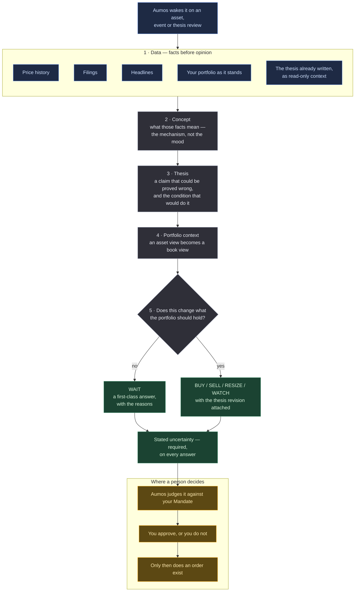

# Basic Investor

<a href="README.ko.md">한국어</a>

> Reads what happened, works out what it means, writes down a claim that could be proved
> wrong, and only then asks whether your portfolio should change.

## In one paragraph

Basic Investor is the plainest manager in the catalogue: one analyst, reading one asset,
in the order a careful analyst actually works. It gathers the facts first and refuses to
have an opinion while it is doing so; then it interprets them; then it writes a **thesis**
— a claim about the future, with the condition that would prove it wrong; and only at the
end does it ask what any of that means for the portfolio you actually hold. Its usual
answer is either WAIT or a BUY that comes with that written thesis attached.

It is also the **reference package** — the one the Aumos test suite runs on every commit —
so it doubles as the worked example for anyone writing their own. That side of it lives in
[WALKTHROUGH.md](WALKTHROUGH.md), so this page can be what every other manager's page is:
the page a person reads before installing something that will judge their money.

## The methodology

**FinRobot's three-stage chain of thought, extended with two Aumos stages.**

*Words this page uses, in plain terms:*

| | |
|---|---|
| **Thesis** | a written claim about the future, including the condition that would prove it wrong. Not a rating |
| **Chain of thought** | forcing the reasoning into fixed stages, so a conclusion cannot be reached before the facts are in |
| **`asOf`** | the instant the judgement is pinned to. The manager can only see what had been published by then |
| **WAIT** | "nothing here changes what the portfolio should hold" — a first-class answer, not a failure to decide |
| **Evidence** | the record of what the manager actually fetched, kept by Aumos rather than claimed by the manager |

| stage | what it establishes | where it comes from |
|---|---|---|
| **1 — Data** | the facts, and nothing else. Prices, filings, headlines, gathered before any interpretation is allowed | FinRobot |
| **2 — Concept** | what those facts mean — the mechanism, not the mood | FinRobot |
| **3 — Thesis** | a claim about the future that could be proved wrong, and the condition that would do it | FinRobot |
| **4 — Portfolio context** | an asset view becomes a portfolio view: what does the book already hold, and does this change it? | Aumos |
| **5 — Decision** | one action, one target, and the reasons | Aumos |

Three things in that are decisions rather than structure.

**WAIT is stated as a peer, repeatedly.** Left alone, an analyst-shaped prompt produces
analyst-shaped output: something to do. So the prompt says out loud that an unjustified
BUY and a well-reasoned WAIT are not close to equally good, and stage 4 closes by asking
*"does this change what the portfolio should hold?"* rather than *"is this a good
company?"* — because those questions have different answers, and only the first one is the
product.

**The thesis is not the manager's.** It arrives as read-only context and goes back as a
proposal. Long-term memory belongs to Aumos rather than to the manager: a manager that
kept its own would take the reason a position exists with it when it was swapped out. The
thesis stage proposes the *next revision* of an existing thesis rather than restating it,
because a revision chain full of no-op restatements loses the property that makes it worth
keeping — that every version transition has a reason and a decision behind it.

**It says the case against itself.** Stated uncertainty is a required part of the answer,
not a courtesy.

## How a run works

One run, one proposal. Nothing below places an order.

**Legend** — 🟦 what it reads · ⬜ what it works out on its own · 🟩 what it hands back ·
🟧 where a person decides.

⚠️ **The five stages are prompt structure, not orchestration.** There is **one** manager
call per run; the stages are sections of one prompt sharing one context window, which is
the entire reason the decomposition works. Aumos does not run a process per stage, and
does not claim to know a manager's internals — what it knows about the inside of a run is
what it *observed*: the tool calls, their timings, their evidence.

**Cadence.** It is woken by an event or a review rather than by a calendar, and the
condition it arms on its answer is what brings it back.

## What it needs

| | |
|---|---|
| **Markets** | US-listed equities and ETFs (`XNAS`, `XNYS`) |
| **Data** | `source:passthrough` — prices, filings and headlines, asked of the vendors this machine holds credentials for. The response is theirs, unread by Aumos; this package does the reading |
| **The book** | `portfolio:read` — so a judgement is about this portfolio rather than about the asset in the abstract |
| **Settings** | how many days of price history to request, and how many articles at most. Neither can loosen the time gate, which is the gateway's and is not configurable from a package |
| **Language** | it answers in the language the invocation asks for. Field names and enum values stay English — those are the wire format — and quoted sources stay in the language they were published in |
| **Your approval** | **it proposes and never trades.** Every judgement enters your approval queue and a person approves it |

## What it is bad at

- **Anything that needs more than one asset in view at once.** It reasons about one
  subject per run. Comparing two candidates against each other is not something it does.
- **Risk budgeting.** It reads the book to place its judgement in context, not to manage
  the book's total exposure. `prudent-allocator` is the package for that question.
- **Speed.** Five stages of reasoning and a human approval gate are not a short path, and
  anything that only works if executed within hours will come back as a WATCH.
- **Knowing whether it is any good.** One run against fixture data says nothing about
  whether this manager invests well, and no number of such runs would.

**Do not install this** if you want a specialist. Its virtue is that it is the ordinary
case done carefully, which also means it is nobody's edge.

## Notes

**Evidence, and what "it saw" means.** A Decision's evidence is what Aumos **observed**
the manager fetch, not what it claimed to have read. A citation is self-report; the
observation is not. So a Decision leads to its evidence and its evidence to its
provenance, answering *"what did this judgement look at, where did it come from, and when
was it published"* whether or not the manager was honest — which is what makes it an audit
trail rather than a bibliography.

**How it is exercised.** Every run in the test suite goes against a fixture world:
earnings released at `2026-05-27T20:05:00Z`, every run pinned to five minutes before.
Post-event values sit nowhere near pre-event ones — closes of 412 against 100, revenue
999,999 against 100,000 — so a rationale mentioning a 412 close is visibly reading the
future. The automated half is not a mock: a real coding CLI is spawned, it spawns the real
gateway from the real configuration, and every tool call goes over the real protocol
through the real time gate. The only faked thing is the judgement itself. The other half
is the same bundle in front of a real model on a real subscription.

**What that does not establish** is that the judgement is any good. That is what a forward
track record is for, and it takes calendar time rather than compute. What is established
is narrower and worth stating exactly: that a package shaped like this loads, runs inside
its permissions, cannot see past `asOf`, and produces something the Kernel will seal.

**Writing your own.** [WALKTHROUGH.md](WALKTHROUGH.md) is this package read as a worked
example — what `asOf` does to a prompt, why WAIT has to be repeated, who owns the thesis,
how the prose is translated and the format never is, and what happens to an answer that
fails validation. [CONTRIBUTING.md](../../CONTRIBUTING.md) is where the rules are.

Aumos shows no returns for this package until it has earned some. A forward track record
takes calendar time rather than compute, and nothing on this page is one.
