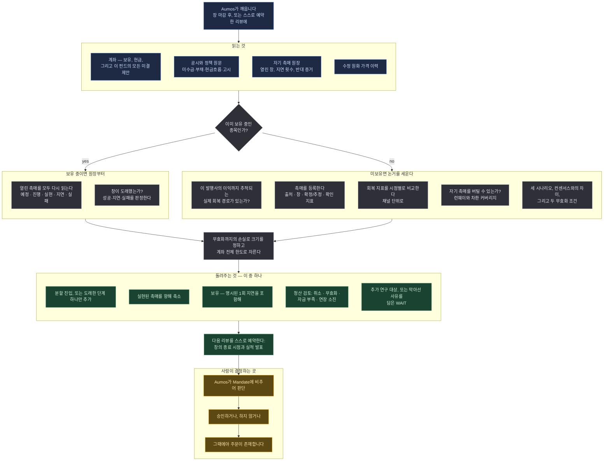

# Catalyst Turnaround

<a href="README.md">English</a>

> 망가진 국내 상장 기업을, 그것을 고칠 구체적이고 날짜가 있는 사건이 있을 때만 삽니다. 그 사건이
> 일어나면, 또는 더 이상 오지 않게 되면 팝니다.

## 한 문단 요약

Catalyst Turnaround는 사업이나 재무 상태가 악화된 국내 기업 가운데, **이름과 출처와 날짜가 있는
사건**이 그것을 회복시킬 수 있는 곳을 찾습니다. 미수금 회수, 규제 가격의 정상화, 적자 사업부의
정리, 필요하던 차환이 확정으로 바뀌는 일 같은 것들입니다. 그 사건을 출처와 예상 창, 그리고 그것이
실제로 일어났음을 증명할 미래 공시의 특정 숫자까지 적어 원장에 남기고, 그 숫자가 도착하는지로
포지션을 관리합니다. 촉매가 실현되면 회복을 향해 비중을 줄이고, 지연되면 새 증거와 그 대가를 명시한
경우에 한해 한 번은 보유를 이어갑니다. 반복해서 지연되거나 취소되거나 회사의 현금이 그 기다림을 더
이상 감당하지 못하면 청산 검토로 갑니다. 주가가 올랐다는 사실을 촉매의 성공으로 대신 기록하는 일은
없습니다.

## 방법론

검증하려는 주장은 좁고, 「싸다」가 아닙니다. **특정한 관측 가능 사건이 이 회사의 현금흐름을 일정한
시점에 움직일 것이며 시장은 다른 것을 반영하고 있다**는 주장입니다. 아래의 모든 것은 그 주장을
나중에 검산할 수 있어야 한다는 요구에서 나옵니다.

### 촉매 원장

이 매니저의 중심은 점수가 아니라 기록입니다. 등록되는 모든 촉매는 사건의 종류, 출처가 된 원문,
그 원문의 공개 시각, 날짜가 **확정인지 추정인지**, 예상되는 창, 그것을 확인해 줄 지표, 그리고
성공과 실패로 인정할 조건을 함께 가집니다. 전부 창이 열리기 **전에** 적습니다.

보유 중에 그 기록은 다섯 상태를 지납니다. **예정 → 진행 → 실현·지연·실패.** 이것을 이야기가 아닌
기록으로 만드는 규칙이 넷 있습니다.

**1 — 지연에는 세 가지 대가가 붙습니다.** 새 증거, 지금부터의 잔여 기대수익, 그리고 새로 받아들이는
추가 하방입니다. 같은 위협을 다시 적는 것은 새 증거가 아닙니다. 두 번의 연장 이후에는 질문이
「언제 오는가」에서 「이 자본이 대안보다 나은가」로 바뀌고, 벤치마크 대안과 명시적으로 비교합니다.

**2 — 지연과 취소는 다른 기록입니다.** 하나는 창이 움직인 것이고 다른 하나는 일어나지 않을 사건입니다.
둘은 다른 결정으로 이어집니다.

**3 — 실현과 실패는 종결입니다.** 기록은 고쳐 쓰지 않습니다. 진짜로 새로운 촉매는 자기 출처를 가진 새
행이며, 그렇게 해야 이전의 판단이 읽히는 채로 남습니다. 한 번 기록된 반대 증거는 나중 실행에서 조용히
사라질 수 없습니다.

**4 — 성공은 문서 안의 숫자입니다.** 주가가 아니며, 오르든 내리든 마찬가지입니다. 가격은 정확히 두
곳에만 들어옵니다. 논거가 틀렸다는 뜻이 되는 가격까지의 거리는 크기를 정하고, 목표까지의 진행률은
축소를 촉발합니다.

### 의도적으로 하지 않는 것

- **하락 폭으로 시장을 줄 세우지 않습니다.** 가장 많이 떨어졌다는 이유로 우선하지 않으며, 단일한
  「하락 점수」는 이 패키지 어디에도 없습니다.
- **낮은 PER을 필수 자격 조건으로 쓰지 않습니다.** 이것은 누락이 아니라 결정입니다. 이익이 0에
  가까운 지점에서 회복하는 회사는 들어갈 때 배수가 터무니없이 크고 나올 때 작습니다. 앞의 것으로
  거르면 이 매니저가 존재하는 사례 전체가 사라집니다. 모멘텀 지표도 관문이 아닙니다. 가격 안정화는
  **보조 확인**입니다. 기다리게 만들 수는 있어도 사게 만들 수는 없습니다.
- **정책을 논거로 취급하지 않습니다.** 정부 사업은 실재하고 예산이 잡혀 있고 발표까지 되었으면서도,
  특정 회사에는 아무도 적어두지 않은 가정을 통해서만 도달할 수 있습니다. 정책에서 **이 발행사의**
  이익으로 이어지는 경로가 추적되지 않으면 그 종목은 추가 연구 대상으로 남습니다.
- **상쇄 효과를 합산하지 않습니다.** 이 방법론이 쓰여진 유형의 사례에서는 미수금 잔액, 규제 가격,
  도입원가, 해외사업 손익이 동시에 움직이고 서로 반대로 가기도 합니다. 넷은 별개 채널로 추적하며,
  다른 것에서 **파생된** 효과 — 잔액이 줄어 멈추는 이자 — 는 기록하되 두 번 세지 않습니다.
- **「읽지 못했다」와 「틀렸다」를 섞지 않습니다.** 읽지 못한 숫자는 부재이고, 부재는 결코 반증이
  아닙니다.

### 이 문서가 쓰는 말

| | |
|---|---|
| **촉매** | 이 회사의 재무를 바꿀, 구체적이고 날짜가 있고 출처가 있는 사건. 테마도 희망도 아닙니다 |
| **확인 지표** | 미래 공시의 지정된 항목에 실릴 숫자로, 그 도착이 촉매의 발생을 증명합니다 |
| **무효화** | 두 가지입니다. *가격* 수준은 포지션의 크기를 정하고, *사업* 조건은 포지션을 닫습니다 |
| **런웨이** | 유동자산이 현금 소진을 몇 달 감당하는가. 자기 촉매보다 오래 버텨야 합니다 |
| **차환 커버리지** | 현금과 확정된 차환을 1년 내 만기 부채로 나눈 값. 1.0 아래면 아무도 약속하지 않은 돈이 필요하다는 뜻입니다 |
| **채널** | 회복이 드러나는 하나의 경로 — 미수금 잔액, 규제 가격, 도입원가, 해외사업 손익 |
| **분할 계획** | 각 단계가 자기 크기와 날짜 또는 가격 조건과 만료를 가지는 진입 계획 |

## 실행 흐름

한 번의 실행에 하나의 제안. 아래 어느 것도 주문을 내지 않습니다.

**범례** — 🟦 읽는 것 · ⬜ 스스로 계산하는 것 · 🟩 돌려주는 것 · 🟧 사람이 결정하는 곳.

**주기.** 보유 종목에 대해 국내 장 마감 후 위험 검토, 열린 촉매마다 그 창과 확인 지표를 담을 공시에
대한 WATCH, 그리고 촉매를 확인할 수 있는 실적 발표 전후의 검토입니다. 발표 전에는 시나리오를 적기
위해, 발표 후에는 그것을 채점하기 위해서입니다. 제출하는 모든 판단은 다음 리뷰를 예약하며, 할 일이
없다고 결론 내린 판단도 마찬가지입니다. 사용하는 Aumos가 예약을 거절할 수 있고, 설치된 매니저에
저장되는 리뷰 주기는 설치 화면에서 확인한 값입니다.

## 필요한 것

| | |
|---|---|
| **시장** | 국내 상장 개별주식, 원화 기준. ETF도 해외 상장도 아닙니다 |
| **데이터 소스** | 미수금·운전자본·부채·현금흐름 항목을 위한 `open-dart` 공시와 정책 원문, 수정 원화 가격 이력을 위한 연결된 시세 로그인 |
| **키 비용** | OpenDART 키는 금융감독원에 등록하면 무료입니다. 가격 연결은 이 펀드가 이미 가진 로그인이며, 시세만 쓴다면 증권 계좌가 붙어 있을 필요는 없습니다 |
| **자기 기억** | 촉매 원장을 유지합니다. 열린 창, 지연 횟수, 기록된 반대 증거입니다. 이것이 없으면 세 번 지연된 포지션이 첫 지연처럼 보이며, 그럴 때 이 매니저는 추측하지 않고 읽지 못했다고 말합니다 |
| **설정** | 촉매 지평, 지연 허용 횟수, 런웨이와 차환 하한, 요구되는 개선 채널 수, 단일 종목 상한, 축소 기준은 모두 사용자의 몫입니다. 방법의 형태는 아닙니다. 촉매 기록의 필수 항목, 상태 기계, 주가 상승을 성공으로 읽지 않는 규칙이 곧 방법론입니다 |
| **계좌** | 보유 종목과 **펀드의 모든 미결 제안**을 함께 읽습니다. 다른 매니저가 제안하고 아직 체결되지 않은 종목도 이미 약속된 노출이기 때문입니다 |
| **승인** | **제안할 뿐 거래하지 않습니다.** 모든 판단은 Aumos가 Mandate에 비추어 판단하고 사용자가 승인하거나 거절하는 제안입니다 |

## 약한 지점

- **날짜가 붙은 밸류 트랩.** 이 방법론이 요구하는 모든 것은 그저 천천히 쇠퇴하는 회사도 충족할 수
  있습니다. 실제 사건, 실제 창, 실제로 개선된 한 분기, 그리고 그 아래에서 계속 나빠지는 사업.
  무효화 조건이 방어책이고, 완전한 방어책은 아닙니다.
- **기다림.** 두 번 지연된 촉매는 1년치 자본을 쓰며, 어떤 명세서도 그 비용을 청구하지 않습니다.
  지연 허용 횟수는 실재하는 실패 유형을 겨눈 무딘 도구이고, 곧 맞았을 논거를 검토로 밀어 넣기도
  합니다.
- **정책.** 국내에서 찾을 수 있는 사례의 절반은 부처나 규제기관의 결정에 달려 있고, 그 결정은
  공시에서 예측되지 않습니다. 집행은 측정할 수 있어도 번복은 미리 알 수 없습니다.
- **희석.** 이 매니저가 찾아내는 회사는 자주 돈이 필요한 회사입니다. 유상증자로 자금이 채워진 옳은
  사업 논거는 틀린 주당 논거이고, 이 매니저는 그 위험을 가격에 반영하는 대신 명시합니다.
- **조용한 약점: 제대로 작동할 때 가장 불편합니다.** 기한을 실패로 판정하고 청산을 제안한 실행은,
  두 달 뒤 그 사건이 도착하면 가장 나빠 보일 실행입니다.

**설치하지 마십시오.** 이야기가 여전히 좋다는 이유로 무기한 보유해 주는 매니저를 원한다면, 가격에
반응하는 매니저를 원한다면, 정책 발표를 포지션으로 취급하는 매니저를 원한다면 맞지 않습니다.

## 덧붙임

**유지보수자용 문서는 [`ARCHITECTURE.md`](ARCHITECTURE.md)입니다.** 결정적 코어에 무엇이 왜
들어 있는지, 어떤 부분이 `evidence-gated` 패키지에서 파생되었는지, 어떤 fixture가 어떤 규칙을
떠받치는지, 그리고 무엇이 이 패키지가 아니라 호스트의 몫인지를 담고 있습니다.

**이 패키지는 수익률을 보여주지 않으며, 여기에는 거절하고 있는 구체적인 주장이 있습니다.** 이
방법론은 비공개 리서치 하네스에서 이식되었고, 그 저자가 참고 사례에 대해 결과를 보고한 바 있습니다.
이번 설계에서 그 결과를 재검산하지 않았습니다. 검증된 엣지가 아니고, 이 패키지의 트랙레코드도
아니며, 이 패키지의 어떤 임계값도 그 결과를 재현하도록 선택되지 않았습니다. 전방 트랙레코드는
연산이 아니라 달력의 시간을 필요로 하고, 이 페이지에는 그런 것이 없습니다.

**참고 사례는 규칙이 아니라 형태입니다.** 이 방법론이 쓰여진 미수금 회수·요금 정상화 논거는 정책과
재무가 얽힌 턴어라운드이며, 이 패키지의 fixture에서는 그런 사례가 올바르게 분류되는지, 그리고
매력적이지 않은 밸류에이션 배수를 이유로 배제되지 않는지를 확인하는 데 쓰입니다. 특정 기업을
언급하는 규칙은 이 패키지 어디에도 없고, fixture에는 같은 사례가 매수에 **도달하지 않는** 변형도
일부러 포함되어 있습니다.

**섹터: 이 패키지가 계산하는 것과 받기만 하는 것.** 이 매니저는 회사가 어떤 업종인지 판단하지
않습니다 — 사례 작업의 대상은 *사건*과 재무상태표이지 업종이 아니므로, 섹터 분류에 대해 내놓을
관점이 없습니다. 대신 이제 Mandate에 업종 한도가 있으면 그것을 읽습니다. 이전에는 단일종목 한도만
읽었고, «이 패키지에는 섹터 개념이 없으므로 섹터 한도를 어길 수 없다»는 아무것도 증명하지 못하는
말이었습니다. 호스트가 그 한도를 집행하지 않고 패키지가 그것을 받지도 않았으므로, 그런 Mandate
아래에서는 겉보기에 옳은 답이 투자자가 선언한 한도를 넘겨 계좌를 밀어넣을 수 있었습니다. **업종
한도가 선언되어 있는데 계좌의 업종 분류가 불완전하면 — 후보든, 장부의 어떤 보유든 미결 제안이든 —
이 매니저는 아무것도 개시하지 않고 분할 단계도 추가하지 않습니다.** 대기하고, 분류하지 못한 행을
지목하고, 데이터 부재로 기록합니다. 청산, 무효화에 따른 축소, 위험한도로의 재조정, 지연을 견디는
보유는 그대로입니다. 검증할 수 없는 한도가 보류하는 것은 증액입니다.

**다른 매니저와 함께 운용할 때.** 노출은 계좌 전체 기준으로 — 실제 보유와 미결 제안을 함께 —
측정하며, 전략별 한도를 더해 계좌 한도를 늘릴 수 없습니다. 다른 국내 매니저와 함께 운용한다면
계좌에 설정한 단일 종목 상한이 구속하고, 이 패키지는 다른 쪽이 이미 쓴 한도에서 자기 몫을 떼어 가는
대신 포지션을 거절합니다.

**출처.** 이 패키지는 이식물입니다. [`NOTICE.md`](NOTICE.md)에 원본 저장소와 고정된 커밋, 저작권
표기가 있습니다. 그 저장소의 계좌 데이터, 자격증명, 주문 구현, 개인 원장은 포함되지 않았고, 이
패키지 fixture의 모든 숫자는 예시이며 여기에서 작성되었습니다.
