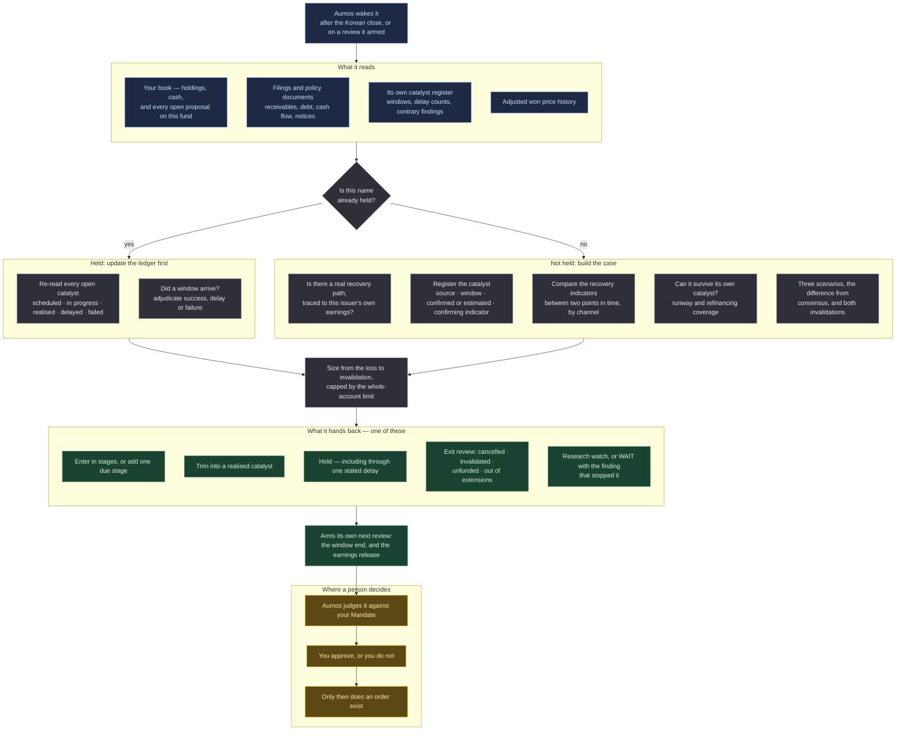

# Catalyst Turnaround

<a href="README.ko.md">한국어</a>

> Buys a Korea-listed company that broke, only when something specific and dated would repair it —
> and sells when that thing happens, or stops being coming.

## In one paragraph

Catalyst Turnaround looks for Korean companies whose business or balance sheet has deteriorated and
where a **named, sourced, dated event** would repair it: a receivable balance being recovered, a
regulated price being normalised, a loss-making division being closed, a refinancing moving from
needed to secured. It writes that event down as a record with a source, a window, and the exact
number in a future filing that would prove it happened — and then it manages the position by whether
that number arrives. If the event lands, it trims into the recovery. If it slips, it may hold once,
on stated new evidence and a stated cost. If it slips again and again, or is cancelled, or the
company's cash stops covering the wait, it goes to an exit review. It never records a rising share
price as a catalyst that worked.

## The methodology

The claim being tested is narrow and it is not «this is cheap». It is that **a specific, observable
event will move this specific company's cash flow, on a schedule, and the market is pricing something
else.** Everything below follows from having to be able to check that later.

### The catalyst ledger

The centre of this manager is a record rather than a score. Every catalyst it registers carries: what
kind of event it is, the primary document it came from, when that document was published, whether the
date is **confirmed or estimated**, the window it is expected in, the indicator that will confirm it,
and the conditions that would count as success and as failure — all written *before* the window
opens.

While a position is held, that record moves through five states: **scheduled → in progress →
realised, delayed, or failed.** Four rules make it a record rather than a narrative.

**1 — A delay costs three things.** New evidence, the return still expected from here, and the extra
downside now being accepted. Recording the same threat again is not new evidence. After two
extensions the question stops being *when does it land* and becomes *does this capital beat the
alternative*, compared against a benchmark, explicitly.

**2 — A delay and a cancellation are different records.** One is a window that moved; the other is an
event that will not happen. They lead to different decisions.

**3 — Realised and failed are final.** A record is not edited. A genuinely new catalyst is a new row
with its own source, which leaves the old finding readable — and contrary evidence, once filed, cannot
be quietly dropped on a later run.

**4 — Success is a number in a document.** Never the share price, in either direction. The price
enters this methodology in exactly two places: the distance to the level that would mean the thesis is
wrong, which sets the size, and the progress toward the target, which triggers the trim.

### What it deliberately does not do

- **It does not rank the market by how far things fell.** The deepest fall is not preferred for being
  the deepest, and there is no single "down-ness" score anywhere in it.
- **It does not use a low valuation multiple as a qualifying condition** — and this is a decision
  rather than an oversight. A company recovering from near-zero earnings has an enormous multiple on
  the way in and a flattering one on the way out; screening on the first would exclude the whole case
  class. Nor is a momentum oscillator a gate. Price stabilisation is a *secondary confirmation*: it
  can make the manager wait, it can never make it buy.
- **It does not treat a policy as a thesis.** A government programme can be real, funded and announced
  and still reach a given company only through an assumption nobody wrote down. Without a traced path
  from the policy to *this issuer's* earnings, the name stays a research candidate.
- **It does not net offsetting effects.** In the kind of case this was written from, the receivable
  balance, the regulated price, the input cost and the overseas result all move at once, sometimes
  against each other. They are tracked as four separate channels, and an effect that is *derived* from
  another — the interest that stops accruing on a falling balance — is recorded and not counted twice.
- **It does not confuse "we could not read it" with "this is wrong".** A figure that could not be read
  is an absence, and an absence is never a refutation.

### Words this page uses

| | |
|---|---|
| **Catalyst** | a specific, dated, sourced event that would change this company's finances — not a theme and not a hope |
| **Confirming indicator** | the number, in a named part of a future filing, whose arrival proves the catalyst happened |
| **Invalidation** | two things: a *price* level, which sizes the position, and a *business* condition, which closes it |
| **Runway** | how many months the company's liquid assets cover its cash burn. It has to outlast its own catalyst |
| **Refinancing coverage** | cash plus committed refinancing, against debt falling due within a year. Below 1.0 the company needs money nobody has promised |
| **Channel** | one route by which the recovery shows up — a receivable balance, a regulated price, an input cost, an overseas result |
| **Staged plan** | an entry built in parts, each with its own size, its own date-or-price condition and its own expiry |

## How a run works

One run, one proposal. Nothing below places an order.

**Legend** — 🟦 what it reads · ⬜ what it works out on its own · 🟩 what it hands back · 🟧 where a
person decides.

**Cadence.** A risk review after the Korean close on every held position; a WATCH on each open
catalyst's window and on the disclosures that carry its confirming indicator; and a review around the
earnings release that can confirm it — before, so the scenarios are written down, and after, so they
are scored. Every judgement it submits arms the next one, including the judgements that conclude there
is nothing to do. Your Aumos may refuse an arming, and the review interval stored for an installed
manager is whatever you confirm on the install screen.

## What it needs

| | |
|---|---|
| **Market** | Korea-listed single equities, in won. Not ETFs, not overseas listings |
| **Data sources** | filings and public policy documents through `open-dart` for the receivable, working-capital, debt and cash-flow lines; a connected market-data login for adjusted won price history |
| **What a key costs** | an OpenDART key is free from Korea's Financial Supervisory Service on registration. The price connection is a login this fund already has; no brokerage account has to be attached for market data |
| **Its own memory** | it keeps a catalyst register — open windows, delay counts, and which contrary findings are on the record. Without it a position that has slipped three times reads as a first slip, and the manager says so rather than guessing |
| **Settings** | the catalyst horizon, the delay budget, the runway and refinancing floors, the number of improving channels required, the single-name ceiling and the trim threshold are all yours to set. The shape of the method is not: the catalyst record's required fields, the state machine, and the refusal to read a price move as success are the methodology |
| **The book** | it reads your holdings **and every open proposal on the fund**, because a name another manager has proposed and not yet filled is exposure you have already committed to |
| **Your approval** | **it proposes and never trades.** Every judgement is a proposal your Aumos judges against your Mandate and you approve or refuse |

## What it is bad at

- **The value trap with a date on it.** Everything this methodology asks for can be satisfied by a
  company that is simply declining slowly: a real event, a real window, a real improving quarter, and
  a business that keeps getting worse underneath. The invalidation conditions are the defence and they
  are not a complete one.
- **Waiting.** A catalyst that slips twice costs a year of capital, and nothing charges the position
  for that on a statement. The delay budget is a blunt instrument aimed at a real failure mode, and it
  will sometimes force a review on a thesis that was about to be right.
- **Policy.** Half of what it can find in Korea depends on a decision by a ministry or a regulator,
  and that decision is not forecastable from a filing. It can measure the execution; it cannot
  anticipate the reversal.
- **Dilution.** The companies this finds are frequently the companies that need money. A correct
  business thesis funded by an equity raise is a wrong per-share thesis, and the manager states the
  risk rather than pricing it.
- **The quiet one: it is at its least comfortable when it is working.** The run that adjudicates a
  deadline as a failure and proposes an exit is the run that will look worst if the event arrives two
  months later.

**Do not install this** if you want a manager that will hold something indefinitely because the story
is still good, one that reacts to price, or one that will treat a policy announcement as a position.

## Notes

**The maintainer-facing document is [`ARCHITECTURE.md`](ARCHITECTURE.md)** — what is in the
deterministic core and why, which parts were derived from the `evidence-gated` package, which fixtures
stand behind which rule, and what the host owns rather than this package.

**This package shows no returns, and there is a specific claim it is refusing to make.** The
methodology is ported from a private research harness whose author reported a result on the reference
case. That result was never re-audited in this design; it is not a validated edge, it is not this
package's track record, and no threshold in this package was chosen to reproduce it. A forward track
record takes calendar time rather than compute, and nothing on this page is one.

**The reference case is a shape, not a rule.** The 미수금 회수 / 요금 정상화 thesis that this
methodology was written from is a policy-and-balance-sheet turnaround, and it is used in this
package's fixtures to check that such a case classifies correctly and is not excluded for having an
unattractive valuation multiple. There is no rule anywhere in this package that mentions any specific
company, and the fixtures deliberately include a variant of the same case that does **not** reach a
purchase.

**Sectors: which one this package computes, and which one it only receives.** This manager makes no
judgement about what business a company is in — its case work is about an *event* and a balance
sheet, not an industry — so it has no view of its own to offer on sector classification. What it
does now do is read a sector ceiling if your Mandate states one. It used to read only the
single-name limit, and "this package has no sector concept, therefore it cannot break a sector
limit" was never a proof of anything: the host does not enforce that ceiling and this package was
not receiving it, so under such a Mandate a correct-looking answer could take the account through a
limit you had declared. **If a sector ceiling is stated and the account's sector classification is
incomplete — the candidate, or any position or open proposal in the book — this manager opens
nothing and adds no stage.** It waits, names the row it could not classify, and records it as
missing data. Closing out, reducing on an invalidation, resizing to a risk limit and holding through
a delay are untouched: what an unverifiable ceiling withholds is the increase.

**Running it beside other managers.** Exposure is measured across the whole account — real holdings
and open proposals together — and per-strategy limits do not add up into a larger account limit. If
you run this alongside another Korea manager, the single-name ceiling you set on the account is the
one that binds, and this package will refuse a position rather than take its own share of a limit
somebody else has already used.

**Provenance.** This is a port; [`NOTICE.md`](NOTICE.md) carries the upstream repository, the pinned
commit and the copyright line. No account data, credentials, order implementation or private ledger
from that repository is included, and every figure in this package's fixtures is illustrative and was
written here.
