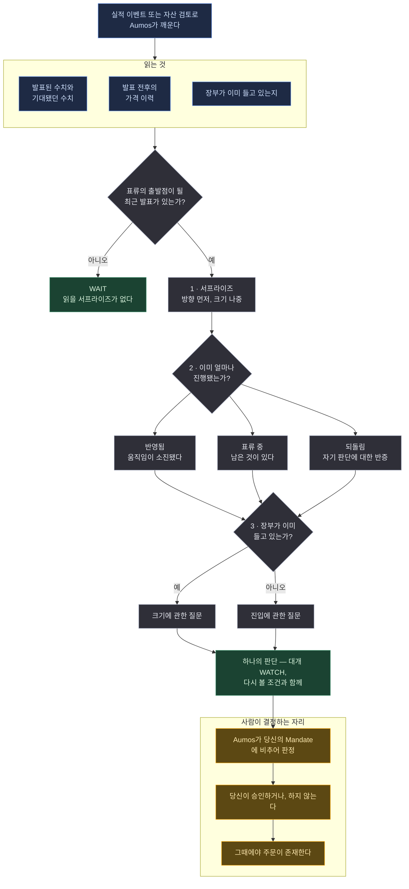

# Earnings Drift Watcher

<a href="README.md">English</a>

> 기업이 실적을 발표한 뒤, 시장은 반응을 끝냈는가 — 아니면 아직 남은 움직임이 있는가?

## 한 문단 요약

기업이 애널리스트 기대를 웃돌거나 밑도는 실적을 내놓으면, 주가는 그날 하루에 조정을 끝내지
않는다. 몇 주에 걸쳐 같은 방향으로 계속 흘러가는 경향이 있다. 잘 기록된 현상이고, 동시에 가장
많이 거래되는 현상이기도 하다. 그래서 흥미로운 질문은 *그게 존재하느냐*가 아니라 **당신이 보고
있는 시점에 이미 얼마나 진행됐느냐**다. 이 매니저가 판단하는 것은 그것 전부다. 정직한 답이
대개 "거의 다 됐으니 나중에 다시 물어라"이기 때문에, 이 매니저의 대표적인 답은 거래가 아니라
WATCH다.

## 방법론

**실적 발표 후 표류(post-earnings-announcement drift).** 사건 하나, 숫자 하나, 그리고 정해진
순서의 질문 셋.

*이 페이지가 쓰는 용어를 쉬운 말로:*

| | |
|---|---|
| **서프라이즈** | 기업이 발표한 값과 애널리스트가 기대한 값의 차이 |
| **표류(drift)** | 그 차이의 방향으로 가격이 몇 주간 계속 움직이는 경향 |
| **이미 반영됨** | 움직임이 이미 일어났으므로 남은 것이 없다 |
| **되돌림(faded)** | 움직였다가 되돌아왔다. 기회가 아니라 자기 판단에 대한 반증이다 |
| **WATCH** | 지금 거래를 제안하는 대신, 다시 볼 조건을 걸어두는 판단 |

| 단계 | 무엇을 확정하는가 |
|---|---|
| 1 — 서프라이즈 | 무엇이 발표됐고, 무엇이 기대됐고, 그 차이는 얼마인가 — **방향**을 먼저, 크기를 나중에 말한다. 확신할 수 있는 쪽이 방향이기 때문이다 |
| 2 — 얼마나 진행됐나 | 반영됨 · 표류 중 · 되돌림. 같은 펀더멘털 사실이 이 답에 따라 정반대 판단을 낳는다 |
| 3 — 누구의 질문인가 | 이미 보유한 종목의 표류는 **크기**에 관한 질문이고, 보유하지 않은 종목의 표류는 **진입**에 관한 질문이다. 같은 판단이 아니다 |

**카탈로그의 다른 패키지와 무엇이 다른가.** 상향식 애널리스트는 기업에서 출발하고 하향식
배분자는 리스크 예산에서 출발하는데, 이것은 사건 하나와 숫자 하나에서 출발한다. 펀더멘털과
가격 이력만 읽고 그 외에는 아무것도 읽지 않는다 — 뉴스도, 과거 논지도. 그 좁음은 결함이 아니라
방법론이다: 보고된 수치와 가격밖에 못 보는 매니저는 스스로를 이야기로 설득할 수 없다.

그 결과 **대표적인 답이 거래가 아니라 WATCH**다. 표류는 타이밍에 관한 질문이고, "여기 뭔가
남았나"에 대한 정직한 답은 대개 "3주 뒤에 다시 물어라"다. 전부 거래를 제안하는 매니저들의
카탈로그는 전부 동시에 틀리는 매니저들의 카탈로그가 된다.

## 실행 흐름

한 번의 실행에 하나의 제안. 아래 어느 것도 주문을 내지 않는다.

**범례** — 🟦 읽는 것 · ⬜ 스스로 계산하는 것 · 🟩 돌려주는 것 · 🟧 사람이 결정하는 자리.

**주기.** 달력이 아니라 실적 이벤트나 자산 검토로 깨어나고, WATCH에 걸어둔 조건이 이 매니저를
다시 데려온다.

## 필요한 것

| | |
|---|---|
| **시장** | 미국 상장 주식 (`XNAS`, `XNYS`) |
| **데이터** | `source:passthrough` — 발표된 수치, 그것을 재는 기준인 기대치, 발표 전후 가격 이력. 이 기계가 자격증명을 들고 있는 데이터 소스에 묻는다 |
| **장부** | `portfolio:read` — 이미 보유 중인지. 둘 중 어느 질문인지가 여기서 갈린다 |
| **설정** | 없다. config 스키마가 없고, 문턱값은 방법론 자체다 |
| **당신의 승인** | **제안할 뿐 거래하지 않는다.** 모든 판단은 당신의 승인 대기열로 들어가고 사람이 승인한다 |

**뉴스는 일부러 읽지 않는다.** 보도를 읽는 표류 판단은 숫자를 걸친 심리 판단이다.
⚠️ §E21 이후로 이것은 없는 권한이 강제하는 제약이 아니라 프롬프트가 지켜야 하는 제약이다.
이제 하나의 권한이 투자자가 설치한 모든 소스에 닿기 때문이다.

## 약한 지점

- **실적 이벤트가 아닌 모든 것.** 최근 발표가 없는 자산 검토를 받으면 표류의 출발점이 될
  서프라이즈가 없다고 정확히 답할 것이고, 그건 당신이 몰랐던 것을 아무것도 알려주지 않는
  WAIT다.
- **사업이 좋은지 판단하는 것.** 아예 묻지 않는다. 망해가는 중에도 기대를 웃돌 수 있고, 이
  매니저는 그 상회를 읽는다.
- **되돌린 움직임.** 반전을 기회가 아니라 자기 판단에 대한 반증으로 다루도록 지시받았고,
  그래서 시장이 틀렸다가 나중에 동의한 경우들을 놓칠 것이다.
- **짧은 시계.** 판단은 사람이 손으로 승인한다. 몇 시간 안에 실행돼야만 작동하는 것은 대신
  WATCH로 적으라고 지시받는다.

**설치하지 마라** — 자주 거래를 제안하는 매니저를 원한다면, 또는 발표한 숫자 하나가 아니라
기업에 대한 견해를 형성하는 매니저를 원한다면.

## 덧붙임

이 페이지에 서 있던 안전성 주장 두 개가 철회됐고, 지우는 대신 눈에 보이게 남겨둔다. 한 번
읽은 독자가 그것이 철회됐다는 사실을 알아낼 수 있어야 하기 때문이다.

⚠️ **셸 없이 실행되지 않는다.** 이 페이지는 *"`tools`가 비어 있으므로 이 에이전트는 자기 셸도
웹도 파일시스템도 없이 실행된다"*고 적었고, Aumos가 `tools` 필드와 그 뒤의 거부 목록을 삭제한
순간 그것은 사실이 아니게 됐다. 지금 참인 것: 이 매니저의 프롬프트는 게이트웨이에 전부를
요청하므로 *판단 근거로 삼는* 모든 것이 기록에 남는다 — 그리고 실행되는 세션은 그 코딩 CLI가
싣고 있는 것을 전부 들고 있으며, 이 패키지의 무엇도 그것을 좁히지 못한다. 그 세션을 가두는
것은 투자자 자신의 기계에서 Aumos가 CLI를 실행하는 OS 계정이다.

⚠️ **그 이전에 빈 도구 목록이 사주던 것.** §E21 이전까지 그것은 *닫힌 레인*을 뜻했고, 닫힌
레인은 "셸 없음" 이상이었다: 게이트웨이가 각 벤더를 읽고, 답을 포트에 매핑하고, 모든 사실에
날짜를 찍고, 판단이 고정된 시점 이후에 발행된 것은 거부했다. 이제 포트는 없다. 데이터 소스는
Aumos가 자격증명을 들고 있는 벤더이고, `source_request`는 벤더가 보낸 것을 — 읽지 않은 채 —
그대로 돌려주며, 무엇도 그것을 `asOf`에 고정하지 않는다. 그러니 *무엇을 언제 알 수 있었는가*가
주제 전부인 매니저에 대해 정직한 진술은 이렇다: 시간 창을 정직하게 지키는 것은 **프롬프트**이고,
무엇을 물었는지의 기록을 지키는 것이 게이트웨이다.

Aumos는 이 패키지가 실적을 쌓기 전까지 어떤 수익률도 보여주지 않는다. 포워드 트랙레코드는
연산이 아니라 달력 시간을 요구하고, 이 페이지의 어떤 것도 트랙레코드가 아니다.
