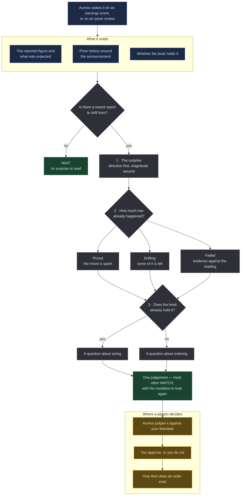

# Earnings Drift Watcher

<a href="README.ko.md">한국어</a>

> After a company reports results, has the market finished reacting — or is there still
> some of the move left?

## In one paragraph

When a company reports earnings that beat or miss what analysts expected, the share price
does not finish adjusting on the day. It tends to keep drifting in the same direction for
weeks. That is a well-documented pattern, and it is also one of the most heavily traded,
which means the interesting question is not *does it exist* but **how much of it has
already happened by the time you are looking**. That is the whole of what this manager
judges. Because the honest answer is usually "most of it, ask again later", its
characteristic answer is WATCH rather than a trade.

## The methodology

**Post-earnings-announcement drift.** One event, one number, and three questions in a
fixed order.

*Words this page uses, in plain terms:*

| | |
|---|---|
| **Surprise** | the gap between what a company reported and what analysts expected |
| **Drift** | the tendency of a price to keep moving in the direction of that surprise for weeks afterwards |
| **Priced in** | the move has already happened, so there is nothing left to capture |
| **Faded** | the price moved and then went back. Evidence against the reading, not an opportunity |
| **WATCH** | a judgement that arms a condition to look again, rather than proposing a trade now |

| stage | what it establishes |
|---|---|
| 1 — the surprise | what was reported, what was expected, and the difference — stated as a **direction** first and a magnitude second, because the direction is the confident part |
| 2 — how much has happened | priced, drifting, or faded. The same fundamental fact produces opposite judgements depending on the answer |
| 3 — whose question it is | drift on a position the book already holds is about **sizing**; drift on one it does not is about **entering**. They are not the same judgement |

**What makes it different from the other packages in the catalogue.** It reasons from one
event and one number, where a bottom-up analyst reasons from a company and a top-down
allocator reasons from a risk budget. It reads fundamentals and price history and nothing
else — no news, no thesis history — and that narrowness is the methodology rather than a
gap in it: a manager that can only see the reported figure and the price cannot talk
itself into a story.

The consequence is that **its characteristic answer is WATCH**, not a trade. Drift is a
question about timing, and the honest answer to "is there anything left in this" is
usually "ask again in three weeks". A catalogue of managers that all propose trades would
be a catalogue of managers that are all wrong at the same time.

## How a run works

One run, one proposal. Nothing below places an order.

**Legend** — 🟦 what it reads · ⬜ what it works out on its own · 🟩 what it hands back ·
🟧 where a person decides.

**Cadence.** It is woken by an earnings event or an asset review rather than by a
calendar, and the condition it arms on a WATCH is what brings it back.

## What it needs

| | |
|---|---|
| **Market** | US-listed equities (`XNAS`, `XNYS`) |
| **Data** | `source:passthrough` — the reported figure, the expectation it is measured against, and the price history around the announcement, asked of the data sources this machine holds credentials for |
| **The book** | `portfolio:read` — whether you already hold it, which decides which of the two questions is being asked |
| **Settings** | none. There is no config schema; the thresholds are the methodology |
| **Your approval** | **it proposes and never trades.** Every judgement enters your approval queue and a person approves it |

**No headlines, deliberately.** A drift judgement that reads the coverage is a sentiment
judgement wearing a number. ⚠️ Since §E21 that is a restraint the prompt has to keep
rather than one a missing capability enforces, because one capability now reaches every
source the investor installed.

## What it is bad at

- **Anything that is not an earnings event.** Given an asset review with no recent report
  it will correctly say there is no surprise to drift from, which is a WAIT that tells you
  nothing you did not know.
- **Judging whether the business is good.** It never asks. A company can beat expectations
  on its way out of business and this manager will read the beat.
- **Faded moves.** It is instructed to treat a reversal as evidence against its own
  reading rather than as an opportunity, and it will therefore miss the cases where the
  market was wrong and later agreed with it.
- **Short horizons.** Its judgements are approved by a person by hand. Anything that only
  works if executed within hours is something it is told to write as a WATCH instead.

**Do not install this** if you want a manager that will propose trades often, or one that
forms a view about a company rather than about one number it reported.

## Notes

Two safety claims that used to stand on this page were withdrawn, and are kept visible
rather than deleted, because a reader who saw one once should be able to find out that it
was withdrawn.

⚠️ **It is not launched with no shell.** This page said *"`tools` is empty, so this agent
is launched with no shell, no web and no filesystem of its own"*, and that stopped being
true when Aumos deleted the `tools` field and the deny list behind it. What is true now:
this manager's prompt asks the gateway for everything, so everything it *reasons from* is
on the record — and the session it runs in holds whatever its coding CLI ships, which
nothing in this package can narrow. What contains that session is the OS account Aumos
launches it as, on the investor's own machine.

⚠️ **And what the empty tool list stopped buying before that.** Until §E21 it meant the
*closed lane*, and the closed lane meant more than "no shell": the gateway read each
vendor, mapped the answer onto a port, dated every fact and refused anything published
after the instant the judgement was pinned to. There are no ports now. A data source is a
vendor Aumos holds a credential for, `source_request` hands back what that vendor sent —
unread — and nothing clamps it to `asOf`. So for a manager whose entire subject is *what
was knowable when*, the honest statement is that the **prompt** is what keeps the window
honest, and the gateway is what keeps the record of what was asked.

Aumos shows no returns for this package until it has earned some. A forward track record
takes calendar time rather than compute, and nothing on this page is one.
