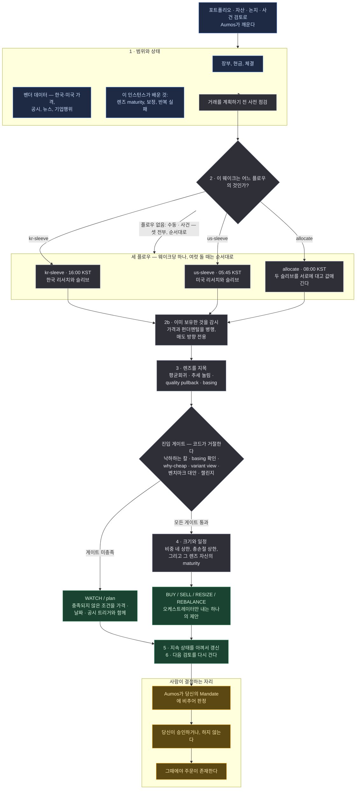

# Evidence-Gated Allocator

<a href="README.md">English</a>

> 기계 신호 하나만으로는 아무것도 사지 않는다. 적어둔 논거, 그 논거에 반하는 논거, 그리고 이
> *종류*의 판단이 실제로 통했다는 기록이 있어야 크게 잡는다.

## 한 문단 요약

화면에서 기회처럼 보이는 것의 대부분은 그냥 화면이다. 이 매니저는 스캐너 점수를 무언가를
**조사할** 이유로 다루지, 살 이유로는 절대 다루지 않는다. 새 포지션을 제안하기 전에 이것들을
요구한다: 틀렸음이 증명될 수 있는 주장, *왜* 싼지에 대한 설명, 그냥 지수를 사는 것보다 낫다는
논증, 그리고 그 논거를 무너뜨리려고 시도한 적대적 검토. 그리고 확신이 아니라 실적으로 크기를
정한다: 이 *종류*의 판단이 독립적인 포워드 증거를 충분히 쌓기 전까지 제안할 수 있는 최대치는
작은 통제된 실험이다 — 작되, 실행할 수 없을 만큼 작지는 않다: 실험 상한은 장부의 비율 **또는**
그 거래소에서 열 만한 최소 규모 중 큰 쪽이고, 둘 다 안 되는 작은 장부에서는 호가와 수수료가
삼켜 버릴 주문을 내는 대신 그렇다고 말한다. 한국과 미국을 한 매니저에서 다루고, 실행당 정확히
하나의 제안을 낸다.

이것은 `morethanmin/trading-harness`의 방법론과 검증 루프를 옮긴 **이식본**이다 — 그 하네스의
개인 데이터나 주문 스택이 아니라. 증권사 연동, 수량, 주문 유형, 지정가, 승인, 체결은 전부 Aumos에
남는다. **이 패키지에는 주문 코드가 없다.**

## 방법론

포트폴리오의 무엇이든 바뀌기 전에, 이 순서로 던지는 두 질문:

1. **반증 가능한 논지와, 반대 증거와, 그냥 벤치마크를 사는 것보다 나은 논거가 있는가?**
2. **이 종류의 판단이 그 크기를 받을 만큼 독립적인 포워드 증거를 쌓았는가?**

*이 페이지가 쓰는 용어를 쉬운 말로:*

| | |
|---|---|
| **논지(thesis)** | 미래에 대해 적어둔 주장과, 그것이 틀렸음을 증명할 조건 |
| **렌즈(lens)** | 후보를 읽는 셋업의 종류 — 싼 것이 되튀는 경우, 강한 것이 눌리는 경우 등. 렌즈마다 자기 트랙레코드를 따로 갖는다 |
| **낙하하는 칼** | 아직 떨어지는 중인 것. 권고가 아니라 코드에서 차단된다 |
| **basing** | 신저가를 더는 만들지 않고 평평해진 가격 — 하락이 끝났다는 증거 |
| **벤치마크 대안** | 정직한 비교: 이 모든 수고 없이 지수만 샀어도 비슷했는가? |
| **maturity(성숙도)** | 렌즈가 쌓은 닫힌 포워드 증거의 양. 낮은 maturity는 크기를 제한하지, 확신을 제한하지 않는다 |
| **슬리브(sleeve)** | 장부에서 한 시장이 차지하는 조각. 이 매니저는 한국 슬리브와 미국 슬리브를 굴린다 |
| **페이퍼 콜** | 돈을 걸지 않은 채 기록되고 채점되는 리서치 콜 |

**스캐너 점수는 발견이지 엣지가 아니다.** 패키지는 자기 발견 점수를 코드에서
`research-priority-only`로 라벨링한다. 나중에 읽는 사람이 기계 신호를 매수 신호로 읽을 수 없도록.

**렌즈 넷을 따로 판단한다.** 평균회귀, 추세 눌림, quality pullback, basing은 서로 다른 질문이고
서로 다른 기록을 갖는다. quality pullback은 200일 이동평균 위에서 고점 대비 15~35% 조정된
구간으로, 다른 둘이 그 사이에 떨어뜨리는 밴드다 — 좋은 종목이 싸질수록 오히려 커버리지에서
사라지는 자리.

**진입 품질은 서술이 아니라 코드가 거절한다.** 낙하하는 칼은 차단된다. 홀로 선 평균회귀 후보는
확인된 basing이나 눌림 상태를 요구받는다. 산문으로 적힌 요구사항은 지친 독자가 면제해주는
요구사항이다.

**리스크는 비중 네 축 — 종목·섹터·테마·팩터 — 그리고 모든 손절이 동시에 발동했을 때의 총손실에
상한이 걸린다.** 마지막 것은 어떤 비중 축도 재지 않는다. 총 리스크 노출 상한과, 신규 단일종목이
너무 빠르게 늘 때의 경고도 있다.

**충족되지 않은 조건은 기계가 평가할 수 있는 WATCH 항목이 된다** — 가격, 날짜 또는 공시 트리거와
만료를 달고. 사라지는 산문이 아니라.

**크기는 확신이 아니라 증거를 따른다.** 닫힌 성과가 각 렌즈의 maturity와 보정을 인스턴스의 사설
메모리에서 갱신한다. 낮은 maturity는 모든 리서치 게이트가 충족됐을 때 작은 통제된 실험을
허용한다. 자신 있는 크기를 허가하는 일은 절대 없다. 그리고 보정이 스스로 방법론을 승격하거나 다시
쓸 수는 없다 — 그건 검토된 패키지나 config 변경의 몫이다.

### 세 플로우, 한 매니저

역할들은 **이 한 매니저의 서브에이전트**이고, 순서대로 호출된다.

| 플로우 | 무엇을 소유하는가 |
|---|---|
| `kr-sleeve` | 한국 리서치와, 기록된 예산 안에서의 한국 슬리브 BUY/SELL/RESIZE |
| `us-sleeve` | 미국 리서치와 미국 슬리브. 정책상 지정된 유동성 포함 |
| `allocate` | 원/달러 슬리브 목표, FX, 장부 전체의 현금과 집중도, 그리고 시장 간 `REBALANCE` |

**대부분의 실행은 셋 중 하나만 돌린다.** 각 플로우는 자기가 맡은 시장에 맞춰 자기 웨이크를 갖는다:

| 웨이크 | KST | 그 직전에 무슨 일이 있었나 |
|---|---|---|
| `us-sleeve` | 05:45–06:45 | 미장이 닫히고 그날 봉이 완성됐다 |
| `allocate` | 08:00 | 두 시장이 다 닫혀 있고 국장은 아직 안 열렸다 — 그날 슬리브 예산을 여기서 정한다 |
| `kr-sleeve` | 16:00 | 국장이 닫히고 그날 봉이 완성됐다 |

실행은 자기를 깨운 플로우가 무엇인지 읽고 그것만 디스패치한다. 둘 이상이 도는 경우 — 수동 실행,
사건 검토, 또는 어떤 슬리브의 결론이 그 시장의 마지막 종가보다 오래됐음을 `allocate` 웨이크가
발견한 경우 — 에는 순서대로 돌고 절대 병렬이 아니다: `allocate`는 두 슬리브를 서로에 대고
값매기는데, 아직 판단 중인 슬리브를 상대로는 그럴 수 없다.

단일 슬리브 실행은 자기 슬리브에 기록된 예산 안에서 움직일 수 있다. 시장 간 `REBALANCE`는 낼 수
없다. 다른 슬리브를 보지 못한 슬리브가 장부 전체의 모양을 주장할 수는 없다.

⛔ **오케스트레이터만, 정확히 한 번 제출한다.** 한 실행은 판단 하나를 봉인하고 두 번째 제출은
거절되므로, 플로우가 제출하면 나머지 둘이 보지도 않은 판단을 봉인하면서 오케스트레이터 자신의
제출까지 함께 무너뜨린다. 프롬프트와 스킬 넷이 그렇게 적고, 페이로드가 서브에이전트를 이름 대면
호출을 거절하는 훅이 강제한다.

⚠️ **2026-08-27까지 이것은 패키지 셋이었다**(`evidence-gated-kr`·`-us`·`-global`). 나눠 둔 값이
얻는 것보다 컸다: 셋은 바이트로 똑같은 코드와 스킬을 싣고 프롬프트 네 줄과 매니페스트만 달랐다 —
한 방법론의 사본 셋이 갈라질 자유를 갖고 있었고, 투자자는 그것을 세 번 찾아 세 번 설치해야 했다.
진짜로 잃은 것은 슬리브별 채점과 슬리브별 승인이다: 트랙레코드의 행도 승인 게이트도 이제 한
매니저이고 한 바구니다.

⚠️ **슬리브별 *디스패치*도 같이 잃었고, 그건 의도가 아니었다.** 통합 전에는 각 시장의 웨이크가
서로 다른 매니저의 것이었으므로 한국 웨이크는 한국 패키지를 돌렸다. 통합 뒤 세 웨이크가 전부 같은
매니저에 도착했고, 매니저는 그때마다 세 플로우를 전부 돌렸다 — 세 배의 일, 그리고 각 슬리브가
하루에 두 번, 한 번은 아직 닫히지도 않은 봉으로 판단됐다. 스케줄러는 그 구분을 계속 유지하고
있었고, 읽는 쪽이 없었다.
[#87](https://github.com/untilled/aumos-catalogue/issues/87)에서 고쳤다.

## 실행 흐름

한 번의 실행에 하나의 제안. 아래 어느 것도 주문을 내지 않는다.

**범례** — 🟦 읽는 것 · ⬜ 스스로 계산하는 것 · 🟩 돌려주는 것 · 🟧 사람이 결정하는 자리.

**주기.** 달력이 아니라 검토나 사건으로 깨어난다. 다시 데려오는 것은 스스로 걸어둔 WATCH —
가격, 날짜 또는 공시를 트리거로 — 그리고 앞을 내다보기 위해 유지하는 리서치 일정이다.

**산술은 모델의 것이 아니다.** 스캐닝, 사이징, 커버리지, 증거 채택, 보정, 귀속, 시점 고정 파싱,
스케줄 계산은 전부 산문이 아니라 패키지 자신의 결정론 코어를 통해 돈다. 그 코어에는 파일시스템
원장도, 자격증명도, 네트워크도, DB도, 주문 접근도 없다.

## 필요한 것

| | |
|---|---|
| **시장** | 한국과 미국의 주식·ETF·현금. 롱온리 |
| **연결과 데이터 소스** | 미국 단일종목 레인은 Toss를 연결하고 `sec-edgar`를 설치한다. Alpaca가 뉴스·기업행위를 제공하며, 없으면 부여된 웹 조사로 대체한다. 완전한 한국 단일종목 펀더멘털 레인은 이 패키지와 함께 이 카탈로그에 게시된 `open-dart`를 추가로 요구한다. `openbb-fmp`는 선택이고 장기 가격 이력을 보충할 때만 쓴다 |
| **장부** | 실시간 포지션·현금·체결. 이 패키지가 아니라 Aumos와 증권사 커넥터가 계속 소유한다 |
| **설정** | 방법론이 비교하는 문턱값들. 기본 5%인 가격 충돌 허용치를 포함한다. 어느 것도 당신의 Mandate를 느슨하게 만들 수 없다 |
| **당신의 승인** | **제안할 뿐 거래하지 않는다.** 수량·주문 유형·지정가·승인·체결은 Aumos의 것이고, 모든 주문은 사람이 승인한다 |

**입력이 없을 때의 비용을, 실행이 발견하기 전에 말한다.** 매니페스트가 Toss·Alpaca는 증권사
연결로, `sec-edgar`·`open-dart`는 데이터 소스로 이름 대므로 설치 화면이 이 펀드나 기계에 무엇이
없는지 말할 수 있다.

| 누락 | 계속 가능 | 차단 |
|---|---|---|
| Toss 연결 | 기존 증거·논지 검토 | 신규 가격 신호와 목표 계산 |
| `sec-edgar` | 한국·ETF 레인 | 신규 미국 펀더멘털 BUY 또는 승격 |
| Alpaca 연결 | SEC·Toss 검토, 날짜와 URL을 남기는 웹 뉴스·기업행위 조사 | 웹도 없거나 관측을 확인하지 못한 뉴스·기업행위 주장 |
| `open-dart` | 한국 ETF와 가격/비중 관리 | 신규 한국 단일종목 펀더멘털 BUY 또는 승격 |
| CLI web | 코어·청산·비중 관리 | theme radar, variant view, 컨센서스 차이, 정책·매크로 주장 |

필요한 연결이 없는 펀드나 필요한 소스를 설치하지 않은 기계는 이름 댄 입력이 없는 것이다 — 아무도
갖지 못한 기능이 아니다. 레인이 막힌 곳에서 답은 어느 것 때문인지 말하는 판단 불가 WAIT다.

## 약한 지점

- **빠른 것.** 모든 게이트는 새 포지션을 늦추려고 존재하고, 대부분의 실행은 거래가 아니라 WATCH로
  끝난다. 그게 우유부단으로 읽힌다면 잘못 고른 패키지다.
- **variant view 없이 선언한 크기로 개별종목을 사는 것.** ⚠️ **설치 전에 읽어라. 가장 놀라기
  쉬운 지점이다.** 레인은 둘이고 사이징이 완전히 다르다. **variant view가 확인된** 후보 —
  시장과 어디서 다르게 보는지를 적은 완전한 thesis, 시장의 관점이 *무엇인지*에 대한 날짜·출처가
  붙은 인용 최소 1건, 그리고 통과한 적대적 챌린지 — 는 당신이 선언한 `maxPositionWeight`까지
  실릴 수 있다(섹터·테마·팩터 상한은 그대로 지배한다). 그것이 없는 후보는 **기계적 대조군**
  진입이다 — **자산의 1% 안팎**, 최대 3%, 레인 전체로 6%. 이 숫자들은 원본 방법론이 승인한 값
  그대로이고, 그것이 인코딩한 거래는 명시적이다: 대조군은 엣지를 논증할 필요가 없는 대신 클 수
  없다.
  ⚠️ **대부분의 후보는 대조군에 떨어지고, 그것이 정상 상태다.** 스캐너가 찾는 것은 가격 패턴이고
  가격 패턴은 공개 정보이므로 variant view가 아니다. "확인되지 않음"이 "확인됨"으로 취급되는
  경로는 없다 — 인용 누락, 미완 thesis, 조건부 챌린지 판정은 전부 대조군행이며
  (`variant_view_unverified`), 매니저는 적용되는 모든 실행에서 어느 상한이 작동 중이고 왜인지를
  말한다(`position_cap_reduced_by_maturity`).
  **승격은 여전히 주 단위가 아니라 연 단위다.** 성숙도 상한이 실제로 구속하는 자리에서 렌즈는 닫힌
  결과 30건, 독립 날짜 클러스터 10개, **서로 다른 시장 레짐 3개**로 승격된다. 앞의 둘은 후보를 더
  많이 찾으면 빨라지지만 셋째는 아니다 — 레짐은 달력이 지나야 바뀌므로 활동량으로 줄일 수 없는
  수년짜리 대기다. 그 바를 넘긴 것 없이 이번 분기에 확신 하나에 장부의 20%를 실어 줄 매니저를
  원한다면 이 매니저가 아니다.
- **원하는 만큼 오래 들고 있는 것.** 모든 비코어 포지션은 **진입 후 40거래일**이면 성과와 무관하게
  청산되고, 등록된 손절을 이탈하면 그보다 먼저 청산된다. 이것은 결함의 고백이 아니다 — 이 방법론은
  닫힌 결과로 크기를 정하는데, 아무것도 닫지 않는 장부는 자기 게이트를 영원히 닫아둔다. 그것이 이
  패키지가 실제로 있던 상태였다(청산 표본 0건). 여기서 손실은 유효한 산출물이다. 사는 것이 기록이기
  때문이다. ⚠️ 손절과 리뷰 날짜를 등록하지 않는 진입은 거부되고, 도래한 스톱을 보고하면서 청산을
  제안하지 않는 실행도 거부된다. thesis가 익을 때까지 2년을 들고 있어 줄 매니저를 원한다면 이것은
  잘못 고른 매니저다.
- **공매도와 레버리지.** 롱온리다.
- **자신의 가장 새로운 계층들.** 선행 리서치와 매도 방향 계층은 이식됐지만 그 트랙레코드는 아니다:
  *"팀의 콜이 지수와 기계 베이스라인을 **둘 다** 이기는가?"*에 답하는 비교는 닫힌 관측 창이 수개월
  쌓여야 무언가를 말한다. 그때까지 리서치 계층의 엣지는 베이스라인의 엣지와 똑같이 가설이다.
- **`open-dart` 없는 한국 펀더멘털.** 소스는 게시돼 있다. 그것이 없거나 API 키가 없는 기계는 그것을
  판단할 수 없다.
- **벤더가 틀린 모든 것.** 벤더는 자기 응답 모양을 그대로 중계한다. **날짜와 신선도를 검사하는 것은
  Aumos가 아니라 이 매니저다.**

**설치하지 마라** — 잦은 거래를 원한다면, 단일 시장 매니저를 원한다면, 또는 화면에 뜬 결과대로
움직여줄 무언가를 원한다면.

## 덧붙임

**세부는 어디 있는가.** [ARCHITECTURE.ko.md](ARCHITECTURE.ko.md)가 이 패키지의 엔지니어링
절반이다 — 어떤 상태를 누가 소유하는지, 데이터·설치 계약, 메모리 계약, 스킬, 그리고 원본 Python
하네스와의 parity 검사. `MIGRATION.md`는 레거시 실행파일 65개와 그 처리를 기록하고,
`IMPLEMENTATION.md`는 빌드 체크리스트를, `CONFORMANCE.md`는 이 저장소에서 도는 검사와 설치된
런타임이 필요한 릴리스 게이트를 분리한다.

**펀더멘털 발굴 분기는 이제 호스트 소스 저장소에서 먹는다 — 새로 생긴 것이다.**
`source-cache:read` / `source-cache:write`(Aumos 0.3.30)가 OpenDART·SEC 공시를 종목별로 보관하고
매 invocation의 `asOf`에서 잘라 준다. 그래서 이 패키지는 같은 재무제표를 매 실행 재조달하지 않으며,
더 중요하게는 **한 번도 채운 적 없는 캐시**와 **갱신이 실패한 캐시**를 구분할 수 있다. 이전에는 둘
다 빈 응답 하나였고, 그것을 읽는 분기는 어느 쪽이든 *굶었다*고만 보고했다. 그래서
`engines.aumos`는 `>=0.3.30`을 요구한다 — 더 낮은 빌드는 모르는 권한을 무시하는 대신 매니페스트
전체를 거부한다. ⛔ 사설 메모리는 캐시가 아니며 앞으로도 되지 않는다.

**그리고 같은 굶주림의 반대편 — 20% 레인에 드디어 공급 경로가 생겼다.**
`variantViewCheck`는 요구 넷으로 메인 단일종목 레인을 열고, 그중 하나인 `consensusRefs`—날짜와
출처가 있는 컨센서스 관측—은 **웹에서만 오는** 입력이다. 증권사 추정치와 목표주가는 공시에도
거래소 피드에도 없고, 매니저의 `WebSearch`/`WebFetch`는 CLI의 것이라 Aumos를 지나지 않으므로
Evidence id를 만들지 않는다 — 그리고 `evidenceIds`는 그 말고는 아무것도 받지 않는다. 이 방법론은
공급 경로를 자기가 막은 입력을 요구하고 있었고, 그 계좌는 8개 실행 동안 단일 종목을 한 주도 사지
않았다(`untilled/aumos#692`). `observation:file`(Aumos 0.3.32, `untilled/aumos#693`)가 그 경로다:
`observation_file` 도구가 URL과 발행일과 **원문 그대로의 구절**을 기록하고 해시를 덮어 Evidence id를
돌려준다. 그래서 `engines.aumos`는 `>=0.3.32`를 요구한다.

⚠️ **그 행은 이 매니저의 증언이고, 패키지는 그 사실을 조용하게 두지 않는다.** Aumos는 아무것도
가져오지 않았고 아무것도 검증하지 않았다 — 행은 모든 단계에서 `observation` / `manager:web-research`로
등급된다. 그래서 `variantViewCheck`는 수립된 컨센서스 행 각각의 등급을 게시하고, 매니저가 직접 기록한
행 위에서 메인 레인이 열리면 `effectivePositionCap`이 `main_lane_rests_on_manager_attestation`을
돌려주며, 제안은 그 코드를 `rationale.risks` 항목 하나에 출처 URL과 함께, 그리고 `uncertainty` 항목
하나에 그대로 실어야 한다 — `risks`인 이유는 승인 화면이 그것을 그리기 때문이다. 둘 중 하나라도
빠지면 `main_lane_attestation_undisclosed` / `blocked`다. ⛔ 요구 넷도, 캐도, 대조군의 1% / 6%도
바뀌지 않는다 — 거부하는 것은 레인을 **조용히** 여는 것이다. 그리고 `observationLedger`가 반대 방향의
고리를 닫는다 — 웹에서 읽고 판단에 썼는데 제출된 어느 id도 받치지 않는 값은
`claim_evidence_missing` / `blocked`이며, 그것이 2026-09-06 BOK 금리 실패를 진단으로 만든 것이다.

**그리고 그 레인의 요구 하나는 지금까지 정직하게 채울 수 없었다 — 진짜 반증 조건이 들어갈 자리가
없었다.** 메인 레인의 첫 요구는 *완결된* thesis이고, thesis가 완결되려면 `invalidationTriggers`가
있어야 한다 — 그 종목에 정들기 전에 미리 정해 두는, 무엇이 확인되면 접을 것인가다. 그런데
`validateThesis`는 `kind: 'event'`를 통째로 거부했다. 진단문은 *"producer-less event is
forbidden"*이라고 적어 놓고, 발표 주체가 있든 없든 모든 event를 거부했다 — 문장이 걸고 있던 조건이
구현된 적이 없었다. 그래서 *"자사주 매입 중단"*과 *"PF 손실 대규모 인식"* 같은, 은행 thesis가 실제로
틀리는 조건들은 버려지거나 아무도 재지 않는 level을 붙인 `metric`으로 위장해야 했다 — 후자가 더 나쁘다,
기계가 검증하는 것처럼 읽히기 때문이다. 이제 `event` 무효화는 **`producer: { publisher, document }`와
`checkBy`를 함께 갖췄을 때** 수립된다: 누가, 어느 문서로 발표하며, 언제까지 읽는가. ⛔ 이것은 게이트를
넓히는 것이 아니라 좁히는 것이다 — 같은 트리거라도 producer가 없으면 여전히 `blocked`
(`invalidation_producer_missing`), producer가 있어도 기한이 없으면 `blocked`
(`invalidation_event_undated` — *"아직 발표 안 됐다"*는 영원히 참인 답이기 때문이다), 그리고 WATCH
어휘도 캡도 승격 게이트도 대조군 수치도 하나도 움직이지 않았다.

**코어 트랜치 게이트가 이제 자기 형제가 거부하는 봉을 함께 거부한다.** `trendState`는 코어 배치를
계속할지 정하는 게이트인데, 토스 캔들 200봉을 벤더 형태 그대로 — `closePrice`·`highPrice`, 값은 전부
**문자열** — 받고서 `status: ok`, `state: "DOWNTREND"`, `trancheGuidance: "stop"`을, **진단 0건**과
`ma20`·`ma50`·`ma200` 전부 `null`인 채로 답했다. 이동평균을 하나도 계산하지 못한 것이다: 상태를
정하는 비교가 전부 `undefined > null`이라 거짓이고, 거짓이면 `DOWNTREND`이며, `DOWNTREND`는 코어
트랜치를 멈춘다. `bars.length`는 어느 형태에서든 200으로 읽히므로 이력 검사도 발동하지 않았다. 같은
계열을 `{date, open, high, low, close, volume}` 숫자형으로 넘기면 `UPTREND` / `small_or_wait`이고
`ma200`은 92,704.055 — 사흘 전 다른 봉 묶음으로 무장된 플랜의 트리거 레벨과 소수점까지 일치한다.
⛔ **검증기는 이미 이 패키지 안에 있었다**: 형제 연산 `indicators`는 바이트가 같은 행에 대해
`normalizeBars`를 돌려 전부 `bar_value_invalid`로 거부한다. 이 게이트가 그것을 부르지 않았을 뿐이고,
이제 부른다. ⚠️ **여기서 거부된 행은 «버려진 행»이 아니다** — `indicators`는 답 자체가 행별 보고라
보고하고 넘어가지만, 자본 배치를 멈추는 게이트는 «읽을 수 있었던 부분집합»으로 평균을 내고 그것을
추세라고 부를 수 없다: 읽히지 않는 행이 하나라도 있으면 답은 `state: "insufficient_data"`이고 진단이
어느 행인지 말한다. 그 뒤에 두 번째 벨트가 선다 — `ma200`이 계산되지 않았으면 어떤 경로로 그렇게
됐든 `state`도 `trancheGuidance`도 반환하지 않는다 — 그리고 `inputContracts.nested.trendState`가 행
형태를 게시한다. 게시된 계약이 `bars: "array"` 하나여서 벤더 페이로드가 그것을 만족시켰기 때문이다.

**진단 코드의 뜻을 정하는 표가 하나가 됐다 — 두 곳에 적혀 있었기 때문이다.** `mandateExecution`은
«이 북이 빈 것은 방법론이 작동한 결과인가, 게이트가 입력을 받은 적이 없어서인가»를 그 런이 보고한
코드와 어휘의 교집합으로 답하는데, 어휘는 읽는 쪽 옆에 손으로 적혀 있었고 코드는 다른 모듈 다섯이
낸다. 둘은 조용히 어긋났다 — 아무것도 매칭하지 못하는 코드는 그냥 매칭하지 않기 때문이다.
`corp_code_unmapped_symbols`(레지스트리를 읽었고 로스터 이름을 놓쳤다) · `radar_lane_starved`(레이더
자신의 낱말로 *«비어 있는 것이 아니라 먹이지 않은 것»*) · `lane_query_failed`(리서치 레인을 질의했고
쓸 수 있는 답이 없었다)를 보고한 런이 그 목록과 **0건** 교차했고, 배선이 세 단계에서 입력을 잃은 북에
대고 `no-candidate-cleared-the-gates` / `info` — *방법론이 작동 중* — 을 답했다. 목록이 찾고 있던 것은
`corp_code_mapping_pending`과 `radar_feed_produced_nothing`이었다: 실재하는 코드이지만 **다른** 연산이
다른 모듈에서 내는 것이다. ⛔ **어휘는 이제 목록이 아니라 `lib/diagnostic-codes.mjs`의 투영이다.**
행마다 코드 · 그것을 내는 연산 · 그것을 담고 있어야 하는 모듈 · 읽히는 레인을 이름 대고,
`tools/verify-evidence-gated-diagnostic-codes.mjs`가 그 모듈들을 열어 «읽는 쪽만 아는 철자»에서 빌드를
빨갛게 만든 다음, `mapCorporationCodes`·`upsideRadar`·`laneCoverage`를 실제로 돌려 그 진단을 손대지 않고
`mandateExecution`에 넘긴다. ⚠️ **그리고 `info`는 더 이상 fall-through가 아니다.** 매칭하지 못한 코드
집합이 전부 도달하던 갈래여서, 어긋난 어휘는 실패하지 않고 **안심시켰다**. 이제는 «실제로 돌아서
거절한 게이트»의 코드가 하나는 있어야 얻고, 이 연산이 아예 읽을 수 없는 코드만 보고한 런은 아무것도
보고하지 않은 런과 같은 답 — `unreported` — 을 받는다. ⛔ 원인 셋도, 그 severity도, «현금을 들고 있는
것은 절대 매수의 논거가 아니다»라는 규칙도 하나도 안 움직였다.

**그리고 반증 조건이 등록된 다음에는, 센티널이 그것에 맞는 숫자를 읽어야 한다. 읽지 않고 있었다.**
`thesisSentinel`은 증거를 `rule.evidenceId`로 찾았는데, `id`가 없는 증거 행은 전부 그 없는 키 하나에
같이 담겼다 — 그래서 행을 이름 대지 않은 조건은 미판정으로 가지 않고 **`id` 없는 행 중 마지막 것**을
빌려서 그것과 비교됐다. 실측: 조건 넷과 관측 넷에서 *"USDKRW > 1,543.40"*이 주가 113,320에 대해
`met`으로 답했다 — 113,320은 실제로 1,543.40보다 크다. 가격 행을 빼면 같은 오답이 가격 조건으로
옮겨갔고, 그것이 조인을 하고 있던 것이 키가 아니라 **자리**였다는 증거다. ⛔ 오차의 방향은 언제나
하나였다 — 빌려온 숫자는 자기 것이 아닌 임계값을 가볍게 넘고, `met`은 `threatened`이며, 그것이 셋
쌓이면 `escalationRequired`가 서고 프롬프트가 그것을 **빚진 리사이즈 또는 청산**으로 바꾼다.
**즉 이 결함은 발화한 적 없는 무효화 조건 위에 강제 매도를 제조할 수 있었다.** 이제 증거는 키로
조인된다 — `evidenceId`, 증거 행의 `invalidationId`, 그리고 metric 조건의 경우 양쪽이 공유하는
`metric`이고, 셋 다 `inputContracts`가 게시한다 — 그리고 아무것에도 조인되지 않거나 두 행에
동시에 조인되는 조건은 `unevaluated`로 답한다. 그 결과 판정은 사람이 읽는 `watch`가 된다.
⛔ 절대 `met`이 아니고(없던 위반을 지어낸다) 절대 `not-met`도 아니다(아무도 증거를 대지 않은
무효화 조건을 *검사했고 문제없다*로 보고하는 것이다).

**그리고 그 북을 재는 캡은 자기가 이름 댄 축에 실제로 닿아야 한다.** 라벨 축 셋 중 둘만 지켜지고
있었다. `concentration`은 `sector`를 단수 문자열로, `themes`·`factors`를 배열로 읽는데, 단수
`theme`은 #147부터 거절됐고 복수 `sectors`는 **읽는 곳도 거절하는 곳도 없었다.** 그것을 넘긴 런은
`exposures.sector: {}`와 **진단 0건**, 그리고 `status: ok`를 받았다 — 선언된 섹터 캡이 아무 무게와도
대조되지 않은 것이다. 통제는 한 필드 폭이다: 그 철자 하나만 단수로 바꾸면 축이 채워진다.
⛔ 실측한 런은 라벨을 가진 코어 ETF 한 종목뿐이라 무해했고, **방향은 무해하지 않다** — 캡이 적용되지
않은 축은 브리치가 그대로 통과하는 축이고, 섹터 캡은 개별주가 여럿 들어온 북에서만 구속한다.
정규화가 아니라 **거절**을 골랐다: 틀린 철자를 쓴 호출자는 다른 자리에도 그렇게 썼고, 조용히 고쳐
읽으면 두 철자가 둘 다 살아 있으면서 어느 쪽이 뜻이었는지 말하는 것이 아무것도 없다. **같은 침묵의
나머지 절반**: 투자자가 *실제로 선언한* 캡이 라벨 없는 행 위에 서면, 아무도 선언하지 않은 캡과
똑같은 빈 맵이 나왔다. 이제 그것은 `concentration_labels_unstated` / `unevaluated`이고 종목과 무게를
이름 댄다 — ⛔ `blocked`가 아니다: 이 패키지는 라벨을 스스로 하나도 선언하지 않으므로, 라벨의
부재로 북을 거절하는 것은 분류를 지어내는 일이다. 행 형태는 `inputContracts.nested.concentration`에
게시된다 — 전에는 `caps`만 말했다.

**그리고 지불할 수 없는 예산은 「예산 내」가 아니다.** `specialistBudget`은 포트폴리오 비중 둘을
비교해 `withinBriefBudget`을 답했고, 통화가 둘인 북에서 그것은 슬리브가 물은 질문이 아니다. 실측한
호출 — `us-sleeve`·`XNYS`·현재 0.11370454·브리프 예산 0.26488897 — 은 `allowed: true`,
`withinBriefBudget: true`, **진단 0건**으로 돌아왔는데, 그 예산 ≈ USD 3,979에 대해 이 북이 든 유휴
달러는 **USD 294.02**였다. 차액은 원화를 환전하거나 KR 자산을 팔아야만 존재한다. 가린 것은
**집계값**이다: `portfolio_read`의 `cash`가 USD 8,596.10이었고 그중 **96.6%가 원화**였으며, 서 있던
`allocate` 플랜은 존재하지 않는 *"유휴 USD 8,514.73"*에 대해 투자자에게 묻고 있었다. 통화는
**예산이 아니라 현금**에 붙였다: 비율로 표현된 한도에는 통화가 없다 — 하나의 FX가 분자와 분모를 같은
배율로 스케일하기 때문이고, 호스트가 바로 옆 질문에서 그것을 이미 정했다(aumos#689). 통화를 갖는 것은
**레벨**이고 조달은 레벨이다. 그래서 조달 통화는 **시장에서 유도되고**(`XKRX` → KRW, `XNAS`·`XNYS` →
USD) 호출자가 선언하지 않으며, 현금은 `portfolio.cashByCurrency`에서 통화별로 읽고, 환율은
`portfolio.fxRates`이며 답이 **그 출처를 이름 댄다** — 이 패키지는 환율을 스스로 소싱하지 않는다.
⚠️ 조달 불가는 **경고**다: 환전도 다른 슬리브 매도도 합법적 선택지이고, 둘 다 `allocate`의 판정이자
투자자의 승인 사항이다. ⛔ 허용되지 않는 것은 **침묵**이다 — 조달 입력이 없는 호출은 이제 기다리는
키를 이름 대는 `sleeve_budget_fundability_unevaluated` / `unevaluated`이고
`budgetFundableInSleeveCurrency`가 `withinBriefBudget` 옆에서 `null`이다. 전에는 `status: ok`와 빈
진단 배열이었다.

**선언된 권한 둘은 현재 아무것도 서빙하지 않는다.** `thesis:read`와 `evidence:read`는 매니페스트
어휘에 있고, 현재 Aumos 빌드는 각각을 빈 도구 목록으로 매핑하므로 실행에 그 도구가 생기지 않는다.
프롬프트가 *가능할 때* 읽는다고 적고 매니페스트가 둘을 `optionalSkills`에 두는 이유가 정확히
그것이다. Aumos가 서빙하기 전까지 자산 주장은 invocation 페이로드와 장부의 브리프로 실행에 닿고,
패키지는 하지 못하는 조회를 하는 척하는 대신 그렇게 말한다.

**페이퍼 트랙은 인스턴스 사설 메모리에 산다 — 담을 수 있는 곳이 그것뿐이기 때문이다.** 페이퍼
콜은 주문도 체결도 없으므로 Decision이 아니다. 결과 둘이 따라오고 어느 쪽도 숨기지 않는다: 같은
장부의 다른 매니저는 이 증거를 볼 수 없고, 새 매니저 인스턴스는 트랙을 처음부터 다시 시작한다.
공유 기록이 옳은 집이지만, 런타임이 서빙하는 것은 이것이다. 처음부터 다시 시작하게 만들지 *않는*
것: 모델 교체, config 편집, 제자리 패키지 업데이트 — 행의 키가 매니저 인스턴스 하나라서 d60 창은
셋을 전부 넘겨 살아남고, 되돌리는 것은 매니저 삭제뿐이다.

**출처.** 매니페스트에 기록된 커밋의 `morethanmin/trading-harness`에서 이식했다. 자격증명, 계좌나
포지션 데이터, 캐시, 백업, 개인 thesis 텍스트, 주문 구현, 과거 성과는 넘어오지 않았다. **원본
하네스의 과거 결과는 Aumos 포워드 트랙레코드가 아니고**, 이 패키지는 그것을 트랙레코드로 주장하지
않는다. 저작자 표시는 `NOTICE.md`에 있다.

Aumos는 이 패키지가 실적을 쌓기 전까지 어떤 수익률도 보여주지 않는다. 포워드 트랙레코드는
연산이 아니라 달력 시간을 요구하고, 이 페이지의 어떤 것도 트랙레코드가 아니다.
