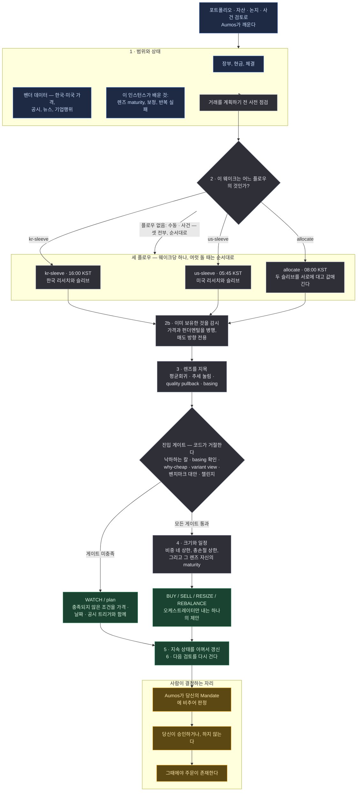

# Evidence-Gated Allocator

<a href="README.md">English</a>

> 기계 신호 하나만으로는 아무것도 사지 않는다. 적어둔 논거, 그 논거에 반하는 논거, 그리고 이
> *종류*의 판단이 실제로 통했다는 기록이 있어야 크게 잡는다.

## 한 문단 요약

화면에서 기회처럼 보이는 것의 대부분은 그냥 화면이다. 이 매니저는 스캐너 점수를 무언가를
**조사할** 이유로 다루지, 살 이유로는 절대 다루지 않는다. 새 포지션을 제안하기 전에 이것들을
요구한다: 틀렸음이 증명될 수 있는 주장, *왜* 싼지에 대한 설명, 그냥 지수를 사는 것보다 낫다는
논증, 그리고 그 논거를 무너뜨리려고 시도한 적대적 검토. 그리고 확신이 아니라 실적으로 크기를
정한다: 이 *종류*의 판단이 독립적인 포워드 증거를 충분히 쌓기 전까지 제안할 수 있는 최대치는
작은 통제된 실험이다. 한국과 미국을 한 매니저에서 다루고, 실행당 정확히 하나의 제안을 낸다.

이것은 `morethanmin/trading-harness`의 방법론과 검증 루프를 옮긴 **이식본**이다 — 그 하네스의
개인 데이터나 주문 스택이 아니라. 증권사 연동, 수량, 주문 유형, 지정가, 승인, 체결은 전부 Aumos에
남는다. **이 패키지에는 주문 코드가 없다.**

## 방법론

포트폴리오의 무엇이든 바뀌기 전에, 이 순서로 던지는 두 질문:

1. **반증 가능한 논지와, 반대 증거와, 그냥 벤치마크를 사는 것보다 나은 논거가 있는가?**
2. **이 종류의 판단이 그 크기를 받을 만큼 독립적인 포워드 증거를 쌓았는가?**

*이 페이지가 쓰는 용어를 쉬운 말로:*

| | |
|---|---|
| **논지(thesis)** | 미래에 대해 적어둔 주장과, 그것이 틀렸음을 증명할 조건 |
| **렌즈(lens)** | 후보를 읽는 셋업의 종류 — 싼 것이 되튀는 경우, 강한 것이 눌리는 경우 등. 렌즈마다 자기 트랙레코드를 따로 갖는다 |
| **낙하하는 칼** | 아직 떨어지는 중인 것. 권고가 아니라 코드에서 차단된다 |
| **basing** | 신저가를 더는 만들지 않고 평평해진 가격 — 하락이 끝났다는 증거 |
| **벤치마크 대안** | 정직한 비교: 이 모든 수고 없이 지수만 샀어도 비슷했는가? |
| **maturity(성숙도)** | 렌즈가 쌓은 닫힌 포워드 증거의 양. 낮은 maturity는 크기를 제한하지, 확신을 제한하지 않는다 |
| **슬리브(sleeve)** | 장부에서 한 시장이 차지하는 조각. 이 매니저는 한국 슬리브와 미국 슬리브를 굴린다 |
| **페이퍼 콜** | 돈을 걸지 않은 채 기록되고 채점되는 리서치 콜 |

**스캐너 점수는 발견이지 엣지가 아니다.** 패키지는 자기 발견 점수를 코드에서
`research-priority-only`로 라벨링한다. 나중에 읽는 사람이 기계 신호를 매수 신호로 읽을 수 없도록.

**렌즈 넷을 따로 판단한다.** 평균회귀, 추세 눌림, quality pullback, basing은 서로 다른 질문이고
서로 다른 기록을 갖는다. quality pullback은 200일 이동평균 위에서 고점 대비 15~35% 조정된
구간으로, 다른 둘이 그 사이에 떨어뜨리는 밴드다 — 좋은 종목이 싸질수록 오히려 커버리지에서
사라지는 자리.

**진입 품질은 서술이 아니라 코드가 거절한다.** 낙하하는 칼은 차단된다. 홀로 선 평균회귀 후보는
확인된 basing이나 눌림 상태를 요구받는다. 산문으로 적힌 요구사항은 지친 독자가 면제해주는
요구사항이다.

**리스크는 비중 네 축 — 종목·섹터·테마·팩터 — 그리고 모든 손절이 동시에 발동했을 때의 총손실에
상한이 걸린다.** 마지막 것은 어떤 비중 축도 재지 않는다. 총 리스크 노출 상한과, 신규 단일종목이
너무 빠르게 늘 때의 경고도 있다.

**충족되지 않은 조건은 기계가 평가할 수 있는 WATCH 항목이 된다** — 가격, 날짜 또는 공시 트리거와
만료를 달고. 사라지는 산문이 아니라.

**크기는 확신이 아니라 증거를 따른다.** 닫힌 성과가 각 렌즈의 maturity와 보정을 인스턴스의 사설
메모리에서 갱신한다. 낮은 maturity는 모든 리서치 게이트가 충족됐을 때 작은 통제된 실험을
허용한다. 자신 있는 크기를 허가하는 일은 절대 없다. 그리고 보정이 스스로 방법론을 승격하거나 다시
쓸 수는 없다 — 그건 검토된 패키지나 config 변경의 몫이다.

### 세 플로우, 한 매니저

역할들은 **이 한 매니저의 서브에이전트**이고, 순서대로 호출된다.

| 플로우 | 무엇을 소유하는가 |
|---|---|
| `kr-sleeve` | 한국 리서치와, 기록된 예산 안에서의 한국 슬리브 BUY/SELL/RESIZE |
| `us-sleeve` | 미국 리서치와 미국 슬리브. 정책상 지정된 유동성 포함 |
| `allocate` | 원/달러 슬리브 목표, FX, 장부 전체의 현금과 집중도, 그리고 시장 간 `REBALANCE` |

**대부분의 실행은 셋 중 하나만 돌린다.** 각 플로우는 자기가 맡은 시장에 맞춰 자기 웨이크를 갖는다:

| 웨이크 | KST | 그 직전에 무슨 일이 있었나 |
|---|---|---|
| `us-sleeve` | 05:45–06:45 | 미장이 닫히고 그날 봉이 완성됐다 |
| `allocate` | 08:00 | 두 시장이 다 닫혀 있고 국장은 아직 안 열렸다 — 그날 슬리브 예산을 여기서 정한다 |
| `kr-sleeve` | 16:00 | 국장이 닫히고 그날 봉이 완성됐다 |

실행은 자기를 깨운 플로우가 무엇인지 읽고 그것만 디스패치한다. 둘 이상이 도는 경우 — 수동 실행,
사건 검토, 또는 어떤 슬리브의 결론이 그 시장의 마지막 종가보다 오래됐음을 `allocate` 웨이크가
발견한 경우 — 에는 순서대로 돌고 절대 병렬이 아니다: `allocate`는 두 슬리브를 서로에 대고
값매기는데, 아직 판단 중인 슬리브를 상대로는 그럴 수 없다.

단일 슬리브 실행은 자기 슬리브에 기록된 예산 안에서 움직일 수 있다. 시장 간 `REBALANCE`는 낼 수
없다. 다른 슬리브를 보지 못한 슬리브가 장부 전체의 모양을 주장할 수는 없다.

⛔ **오케스트레이터만, 정확히 한 번 제출한다.** 한 실행은 판단 하나를 봉인하고 두 번째 제출은
거절되므로, 플로우가 제출하면 나머지 둘이 보지도 않은 판단을 봉인하면서 오케스트레이터 자신의
제출까지 함께 무너뜨린다. 프롬프트와 스킬 넷이 그렇게 적고, 페이로드가 서브에이전트를 이름 대면
호출을 거절하는 훅이 강제한다.

⚠️ **2026-08-27까지 이것은 패키지 셋이었다**(`evidence-gated-kr`·`-us`·`-global`). 나눠 둔 값이
얻는 것보다 컸다: 셋은 바이트로 똑같은 코드와 스킬을 싣고 프롬프트 네 줄과 매니페스트만 달랐다 —
한 방법론의 사본 셋이 갈라질 자유를 갖고 있었고, 투자자는 그것을 세 번 찾아 세 번 설치해야 했다.
진짜로 잃은 것은 슬리브별 채점과 슬리브별 승인이다: 트랙레코드의 행도 승인 게이트도 이제 한
매니저이고 한 바구니다.

⚠️ **슬리브별 *디스패치*도 같이 잃었고, 그건 의도가 아니었다.** 통합 전에는 각 시장의 웨이크가
서로 다른 매니저의 것이었으므로 한국 웨이크는 한국 패키지를 돌렸다. 통합 뒤 세 웨이크가 전부 같은
매니저에 도착했고, 매니저는 그때마다 세 플로우를 전부 돌렸다 — 세 배의 일, 그리고 각 슬리브가
하루에 두 번, 한 번은 아직 닫히지도 않은 봉으로 판단됐다. 스케줄러는 그 구분을 계속 유지하고
있었고, 읽는 쪽이 없었다.
[#87](https://github.com/untilled/aumos-catalogue/issues/87)에서 고쳤다.

## 실행 흐름

한 번의 실행에 하나의 제안. 아래 어느 것도 주문을 내지 않는다.

**범례** — 🟦 읽는 것 · ⬜ 스스로 계산하는 것 · 🟩 돌려주는 것 · 🟧 사람이 결정하는 자리.

**주기.** 달력이 아니라 검토나 사건으로 깨어난다. 다시 데려오는 것은 스스로 걸어둔 WATCH —
가격, 날짜 또는 공시를 트리거로 — 그리고 앞을 내다보기 위해 유지하는 리서치 일정이다.

**산술은 모델의 것이 아니다.** 스캐닝, 사이징, 커버리지, 증거 채택, 보정, 귀속, 시점 고정 파싱,
스케줄 계산은 전부 산문이 아니라 패키지 자신의 결정론 코어를 통해 돈다. 그 코어에는 파일시스템
원장도, 자격증명도, 네트워크도, DB도, 주문 접근도 없다.

## 필요한 것

| | |
|---|---|
| **시장** | 한국과 미국의 주식·ETF·현금. 롱온리 |
| **연결과 데이터 소스** | 완전한 미국 단일종목 레인은 이 펀드에 Toss·Alpaca를 연결하고 `sec-edgar`를 설치한다. 완전한 한국 단일종목 펀더멘털 레인은 이 패키지와 함께 이 카탈로그에 게시된 `open-dart`를 추가로 요구한다. `openbb-fmp`는 선택이고 장기 가격 이력을 보충할 때만 쓴다 |
| **장부** | 실시간 포지션·현금·체결. 이 패키지가 아니라 Aumos와 증권사 커넥터가 계속 소유한다 |
| **설정** | 방법론이 비교하는 문턱값들. 기본 5%인 가격 충돌 허용치를 포함한다. 어느 것도 당신의 Mandate를 느슨하게 만들 수 없다 |
| **당신의 승인** | **제안할 뿐 거래하지 않는다.** 수량·주문 유형·지정가·승인·체결은 Aumos의 것이고, 모든 주문은 사람이 승인한다 |

**입력이 없을 때의 비용을, 실행이 발견하기 전에 말한다.** 매니페스트가 Toss·Alpaca는 증권사
연결로, `sec-edgar`·`open-dart`는 데이터 소스로 이름 대므로 설치 화면이 이 펀드나 기계에 무엇이
없는지 말할 수 있다.

| 누락 | 계속 가능 | 차단 |
|---|---|---|
| Toss 연결 | 기존 증거·논지 검토 | 신규 가격 신호와 목표 계산 |
| `sec-edgar` | 한국·ETF 레인 | 신규 미국 펀더멘털 BUY 또는 승격 |
| Alpaca 연결 | SEC·Toss 검토 | 뉴스·기업행위 확인이 필요한 신규 판단 |
| `open-dart` | 한국 ETF와 가격/비중 관리 | 신규 한국 단일종목 펀더멘털 BUY 또는 승격 |
| CLI web | 코어·청산·비중 관리 | theme radar, variant view, 컨센서스 차이, 정책·매크로 주장 |

필요한 연결이 없는 펀드나 필요한 소스를 설치하지 않은 기계는 이름 댄 입력이 없는 것이다 — 아무도
갖지 못한 기능이 아니다. 레인이 막힌 곳에서 답은 어느 것 때문인지 말하는 판단 불가 WAIT다.

## 약한 지점

- **빠른 것.** 모든 게이트는 새 포지션을 늦추려고 존재하고, 대부분의 실행은 거래가 아니라 WATCH로
  끝난다. 그게 우유부단으로 읽힌다면 잘못 고른 패키지다.
- **공매도와 레버리지.** 롱온리다.
- **자신의 가장 새로운 계층들.** 선행 리서치와 매도 방향 계층은 이식됐지만 그 트랙레코드는 아니다:
  *"팀의 콜이 지수와 기계 베이스라인을 **둘 다** 이기는가?"*에 답하는 비교는 닫힌 관측 창이 수개월
  쌓여야 무언가를 말한다. 그때까지 리서치 계층의 엣지는 베이스라인의 엣지와 똑같이 가설이다.
- **`open-dart` 없는 한국 펀더멘털.** 소스는 게시돼 있다. 그것이 없거나 API 키가 없는 기계는 그것을
  판단할 수 없다.
- **벤더가 틀린 모든 것.** 벤더는 자기 응답 모양을 그대로 중계한다. **날짜와 신선도를 검사하는 것은
  Aumos가 아니라 이 매니저다.**

**설치하지 마라** — 잦은 거래를 원한다면, 단일 시장 매니저를 원한다면, 또는 화면에 뜬 결과대로
움직여줄 무언가를 원한다면.

## 덧붙임

**세부는 어디 있는가.** [ARCHITECTURE.ko.md](ARCHITECTURE.ko.md)가 이 패키지의 엔지니어링
절반이다 — 어떤 상태를 누가 소유하는지, 데이터·설치 계약, 메모리 계약, 스킬, 그리고 원본 Python
하네스와의 parity 검사. `MIGRATION.md`는 레거시 실행파일 65개와 그 처리를 기록하고,
`IMPLEMENTATION.md`는 빌드 체크리스트를, `CONFORMANCE.md`는 이 저장소에서 도는 검사와 설치된
런타임이 필요한 릴리스 게이트를 분리한다.

**선언된 권한 둘은 현재 아무것도 서빙하지 않는다.** `thesis:read`와 `evidence:read`는 매니페스트
어휘에 있고, 현재 Aumos 빌드는 각각을 빈 도구 목록으로 매핑하므로 실행에 그 도구가 생기지 않는다.
프롬프트가 *가능할 때* 읽는다고 적고 매니페스트가 둘을 `optionalSkills`에 두는 이유가 정확히
그것이다. Aumos가 서빙하기 전까지 자산 주장은 invocation 페이로드와 장부의 브리프로 실행에 닿고,
패키지는 하지 못하는 조회를 하는 척하는 대신 그렇게 말한다.

**페이퍼 트랙은 인스턴스 사설 메모리에 산다 — 담을 수 있는 곳이 그것뿐이기 때문이다.** 페이퍼
콜은 주문도 체결도 없으므로 Decision이 아니다. 결과 둘이 따라오고 어느 쪽도 숨기지 않는다: 같은
장부의 다른 매니저는 이 증거를 볼 수 없고, 새 매니저 인스턴스는 트랙을 처음부터 다시 시작한다.
공유 기록이 옳은 집이지만, 런타임이 서빙하는 것은 이것이다.

**출처.** 매니페스트에 기록된 커밋의 `morethanmin/trading-harness`에서 이식했다. 자격증명, 계좌나
포지션 데이터, 캐시, 백업, 개인 thesis 텍스트, 주문 구현, 과거 성과는 넘어오지 않았다. **원본
하네스의 과거 결과는 Aumos 포워드 트랙레코드가 아니고**, 이 패키지는 그것을 트랙레코드로 주장하지
않는다. 저작자 표시는 `NOTICE.md`에 있다.

Aumos는 이 패키지가 실적을 쌓기 전까지 어떤 수익률도 보여주지 않는다. 포워드 트랙레코드는
연산이 아니라 달력 시간을 요구하고, 이 페이지의 어떤 것도 트랙레코드가 아니다.
