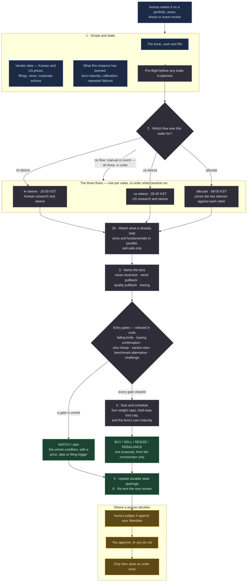

# Evidence-Gated Allocator

<a href="README.ko.md">한국어</a>

> Will not buy anything on a machine signal alone. Requires a written case, the case
> against it, and a record that this *kind* of judgement has worked before it will size
> one large.

## In one paragraph

Most of what looks like an opportunity on a screen is just a screen. This manager treats a
scanner score as a reason to **research** something, never as a reason to buy it. Before
it proposes a new position it wants a claim that could be proved wrong, an explanation of
*why* the thing is cheap, an argument that it beats simply buying the index instead, and
an adversarial review that tried to knock the case down. And it sizes from the arithmetic
rather than from confidence: a position is quarter Kelly on the candidate's own expected and
downside return, held under a risk budget derived from the declared `maxDrawdown`, with the
declared `maxPositionWeight` as the ceiling above that — ⛔ never the answer by default.
A position that comes out below the smallest order worth placing on that exchange is refused
rather than rounded up to it, because a size the arithmetic did not ask for measures the
rounding and not the idea.
⚠️ **A separate shrunken "experimental lane" was removed on 2026-09-08** at the investor's
direction (#226): this manager is attached to a real broker, every order passes a person's
approval and every judgement lands in an append-only ledger beside its forward return, so the
buying *is* the measurement. What it does not do is buy without a case: a candidate with no
checked variant view is not proposed at all.
It covers Korea and the US in one manager, and returns exactly one proposal per run.

It is a **port** of the methodology and validation loop of `morethanmin/trading-harness` —
not that harness's personal data or order stack. Broker integration, quantities, order
type, limits, approval and execution stay entirely with Aumos; **this package contains no
order code.**

## The methodology

Two questions, asked in this order, before anything in the portfolio changes:

1. **Is there a falsifiable thesis, opposing evidence, and a better case than simply
   buying the benchmark?**
2. **Has this kind of judgement accumulated enough independent forward evidence to deserve
   its size?**

*Words this page uses, in plain terms:*

| | |
|---|---|
| **Thesis** | a written claim about the future, and the condition that would prove it wrong |
| **Lens** | the kind of setup a candidate is being read through — a cheap thing bouncing back, a strong thing dipping, and so on. Each lens keeps its own track record |
| **Falling knife** | something still falling. Blocked in code, not merely discouraged |
| **Basing** | a price that has stopped making new lows and gone flat — the evidence that the fall is over |
| **Benchmark alternative** | the honest comparison: would the index have done as well, with none of this work? |
| **Maturity** | how much closed forward evidence a lens has. Low maturity caps the size, never the confidence |
| **Sleeve** | one market's slice of the book. This manager runs a Korean one and a US one |
| **Paper call** | a research call recorded and scored without any money behind it |

**A scanner score is discovery, not edge.** The package labels its own discovery score
`research-priority-only` in code, so a machine signal cannot be read as a buy signal by a
later reader.

**Four lenses, judged separately.** Mean reversion, trend pullback, quality pullback and
basing are different questions and keep different records. Quality pullback is the 15–35%
-off-high band above the 200-day average that the other two drop between them — where a
quality name gets *less* covered the cheaper it becomes.

**Entry quality is refused in code rather than described.** A falling knife blocks. A
mean-reversion candidate standing alone needs a confirmed basing or pullback state. A
requirement written as prose is a requirement a tired reader waives.

**Risk is capped on four weight axes** — position, sector, theme and factor — **and on
total loss if every stop fired at once**, which none of the weight axes measures. There is
also a ceiling on total risk exposure and a warning when new single names are being added
too quickly.

**Conditions that are not met become machine-evaluable WATCH entries**, with a price, a
date or a filing trigger and an expiry — rather than prose that disappears.

**Size follows evidence, not conviction.** Closed outcomes update each lens's maturity and
calibration in the instance's own private folder. Low maturity permits a small controlled
experiment when every research gate is complete; it never licenses confident sizing. And
calibration cannot promote or rewrite a methodology on its own — that takes a reviewed
package or config change.

### Three flows, one manager

The roles are **subagents of this one manager**, dispatched in order.

| flow | what it owns |
|---|---|
| `kr-sleeve` | Korean research and the Korean sleeve's BUY/SELL/RESIZE, inside the recorded budget |
| `us-sleeve` | US research and the US sleeve, including policy-designated liquidity |
| `allocate` | the won/dollar sleeve targets, FX, book-wide cash and concentration, and the cross-market `REBALANCE` |

**Most runs dispatch one of them, not all three.** Each flow has its own wake, timed to the
market it owns:

| wake | KST | what has just happened |
|---|---|---|
| `us-sleeve` | 05:45–06:45 | the US session closed and its bar is complete |
| `allocate` | 08:00 | both markets are closed and the Korean one has not opened — the day's sleeve budgets are set here |
| `kr-sleeve` | 16:00 | the Korean session closed and its bar is complete |

A run reads which flow woke it and dispatches that one. When more than one runs — a manual
run, an event review, or an `allocate` wake that finds a sleeve's conclusion older than that
market's last close — they run in order and never in parallel: `allocate` prices the two
sleeves against each other and cannot do that against a sleeve that is still deciding.

A single-sleeve run may act inside its own sleeve's recorded budget. It may not propose the
cross-market `REBALANCE`; a sleeve that never saw the other one cannot claim the shape of the
whole book.

⛔ **Only the orchestrator submits, and exactly once.** A run seals one judgement and a
second submission is refused, so a flow that submitted would seal a judgement the other two
never saw and take the orchestrator's own down with it. This is said in the prompt, in all
four skills, and enforced by a hook that refuses the call when the payload names a
subagent.

⚠️ **This was three packages until 2026-08-27** (`evidence-gated-kr`, `-us`, `-global`),
and the split cost more than it bought: the three shipped byte-identical code and skills,
differing only in four lines of prompt and their manifests — three copies of one
methodology, free to drift, that an investor had to find and install three times. What is
genuinely lost is per-sleeve scoring and per-sleeve approval: the track record's row and
the approval gate are now one manager and one basket.

⚠️ **Per-sleeve *dispatch* was lost too, and that was not intended.** Before the merge each
market's wake belonged to a different manager, so a Korean wake ran the Korean package. After
it, all three wakes reached the same manager and it ran all three flows on each of them —
three times the work, with each sleeve judged twice a day, once on a bar that had not closed
yet. The scheduler had kept the distinction the whole time; nothing read it. Fixed in
[#87](https://github.com/untilled/aumos-catalogue/issues/87).

## How a run works

One run, one proposal. Nothing below places an order.

**Legend** — 🟦 what it reads · ⬜ what it works out on its own · 🟩 what it hands back ·
🟧 where a person decides.

**Cadence.** It is woken by a review or an event rather than by a calendar. What brings it
back is the WATCH it armed — with a price, a date or a filing as the trigger — and the
research schedule it keeps for looking ahead.

**The arithmetic is not the model's.** Scanning, sizing, coverage, evidence admission,
calibration, attribution, point-in-time parsing and scheduling all run through the
package's own deterministic core rather than through prose. That core has no filesystem
ledger, credential, network, database or order access.

## What it needs

| | |
|---|---|
| **Markets** | Korean and US equities, ETFs and cash. Long-only |
| **Connections and data sources** | the US single-name lane links Toss and installs `sec-edgar`; Alpaca supplies news/actions, with granted web research as fallback. A complete Korean single-name fundamental lane additionally requires `open-dart`, published in this catalogue alongside this package. `openbb-fmp` is optional and only supplements long price history |
| **The book** | live positions, cash and fills, which stay owned by Aumos and the broker connector — not by this package |
| **Settings** | thresholds the methodology compares against, including the price-conflict tolerance (5% by default). None of them can loosen your Mandate |
| **Your approval** | **it proposes and never trades.** Quantities, order type, limits, approval and execution are Aumos's, and a person approves every order |

**What a missing input costs, stated before a run discovers it.** The manifest names Toss and
Alpaca as broker connections and `sec-edgar` and `open-dart` as data sources, so the install screen
can say which of them this fund or machine lacks.

| missing | continues | blocked |
|---|---|---|
| Toss connection | existing evidence and thesis review | new price signal and target calculation |
| `sec-edgar` | the Korean and ETF lane | a new US fundamental BUY or promotion |
| Alpaca connection | SEC and Toss review; news/actions through granted web research with dated URLs | news/action claims if web is also unavailable or cannot confirm the observation |
| `open-dart` | Korean ETF and price/weight management | a new Korean single-name fundamental BUY or promotion |
| CLI web | core, exit and weight management | theme radar, variant view, consensus difference, policy and macro claims |

A fund without a required connection, or a machine without a required source, is missing a named
input — not a capability nobody has. Where the lane is blocked, the answer is an unable-to-judge
WAIT that says which one.

## What it is bad at

- **Being quick.** Every gate exists to slow a new position down, and most runs end in
  WATCH rather than a trade. If that reads as indecision, this is the wrong package.
- **Buying a single name at the size you declared, without a variant view.** ⚠️ **Read this
  before you install, because it is the thing most likely to surprise you.** There are two
  lanes and they are sized very differently. A candidate whose **variant view is
  established** — a complete thesis that says where its view differs from the market, at
  least one dated and sourced citation of what the market's view *is*, and a cleared
  adversarial challenge — may be sized up to the `maxPositionWeight` you declared, subject to
  your sector, theme and factor caps. A candidate without one is a **mechanical control
  arm** entry: around **1% of the book**, at most 3%, and 6% across that whole lane. Those
  numbers are the source methodology's own approved limits, and the trade they encode is
  explicit — the control arm does not have to argue an edge, so it is not allowed to be big.
  ⚠️ **Most candidates land in the control arm, and that is the normal state.** The scanners
  find price patterns, which are public information, and a price pattern is not a variant
  view. "Not established" is never treated as established: a missing citation, an
  unfinished thesis or a conditional challenge verdict means **no position**
  (`variant_view_required_for_position`), and the manager says on every run which cap is
  operating and why (`position_cap_reduced_below_declared`).
  ⚠️ **Since #226 that gate refuses rather than shrinks.** It used to size such a candidate
  twenty times smaller and submit it; an evidence gate that doubles as a size dial is neither
  honest about the evidence nor honest about the size.
  **Promotion is still measured in years, not weeks — and it no longer gates a size.**
  A lens is promoted on 30 closed outcomes, 10 independent date clusters and **3 distinct
  market regimes**. The first two respond to finding more candidates; the third does not — a
  regime turns on the calendar, so three of them is a multi-year wait no rate of activity
  shortens. If you want a manager that will put 20% of your book into one conviction name
  this quarter without one of them clearing that bar, it is not this one.
- **Holding a name for as long as you like.** Every non-core position is closed **40 trading
  days after it was entered**, whatever it is doing, and closed again earlier if it falls
  through its registered stop. That is not a defect being disclosed: the whole methodology
  sizes on closed outcomes, and a book that never closes anything keeps its own gates shut
  forever — which is exactly the state this package was in, with zero closed samples. A loss
  is a valid output here, because the output being bought is the record. ⚠️ An entry that does
  not register its stop and its review date is refused, and a run that reports a due stop
  without proposing the exit is refused too. If you want a manager that will sit in a position
  for two years while the thesis matures, this is the wrong one.
- **Short positions and leverage.** It is long-only.
- **Its own newest layers.** The forward-research and sell-side layers are ported, but
  their track record is not: the comparison that answers *"do the team's calls beat the
  index **and** the mechanical baseline?"* needs months of closed windows before it says
  anything. Until then the research layer's edge is a hypothesis, exactly as the
  baseline's is.
- **Korean fundamentals without `open-dart`.** The source is published; a machine without
  it, or without an API key for it, cannot judge them.
- **Anything a vendor got wrong.** Vendors relay their own response shapes; **this
  manager, not Aumos, checks dates and freshness.**

**Do not install this** if you want frequent trades, a single-market manager, or something
that will act on a screen result.

## Notes

**Where the details live.** [ARCHITECTURE.md](ARCHITECTURE.md) is the engineering half of
this package — who owns which piece of state, the data and installation contract, the
memory contract, the skills, and the parity check against the original Python harness.
`MIGRATION.md` records all 65 legacy executables and their disposition; `IMPLEMENTATION.md`
tracks the build checklist and `CONFORMANCE.md` separates checks that run in this
repository from release gates that need an installed runtime. `INCIDENTS.md` holds what each rule in
`PROMPT.md` was measured against — the run that failed and the number it produced — so that the
prompt itself can stay an execution contract a run reads in one pass.

**The prices this methodology works to are now stated, and 0.6.0 needs a host that reads them.**
The stop distance this package derives and the rungs of a staged entry were always numbers it
computed, and there was nowhere in the decision contract to put them: the only way to say a price was
to arm a watch, and one *price-below* is a stop under a holding **and** an entry somebody is waiting
for on a name they do not own. `DecisionProposal.priceLevels` (Aumos 0.4.0) carries the price with
its purpose stated — `entry`, `stop`, `take-profit` — its currency, its reason in this package's own
words, and an optional link to the watch that is watching it. ⛔ Writing a price down arms nothing
and orders nothing; the approval gate is still the only road to a broker. ⚠️ No profit target is
emitted: a fair value range is a valuation, and turning its high end into a level where the book
sells is a rule this methodology never declared. ⚠️ On a host that does not read the field the run
omits it and says so, rather than losing the judgement — `HOST-FOLLOWUPS.md` carries why the version
range and that check are both needed.

**The fundamental discovery branch is fed from host source storage, and this is new.**
`source-cache:read` / `source-cache:write` (Aumos 0.3.30) hold OpenDART and SEC filings per filer,
trimmed at each invocation's `asOf`, so this package no longer re-procures the same statements every
run — and, more importantly, can tell a cache nobody has ever filled from a refresh that failed.
Both were one empty payload before, and the branch that reads them reported *starved* either way.
`engines.aumos` therefore requires `>=0.3.30`; an older build refuses the whole manifest rather than
ignoring an unknown capability. ⛔ Private memory is not and never becomes the cache.

**And the other end of the same starvation: the 20% lane finally has a supply route.**
`variantViewCheck` opens the main single-name lane on four requirements, and one of them —
`consensusRefs`, a dated consensus observation — takes an input that exists **on the web and
nowhere else**. Broker estimates and price targets are in no filing and on no exchange feed, and a
manager's `WebSearch`/`WebFetch` are the CLI's tools: they never reach Aumos, so they issue no
evidence id, and `evidenceIds` accepts nothing else. This methodology was requiring an input whose
only supply route it had closed, and the account bought no single name in eight runs
(`untilled/aumos#692`). `observation:file` (Aumos 0.3.32, `untilled/aumos#693`) is that route: the
`observation_file` tool files the URL, the publication date and **the source's own words verbatim**,
hashes the passage and returns an evidence id. `engines.aumos` therefore requires `>=0.3.32`.

⚠️ **The row is this manager's testimony, and the package never lets that go quiet.** Aumos fetched
nothing and verified nothing; the row is graded `observation` / `manager:web-research` at every step.
So `variantViewCheck` publishes the grade of each accepted consensus row, and when the main lane
opens on one the manager filed itself, `effectivePositionCap` returns
`main_lane_rests_on_manager_attestation` on `disclosures` and the proposal must carry that code
verbatim in one `rationale.risks` entry with the source URL and in one `uncertainty` entry — `risks`
because that is what the approval screen renders. `proposalDisclosure` is the operation that judges
the assembled proposal against those obligations, and missing either half is
`main_lane_attestation_undisclosed` / `blocked` there. ⛔ The arithmetic itself reads no prose since
#212 ②: a `blocked` raised from a substring reached `targetWeight`, so editing a sentence moved a
position weight.
⛔ Nothing about the four requirements, the caps or the control arm's 1% / 6% changes: what is
refused is opening the lane **quietly**. And `observationLedger` closes the loop the other way — a
value read on the web, used in judgement and supported by none of the submitted ids is
`claim_evidence_missing` / `blocked`, which is the 2026-09-06 BOK-rate failure made into a finding.
⚠️ The grade travels there too, and by evidence id: a claim citing a receipt passed in the same call
is graded by that receipt, and an id nothing in the call filed is named `claim_grade_unstated` —
because «nothing here can say» and «ungraded» are two different answers, and the main lane's
disclosure is built on which one it is.

**And the requirement behind that lane could not be met honestly until now: a real falsifier had
nowhere to go.** The main lane's first requirement is a *complete* thesis, and a thesis is complete
only with `invalidationTriggers` — what would make you drop the name, decided before you are
attached to it. `validateThesis` refused `kind: 'event'` outright, with a diagnostic that read
*"producer-less event is forbidden"* and then refused every event, produced or not. The clause it
turns on was never implemented. So *"자사주 매입 중단"* and *"PF 손실 대규모 인식"* — the two conditions
under which a bank thesis is actually wrong — had to be dropped, or dressed as a `metric` with a
level nobody measures, which is worse because it reads as machine-checked. An `event` invalidation is
now accepted **with a `producer: { publisher, document }` and a `checkBy`**: who announces the fact,
in which document, read by when. ⛔ This narrows the gate rather than widening it — the same trigger
without a producer is still `blocked` (`invalidation_producer_missing`), a producer without a
deadline is `blocked` too (`invalidation_event_undated`, because *"not announced yet"* is a true
answer forever), and no WATCH kind, cap, promotion gate or control-arm number moved.

**The core tranche gate now reads bars its own sibling would refuse.** `trendState` decides whether
core deployment continues, and it was handed two hundred Toss candle rows in the vendor's shape —
`closePrice`, `highPrice`, every value a **string** — and answered `status: ok`, `state: "DOWNTREND"`,
`trancheGuidance: "stop"`, with **zero diagnostics** and `ma20`/`ma50`/`ma200` all `null`. Not one
moving average had been computed: the comparisons that decide the state are `undefined > null`, all
false, and false is `DOWNTREND`, and `DOWNTREND` halts core tranches. `bars.length` reads 200
whichever shape the rows hold, so the history check never fired either. The same series in
`{date, open, high, low, close, volume}` numeric form answers `UPTREND` / `small_or_wait` with
`ma200` 92,704.055 — corroborated to the cent by a plan armed three days earlier off a different bar
set. ⛔ The validator was already in this package: `indicators` runs `normalizeBars` over the
byte-identical rows and refuses every one as `bar_value_invalid`. This gate simply never called it,
and now it does. ⚠️ **A rejected row is not a dropped row here** — `indicators` reports per row
because its answer *is* the report, but a gate that stops capital deployment cannot average over the
subset it happened to parse: one unreadable row and the answer is `state: "insufficient_data"` with
the rows named. A second belt stands behind it — no computed `ma200`, no `state` and no
`trancheGuidance`, whatever left it null — and `inputContracts.nested.trendState` now publishes the
row shape, since `bars: "array"` was the whole contract and a vendor payload satisfies it.

**And the answer that table produced is no longer read off a code at all — it is counted** (#212 ④).
`mandateExecution` decided *«why does this book hold no single name?»* by intersecting the
diagnostics its siblings returned with the lanes of `lib/diagnostic-codes.mjs`, and the positive
answer — `no-candidate-cleared-the-gates`, *the gates ran, on their inputs, and nothing was worth
owning* — was granted by the presence of one `gate-ran` code. ⚠️ **No input to that table counted
anything.** `active_return_below_gate` says a gate refused **one** name; it says nothing about
whether the other seventy-three were prepared, so a roster nobody had collected a price series for,
plus one gate refusing one candidate, came back as *the methodology is working*. That is
`untilled/aumos-catalogue#209`'s own error — blindness reported as an absence of opportunity —
reached through the check #171 added to stop a different one.

`untilled/aumos#724` and `#730` gave the host a research job and a research result that **count**, so
`executionRecord` reads them and answers three facts: `dataPreparation`, `candidateEvaluation` and
`eligibleCount`. ⚠️ **`untilled/aumos#743` then took half of the counting away, and took the right
half.** `research_result_get` is gone — the sweep is `task_start`/`task_get`/`task_cancel` now, and
each recipe answer is a **file** the run reads back with `files_read` — and with the settled summary
went its `sourced` and `unprepared`. Those two said *this fund held readable documents for this
name*, which is a judgement about documents that only the domain reading them makes; a common
executor making it was the app holding an investment opinion, and this package is the one that has to
hold it. So each half is counted where it is known: the host says how many items there are, how many
are left, how many answered and how many could not (`task_get`'s `total`, `pending`, `done`,
`failed`), the recipe writes `sourced` — *was I handed any document at all* — onto each answer, and
`executionRecord` derives `sourced`/`unprepared`/`evaluated` from the answers this run actually read.
⛔ Still **three reports and never summed**, the host's rule kept verbatim. `eligibleCount` is
unchanged and is this package's, derived from `eligibleSymbols`, the names the run's own fold arrived
at, because a number
a run can type is a number a run can invent. ⛔ **Absent is `null` and `[]` is `0`** — the same
three-way split `basis` keeps, where `none` is not zero, and its three words moved with the tools
(`rows` · `run` · `none`, where `rows` is *this run read its own answers back*) — and a record this
operation did not produce is refused as `execution_record_unreadable` rather than read, because an
object asserting `dataPreparation: 'prepared'` is the same inference wearing the new field's name.
⚠️ **A settled task run whose answer files were never read is `unsettled`, not `prepared`**: finishing
is the host's fact and preparing is this package's, and a count derived from answers is only as
complete as the answers read.

What was deleted, and what replaced each piece:

| deleted | replaced by |
|---|---|
| the `gate-ran` lane of `CAUSE_CODE_REGISTRY` and `CAUSE_GATE_RAN_CODES` (4 rows: `active_return_below_gate`, `challenge_not_cleared`, `thesis_incomplete`, `valuation_gap_has_no_source_for_this_instrument`) | `dataPreparation === 'prepared'` **and** `candidateEvaluation === 'evaluated'` **and** `eligibleCount === 0` on the record |
| the emission proofs for those four rows in `tools/verify-evidence-gated-diagnostic-codes.mjs` ⑴ | ⛔ nothing — the codes are still emitted and still explain *why* a candidate was refused; they grant nothing, and an assertion that no lane holds them stands in their place |
| `gateRanCodes` / `gateRanCodeVocabulary` on the response | `dataPreparation` · `candidateEvaluation` · `eligibleCount` · `executionRecordRead` · `executionBasis` |
| `!recognisedCodes.length` as the guard against an unknown code reaching the positive answer (#171) | ⛔ structural: the answer needs a counted record, so no code can grant it. The observation survives as `mandate_execution_codes_unrecognised` / `info` — said, never silent |

⚠️ **What the diagnostics still do is withdraw the answer, and that is the safe direction.** An
`input-path` code names a stage that lost an input the task run cannot see — the corp-code join
is not the price sweep — and it outranks the record; an `unresolved` code forbids the positive answer
without claiming the wiring is at fault. Reading a reason to *decline* a claim is the opposite of
reading one to grant it. ⛔ And the three absences never collapse: `'unevaluated'` is «no record»,
`'unprepared'` is «the machine looked and nothing was readable at this pin», and `0` is a
measurement. A fifth cause, `candidates-cleared-not-proposed`, exists because the record can say
something the code lane never could — names *did* clear and the book holds none of them.
⛔ Nothing blocks, nothing asks for a purchase, and no weight anywhere moved.

**One table now decides what a diagnostic code means, because it was being spelled twice.**
`mandateExecution` answers *«is this book empty because the methodology worked, or because its gates
never received their inputs?»* by intersecting the codes a run reports with a vocabulary — and the
vocabulary was written out by hand beside the reader while the codes are emitted by five other
modules. They drifted, silently, because a code that matches nothing simply does not match. A run
reporting `corp_code_unmapped_symbols` (the join read the registry and missed roster names),
`radar_lane_starved` (*"unfed rather than empty"*, in the radar's own words) and `lane_query_failed`
(the research lane was queried and answered nothing usable) intersected the list at **zero**, and was
told `no-candidate-cleared-the-gates` / `info` — *the methodology is working* — over a book whose
wiring had lost its inputs at three separate stages. The list was looking for
`corp_code_mapping_pending` and `radar_feed_produced_nothing`: real codes, emitted by *different*
operations in different modules. ⛔ **The vocabulary is not a list any more**, it is a projection of
`lib/diagnostic-codes.mjs`, where each row names the code, the operation that emits it, the module
that must contain it and the lane it is read in; `tools/verify-evidence-gated-diagnostic-codes.mjs`
opens those modules and fails the build on a spelling only the reader knows, then runs
`mapCorporationCodes`, `upsideRadar` and `laneCoverage` for real and hands their diagnostics to
`mandateExecution` unedited. ⚠️ **And `info` is no longer the fall-through.** It was the branch every
unmatched set of codes reached, so a vocabulary out of step did not fail — it reassured. It is earned
now, by at least one code from a gate that actually ran and refused; a run reporting codes this
operation cannot read at all says `unreported`, the answer it already had for a run that reported
nothing. ⛔ Nothing about the three causes, their severities or the rule that holding cash is never an
argument for buying moved.

**And once a falsifier is registered, the sentinel has to read the right number against it.** It did
not. `thesisSentinel` looked its evidence up under `rule.evidenceId`, and every evidence row carrying
no `id` was filed under the same missing key — so a rule that named no row did not go unevaluated, it
borrowed **whichever id-less row came last** and was compared against it. Measured: four rules and
four readings, and *"USDKRW above 1,543.40"* answered `met` on a share price of 113,320, which is
indeed above 1,543.40. Dropping the price row moved the same wrong answer onto the price rule, which
is the proof that position was doing the joining. ⛔ The error only ever pointed one way — a borrowed
number clears a threshold it was never scaled to, `met` is `threatened`, and three of those set
`escalationRequired`, which this prompt turns into an owed resize or liquidation. **The defect could
manufacture forced selling on an invalidation that never fired.** Evidence now joins by key —
`evidenceId`, an evidence row's `invalidationId`, or the shared `metric` of a metric rule, all three
published under `inputContracts` — and a rule that joins to nothing or to two rows at once answers
`unevaluated`. That makes the verdict `watch`, which a person reads. ⛔ It is never `met`, which
invents a breach, and never `not-met`, which would report an invalidation as checked and clear on
evidence nobody supplied.

**And the caps that book is measured against have to reach the axis they name.** Two of the three
label axes were guarded and one was not. `concentration` reads `sector` as a single string and
`themes`/`factors` as arrays; the singular `theme` had been refused since #147, and the plural
`sectors` was read by nothing and refused by nothing. A run that wrote it got `exposures.sector: {}`,
**no diagnostic**, and `status: ok` — a declared sector cap compared against nothing. The control is
one field wide: changing that spelling to the singular and nothing else fills the axis. ⛔ The run
that measured it held one labelled core ETF and was harmless, and the direction is not — the axis a
cap is not applied to is the axis a breach passes on, and a sector cap only ever binds a book that
holds several single names. All three spellings are now refused as `input_shape_invalid` rather than
normalised, because the caller who wrote the wrong one wrote it elsewhere too and a quiet rewrite
leaves both spellings alive with nothing to say which was meant. **And the other half of the same
silence:** a cap the investor *did* declare, over rows carrying no label on that axis, produced the
same empty map as a cap nobody declared. That is `concentration_labels_unstated` / `unevaluated`
now, naming the symbols and their weight — never `blocked`, because this package declares no labels
of its own and refusing a book for the absence of one would be inventing the classification. The row
shape is published under `inputContracts.nested.concentration`, which said only `caps` before.

**And a budget the book cannot pay for is not a budget it is inside.** `specialistBudget` compared
two portfolio weights and answered `withinBriefBudget`, which on a two-currency book is not the
question the sleeve asked. The measured call — `us-sleeve`, `XNYS`, current 0.11370454, Brief budget
0.26488897 — came back `allowed: true`, `withinBriefBudget: true` and **no diagnostic** over a budget
of roughly USD 3,979 on a book holding USD 294.02 in idle dollars; the difference is reachable only
by converting won or selling a KR asset. The aggregate is what hid it: `portfolio_read`'s `cash` read
USD 8,596.10 and **96.6% of it was won**, and the standing `allocate` plan was asking the investor
about *"idle USD 8,514.73"* that did not exist. The currency goes on the **cash**, not on the budget:
a limit expressed as a ratio has no currency, because one FX rate scales its numerator and its
denominator alike, and the host settled that beside this one (aumos#689) — what has a currency is a
level, and procurement is a level. So the funding currency is derived from the market (`XKRX` → KRW,
`XNAS`/`XNYS` → USD) and never declared by the caller, the cash is read per currency from
`portfolio.cashByCurrency`, and the rate is `portfolio.fxRates` with the answer naming where it came
from — this package sources none of its own. ⚠️ Unfundable is a **warning**: converting currency and
selling the other sleeve are legitimate moves, and both are `allocate`'s judgement and the investor's
approval. ⛔ What is not allowed is silence — a call carrying no procurement is
`sleeve_budget_fundability_unevaluated` / `unevaluated` naming the key it waits for, with
`budgetFundableInSleeveCurrency: null` beside `withinBriefBudget`, where it used to be `status: ok`
and an empty diagnostics array.

**And then it could not come out true.** (#250) Two defects, and each of them alone was enough to
make the funding verdict useless. `sleeveCashByCurrency` was the **only** numerator, so a sleeve
fundable entirely out of its own same-currency parking — short-duration and T-bill holdings, the rows
already carrying `parkedLiquidity: true` for the concentration axes since #141 — was told
`budgetFundableInSleeveCurrency: false` on every run, four runs running. The measurement that settles
it: write the budget down to the fundable amount, call again, and the «shortfall» matches that
sleeve's own parked market value **to the cent**. The money was there and the route was not a
conversion; it was a sale inside one currency. `sleeveParkedLiquidity` is now read per currency and
sits in the numerator, and the answer reports `fundableFromCash` and `fundableFromParking` **apart** —
because selling parking is an act that needs a proposal and holding cash is not, so a bare sum would
price the one as the other. `fundingRoute` names which of the four it is: `cash`,
`sell-parking-same-currency`, `fx-conversion`, `cross-market-sale`; the last two are still
`allocate`'s and the investor's, and the second is the sleeve's own.
The other half was arithmetic. The comparison was made in **weight** space against a `1e-9` epsilon
while the answer was printed in **cents**, and every weight in these runs is written to eight decimal
places — which carries up to five times that tolerance in rounding error. One control:
`requiredAmount 294.02`, `fundableAmount 294.02`, `shortfallAmount 0`, and
`budgetFundableInSleeveCurrency: false` with the code fired. **No budget value could pass this code
quietly**, so `mandateExecution` booked an unresolved code on every run of the flow. The verdict is
decided on the printed shortfall now — `<= 0` of the number the answer publishes — so the two cannot
disagree, and the fix is not a wider tolerance but a comparison made where the answer is stated.

**Two inputs were shape-valid and answered the opposite question.** (#251) Four traps were met in one
run; two were refused honestly and two came back confident and reversed. The `concentration` caps
are five and only two of them are the Mandate's, so a run put the other three where its settings
declare them — `config` — and got `concentration_cap_missing` / `unevaluated` three times. ⛔
`unevaluated` is not a pass, and that answer reads as one anyway: `breaches` comes back empty and
`exposures` comes back populated, so three unmeasured axes look measured and clear. They are now
`concentration_caps_misplaced` / **blocked**, naming both wrong places — the top of `config`, and the
settings block handed straight through as `config.concentration` — and `unmeasuredAxes` says outright
which axes an answer did not measure. And `specialistBudget`'s requested weight was the sleeve
**total** under a name that reads as the increment: a sleeve at 0.31471199 taking on a new 3% name
passed `0.03`, which was read as *cut this sleeve to three per cent* and came back
`increaseWeight: −0.28471199`, `allowed: true`, no diagnostic — met twice in the same run, by the
sleeve flow and by `allocate` independently. The key is `requestedSleeveTotalWeight`; the retired
spelling is refused by name, and ⛔ never read as the new one, because aliasing it would keep
answering the same reversed question. `executionRecord` was reading `data` non-null and nothing was
reading `rows[].evaluated`, which published a record saying «25 names eligible» beside «nothing was
evaluated»; either field settles it now, and a row saying neither is named rather than counted as an
answer that found nothing.

**Four more calls came back as answers about something else.** (#177) The pattern this package
records most often — *a wrong input is not refused and comes back looking like a pass* — was measured
four more times on one run, and the costliest was a **1,338.848×** NAV. `sleeveNav` read a position
row's `currency` as two facts at once: which sleeve the name belongs to, and which unit `marketValue`
is counted in. The host's `portfolio_read` marks **every** holding in the book's base currency, so a
KRW listing on a USD book arrives as a dollar figure with `valueCurrency: "USD"` beside it — a key
this operation did not read, sitting in a row where a `named` operation's unknown-key report cannot
see it. USD 4,717.16 went into the won bucket at face value: `krwSleeveNav` **11,119,948.16** against
a true 17,430,791.23, `status: ok`, no diagnostic. The two facts are separated now rather than a
spelling being guessed at: `currency` stays the currency the asset quotes in and `valueCurrency`
states the unit of the mark, converted at the rate this package is **handed** (aumos#689, the same
rule #174 settled next door), with `marketValueBasis` saying which reading was taken and
`fxUsed`/`fxBasis` where the rate came from. ⛔ A row whose value cannot be put in its sleeve's
currency is dropped and named, never counted at face value. The other three are all one shape —
a field the operation does not read, answered with a verdict. `validateMacro`'s rows are keyed by
`indicator` and not `metric`, and its ten kebab-case values were the one closed vocabulary
`inputContracts.vocabulary` did not publish; written under `metric`, every row is unusable and
`macroLaneAvailable` comes back `false`, which reads as *the policy lane is empty*. `thesisSentinel`
compares against `level` and reads `value`/`availableAt`; written as `threshold` and
`observed`/`observedAt` a price 20% through a registered invalidation joined its evidence and came
back *"Rule and evidence are not comparable"*, making the verdict `watch` instead of `threatened`.
And `specialistBudget`'s `managerId` is the literal `evidence-gated` — a run that passed its own
`inst_…`, the id every other surface of the host addresses this manager by, had the whole call
refused against a contract that said only `managerId: "string"`. All four spellings are
`input_shape_invalid` rather than dropped, and all four shapes are published.

**A capability's name and a tool's name are two vocabularies, and this paragraph used to confuse
them.** It read *"two declared capabilities currently serve nothing"* about `thesis:read` and
`evidence:read`, and that stopped being true: both are served, under spellings this package had never
written — `thesis_list`/`thesis_get` and `evidence_get`/`evidence_search`. ⛔ What no build has ever
served is `thesis_read` and `evidence_read`, which were names, not capabilities. The manifest lists
the tools it wants under `optionalSkills` for that reason, and where a session does not hold the
served pair, asset claims reach a run through the invocation payload and through the book's shared
folder — the package says so rather than implying a lookup it cannot make.

**The paper track lives in this instance's own private folder, because nothing else can hold it.** A
paper call has no order and no fill, so it is not a Decision. Two consequences follow and
neither is hidden: another manager on the same book cannot see this evidence, and a new
manager instance starts the track over. A shared record would be the right home; this is
the one the runtime serves. What does *not* start it over is a model swap, a config edit
or an in-place package update — the folder is keyed by manager instance alone, so the d60
window survives all three, and only deleting the manager resets it.

**What this manager remembers is a folder now, and three things it used to get for free are its own
to keep.** `untilled/aumos#743` deleted `memory_read`/`memory_write` and `brief_read`/`brief_write`
and replaced them with two folders: this instance's private one, read and written through
`files_list`/`files_read`/`files_write`, and the book's shared one — what a Brief was — through the
`fund_files_*` six. ⚠️ **Nothing an investor chose moved**: the same records under the same names,
the same isolation, the same ownership split, and the same refusal to keep a hidden portfolio
database there. What did move is who keeps the guarantees. A write used to append a revision and
nothing could be lost; a file is replaced, so where the earlier value has to stay readable this
package writes a **dated file beside** the current one. A read used to answer the newest revision
visible at the run's `asOf`; a read answers the bytes on disk, so the value's own `updatedAsOf` is
the only point-in-time signal and a historical replay can only read a snapshot frozen for that run.
And two writers used to be held apart by the append; they are held apart by a compare-and-swap on
the hash that was read. `engines.aumos` therefore requires `>=0.4.0`. ⚠️ **That floor is unlike the
five before it.** Those moved because a capability an older build does not know refuses the whole
manifest, and this package drops out of that build's catalogue with nobody told. No capability moved
here — the tools behind capabilities this package already declared were renamed — so an older build
does not refuse anything: it serves a grant whose tool names nothing calls, and the run reports them
absent and submits a WAIT it could have avoided. That is quieter than a refusal, which is why the
floor is stated rather than left to chance. ⛔ This package does not copy its own older records across —
Aumos exports them once, host-side, and a package writing them too would be a second writer racing
the first over paths it does not own.

**Provenance.** Ported from `morethanmin/trading-harness` at the commit recorded in the
manifest. No credentials, account or position data, caches, backups, personal thesis text,
order implementation or historical performance came across. **Historical harness results
are not an Aumos forward track record**, and this package does not claim them as one. See
`NOTICE.md` for attribution.

Aumos shows no returns for this package until it has earned some. A forward track record
takes calendar time rather than compute, and nothing on this page is one.
