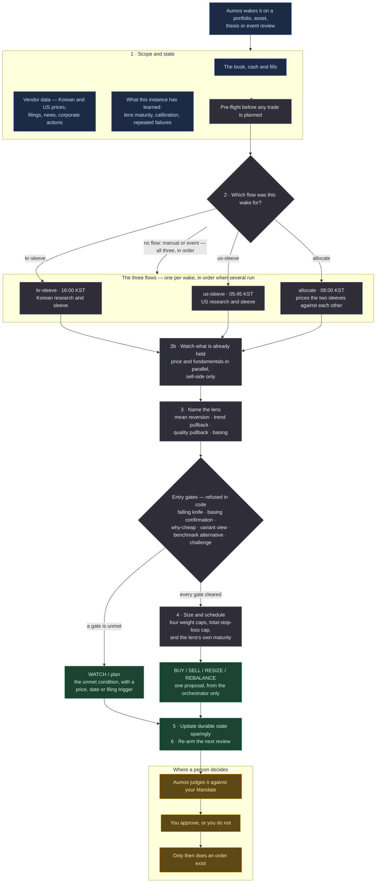

# Evidence-Gated Allocator

<a href="README.ko.md">한국어</a>

> Will not buy anything on a machine signal alone. Requires a written case, the case
> against it, and a record that this *kind* of judgement has worked before it will size
> one large.

## In one paragraph

Most of what looks like an opportunity on a screen is just a screen. This manager treats a
scanner score as a reason to **research** something, never as a reason to buy it. Before
it proposes a new position it wants a claim that could be proved wrong, an explanation of
*why* the thing is cheap, an argument that it beats simply buying the index instead, and
an adversarial review that tried to knock the case down. And it sizes by track record
rather than by confidence: until this *kind* of judgement has accumulated enough
independent forward evidence, the most it will propose is a small controlled experiment — small,
but never so small that it cannot be executed: the experimental ceiling is a percentage of the book
*or* the smallest position worth opening on that exchange, whichever is larger, and on a book too
small for either it says so rather than proposing an order that a tick and a fee would swallow.
It covers Korea and the US in one manager, and returns exactly one proposal per run.

It is a **port** of the methodology and validation loop of `morethanmin/trading-harness` —
not that harness's personal data or order stack. Broker integration, quantities, order
type, limits, approval and execution stay entirely with Aumos; **this package contains no
order code.**

## The methodology

Two questions, asked in this order, before anything in the portfolio changes:

1. **Is there a falsifiable thesis, opposing evidence, and a better case than simply
   buying the benchmark?**
2. **Has this kind of judgement accumulated enough independent forward evidence to deserve
   its size?**

*Words this page uses, in plain terms:*

| | |
|---|---|
| **Thesis** | a written claim about the future, and the condition that would prove it wrong |
| **Lens** | the kind of setup a candidate is being read through — a cheap thing bouncing back, a strong thing dipping, and so on. Each lens keeps its own track record |
| **Falling knife** | something still falling. Blocked in code, not merely discouraged |
| **Basing** | a price that has stopped making new lows and gone flat — the evidence that the fall is over |
| **Benchmark alternative** | the honest comparison: would the index have done as well, with none of this work? |
| **Maturity** | how much closed forward evidence a lens has. Low maturity caps the size, never the confidence |
| **Sleeve** | one market's slice of the book. This manager runs a Korean one and a US one |
| **Paper call** | a research call recorded and scored without any money behind it |

**A scanner score is discovery, not edge.** The package labels its own discovery score
`research-priority-only` in code, so a machine signal cannot be read as a buy signal by a
later reader.

**Four lenses, judged separately.** Mean reversion, trend pullback, quality pullback and
basing are different questions and keep different records. Quality pullback is the 15–35%
-off-high band above the 200-day average that the other two drop between them — where a
quality name gets *less* covered the cheaper it becomes.

**Entry quality is refused in code rather than described.** A falling knife blocks. A
mean-reversion candidate standing alone needs a confirmed basing or pullback state. A
requirement written as prose is a requirement a tired reader waives.

**Risk is capped on four weight axes** — position, sector, theme and factor — **and on
total loss if every stop fired at once**, which none of the weight axes measures. There is
also a ceiling on total risk exposure and a warning when new single names are being added
too quickly.

**Conditions that are not met become machine-evaluable WATCH entries**, with a price, a
date or a filing trigger and an expiry — rather than prose that disappears.

**Size follows evidence, not conviction.** Closed outcomes update each lens's maturity and
calibration in the instance's private memory. Low maturity permits a small controlled
experiment when every research gate is complete; it never licenses confident sizing. And
calibration cannot promote or rewrite a methodology on its own — that takes a reviewed
package or config change.

### Three flows, one manager

The roles are **subagents of this one manager**, dispatched in order.

| flow | what it owns |
|---|---|
| `kr-sleeve` | Korean research and the Korean sleeve's BUY/SELL/RESIZE, inside the recorded budget |
| `us-sleeve` | US research and the US sleeve, including policy-designated liquidity |
| `allocate` | the won/dollar sleeve targets, FX, book-wide cash and concentration, and the cross-market `REBALANCE` |

**Most runs dispatch one of them, not all three.** Each flow has its own wake, timed to the
market it owns:

| wake | KST | what has just happened |
|---|---|---|
| `us-sleeve` | 05:45–06:45 | the US session closed and its bar is complete |
| `allocate` | 08:00 | both markets are closed and the Korean one has not opened — the day's sleeve budgets are set here |
| `kr-sleeve` | 16:00 | the Korean session closed and its bar is complete |

A run reads which flow woke it and dispatches that one. When more than one runs — a manual
run, an event review, or an `allocate` wake that finds a sleeve's conclusion older than that
market's last close — they run in order and never in parallel: `allocate` prices the two
sleeves against each other and cannot do that against a sleeve that is still deciding.

A single-sleeve run may act inside its own sleeve's recorded budget. It may not propose the
cross-market `REBALANCE`; a sleeve that never saw the other one cannot claim the shape of the
whole book.

⛔ **Only the orchestrator submits, and exactly once.** A run seals one judgement and a
second submission is refused, so a flow that submitted would seal a judgement the other two
never saw and take the orchestrator's own down with it. This is said in the prompt, in all
four skills, and enforced by a hook that refuses the call when the payload names a
subagent.

⚠️ **This was three packages until 2026-08-27** (`evidence-gated-kr`, `-us`, `-global`),
and the split cost more than it bought: the three shipped byte-identical code and skills,
differing only in four lines of prompt and their manifests — three copies of one
methodology, free to drift, that an investor had to find and install three times. What is
genuinely lost is per-sleeve scoring and per-sleeve approval: the track record's row and
the approval gate are now one manager and one basket.

⚠️ **Per-sleeve *dispatch* was lost too, and that was not intended.** Before the merge each
market's wake belonged to a different manager, so a Korean wake ran the Korean package. After
it, all three wakes reached the same manager and it ran all three flows on each of them —
three times the work, with each sleeve judged twice a day, once on a bar that had not closed
yet. The scheduler had kept the distinction the whole time; nothing read it. Fixed in
[#87](https://github.com/untilled/aumos-catalogue/issues/87).

## How a run works

One run, one proposal. Nothing below places an order.

**Legend** — 🟦 what it reads · ⬜ what it works out on its own · 🟩 what it hands back ·
🟧 where a person decides.

**Cadence.** It is woken by a review or an event rather than by a calendar. What brings it
back is the WATCH it armed — with a price, a date or a filing as the trigger — and the
research schedule it keeps for looking ahead.

**The arithmetic is not the model's.** Scanning, sizing, coverage, evidence admission,
calibration, attribution, point-in-time parsing and scheduling all run through the
package's own deterministic core rather than through prose. That core has no filesystem
ledger, credential, network, database or order access.

## What it needs

| | |
|---|---|
| **Markets** | Korean and US equities, ETFs and cash. Long-only |
| **Connections and data sources** | the US single-name lane links Toss and installs `sec-edgar`; Alpaca supplies news/actions, with granted web research as fallback. A complete Korean single-name fundamental lane additionally requires `open-dart`, published in this catalogue alongside this package. `openbb-fmp` is optional and only supplements long price history |
| **The book** | live positions, cash and fills, which stay owned by Aumos and the broker connector — not by this package |
| **Settings** | thresholds the methodology compares against, including the price-conflict tolerance (5% by default). None of them can loosen your Mandate |
| **Your approval** | **it proposes and never trades.** Quantities, order type, limits, approval and execution are Aumos's, and a person approves every order |

**What a missing input costs, stated before a run discovers it.** The manifest names Toss and
Alpaca as broker connections and `sec-edgar` and `open-dart` as data sources, so the install screen
can say which of them this fund or machine lacks.

| missing | continues | blocked |
|---|---|---|
| Toss connection | existing evidence and thesis review | new price signal and target calculation |
| `sec-edgar` | the Korean and ETF lane | a new US fundamental BUY or promotion |
| Alpaca connection | SEC and Toss review; news/actions through granted web research with dated URLs | news/action claims if web is also unavailable or cannot confirm the observation |
| `open-dart` | Korean ETF and price/weight management | a new Korean single-name fundamental BUY or promotion |
| CLI web | core, exit and weight management | theme radar, variant view, consensus difference, policy and macro claims |

A fund without a required connection, or a machine without a required source, is missing a named
input — not a capability nobody has. Where the lane is blocked, the answer is an unable-to-judge
WAIT that says which one.

## What it is bad at

- **Being quick.** Every gate exists to slow a new position down, and most runs end in
  WATCH rather than a trade. If that reads as indecision, this is the wrong package.
- **Short positions and leverage.** It is long-only.
- **Its own newest layers.** The forward-research and sell-side layers are ported, but
  their track record is not: the comparison that answers *"do the team's calls beat the
  index **and** the mechanical baseline?"* needs months of closed windows before it says
  anything. Until then the research layer's edge is a hypothesis, exactly as the
  baseline's is.
- **Korean fundamentals without `open-dart`.** The source is published; a machine without
  it, or without an API key for it, cannot judge them.
- **Anything a vendor got wrong.** Vendors relay their own response shapes; **this
  manager, not Aumos, checks dates and freshness.**

**Do not install this** if you want frequent trades, a single-market manager, or something
that will act on a screen result.

## Notes

**Where the details live.** [ARCHITECTURE.md](ARCHITECTURE.md) is the engineering half of
this package — who owns which piece of state, the data and installation contract, the
memory contract, the skills, and the parity check against the original Python harness.
`MIGRATION.md` records all 65 legacy executables and their disposition; `IMPLEMENTATION.md`
tracks the build checklist and `CONFORMANCE.md` separates checks that run in this
repository from release gates that need an installed runtime.

**Two declared capabilities currently serve nothing.** `thesis:read` and `evidence:read`
are in the manifest vocabulary, and the current Aumos build maps each to an empty tool
list, so a run gets no such tool. The prompt reads them *when available* and the manifest
lists them under `optionalSkills` for exactly that reason. Until Aumos serves them, asset
claims reach a run through the invocation payload and through the book's briefs, and the
package says so rather than implying a lookup it cannot make.

**The paper track lives in instance-private memory, because nothing else can hold it.** A
paper call has no order and no fill, so it is not a Decision. Two consequences follow and
neither is hidden: another manager on the same book cannot see this evidence, and a new
manager instance starts the track over. A shared record would be the right home; this is
the one the runtime serves. What does *not* start it over is a model swap, a config edit
or an in-place package update — the row is keyed by manager instance alone, so the d60
window survives all three, and only deleting the manager resets it.

**Provenance.** Ported from `morethanmin/trading-harness` at the commit recorded in the
manifest. No credentials, account or position data, caches, backups, personal thesis text,
order implementation or historical performance came across. **Historical harness results
are not an Aumos forward track record**, and this package does not claim them as one. See
`NOTICE.md` for attribution.

Aumos shows no returns for this package until it has earned some. A forward track record
takes calendar time rather than compute, and nothing on this page is one.
