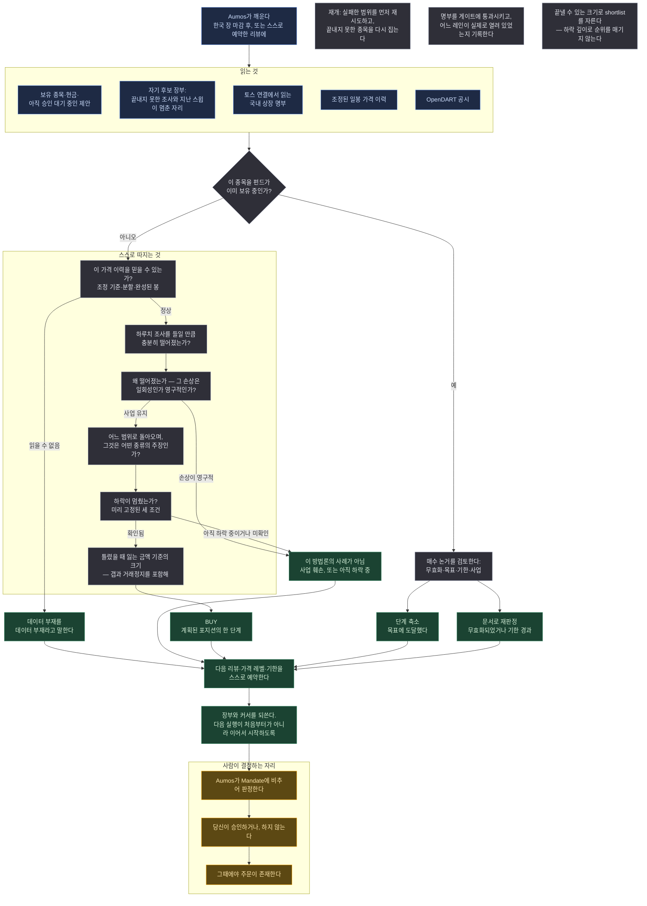

# Fundamental Mean Reversion

<a href="README.md">English</a>

> 사업이 입은 손상보다 주가가 더 많이 떨어진 한국 기업을 찾는다 — 그리고 하락이 눈에 보이게
> 멈추기 전까지는 그중 무엇도 사지 않는다.

## 한 문단 요약

이 매니저는 국내 상장 기업의 큰 하락을 지켜보다가, 하락 자체는 답해주지 않는 질문에 시간을
쓴다. **사업이 정말로 주가가 말하는 만큼 나빠졌는가?** 주가는 회사가 예전보다 덜 벌기 때문에
떨어지기도 하고, 한 번 일어난 일을 시장이 계속될 일처럼 받아들여서 떨어지기도 한다. 살 만한
것은 두 번째뿐이고, 둘을 가르려면 차트가 아니라 공시를 읽어야 한다. 사업이 멀쩡하다는 답이
나와도 곧바로 사지 않는다 — 아직 떨어지고 있는 싼 주식은 기회가 아니기 때문이다. 미리 적어둔
조건들이 하락이 멈췄다고 말한 뒤에야 산다. 크기는 «틀렸을 때 잃는 금액»으로 정하고, 회복
구간에서는 나눠서 팔며, 모든 포지션에 조용히 연장할 수 없는 기한을 붙인다.

## 방법론

**평균회귀. 다만 무게중심은 모양이 아니라 이유에 있다.** 검증하려는 주장은 이것이다: 시장은
때때로 일시적 충격을 영구적인 것처럼 외삽하고, 그 외삽 때문에 떨어진 가격은 충격이 일시적인
것으로 드러나면 정상 범위로 돌아온다. 아래의 모든 장치는 그 경우와 «시장이 그냥 옳았던» 경우를
가르기 위한 것이다.

*이 페이지가 쓰는 용어를 쉬운 말로:*

| | |
|---|---|
| **수정주가** | 액면분할과 배당을 반영해 보정한 가격 이력. 2:1 분할이 50% 폭락처럼 보이지 않게 한다 |
| **낙폭(drawdown)** | 일정 기간의 최고가 대비 현재 가격이 얼마나 아래인지 |
| **RSI** | 최근 움직임이 얼마나 한쪽으로 쏠렸는지를 0~100으로 요약한 값. 낮으면 대개 "최근 세게 팔렸다"는 뜻이다 |
| **200일 이동평균** | 최근 열 달 남짓의 평균 종가. 가격이 어디서 지내왔는지를 가리키는 통상적 약칭 |
| **과매도** | 짧은 시간에 세게 팔린 상태. 매도를 묘사할 뿐 회사에 대해서는 아무 말도 하지 않는다 |
| **손상차손** | 보유 자산을 한 번에 상각하는 것. 보고이익은 줄지만 사업이 버는 현금은 줄지 않는다 |
| **무효화 조건** | 사기 전에 미리 적어두는, "이 논거가 틀렸다"는 뜻이 되는 조건 |
| **분할 진입** | 계획된 포지션을 조각으로 나눠 사되, 각 조각이 구체적인 무언가를 기다리는 방식 |

여섯 가지 규칙이 일을 한다.

**1 — 차트는 무엇을 조사할지 정하고, 사업은 무엇을 살지 정한다.** 30% 이상의 하락에 낮은 RSI
또는 200일선 대비 큰 이격이 더해지면 그 종목은 조사 목록에 오른다. 그게 전부다. 이 방법론의
어떤 포지션도 그 숫자들 위에 서 있은 적이 없고, 그것을 근거로 내미는 실행은 자기가 일한 순서를
설명하고 있는 것이다.

**2 — 설명하기 전에 하락을 분해한다.** 실적 미스, 섹터 전체의 디레이팅, 지수 편출, 규제 헤드라인,
유상증자는 반감기가 서로 다른 다섯 개의 원인이고, 큰 하락에는 대개 하나 이상이 섞여 있다. 논거는
그것들을 먼저 적고, 그다음 일회성 비용과 «이제 덜 버는 사업»을 가르는 검증을 적는다 — 검증은
답을 알기 **전에** 적는다.

**3 — 과매도는 결코 진입 근거가 아니다.** 진입을 여는 조건은 미리 고정되어 있다: 최근 120거래일의
최저가가 최소 15거래일 이전의 것이어야 하고, 현재가가 그보다 최소 5% 위여야 하며, RSI가 35 위로
돌아와 있어야 한다. 그리고 세 가지 결과를 서로 다른 상태로 유지한다 — *아직 신저가를 갱신 중*,
*완성되지 않은 바닥*, *읽을 수 없었음*. 셋은 서로 다른 대응을 요구하고, 그중 회사에 관한 것은
하나도 없다.

**4 — 목표가 어떤 종류의 주장인지 밝힌다.** 회복 목표는 과거 가격대이거나, 이동평균이거나,
정상 수익력에서 만든 가치 범위다 — 그리고 패키지는 «주장의 종류»를 근거(basis)에서 유도할 뿐
호출자가 붙인 라벨을 받지 않는다. 반등의 그럴듯함은 독립적인 가치평가 결과가 아니며, 기술적
추정을 산술처럼 들리게 만드는 혼동은 정확히 이것 하나다. 옛 고점으로 반드시 회복한다는 가정도
두지 않는다.

**5 — 손절 가격은 체결이 아니다.** 포지션 크기는 무효화 지점까지 잃는 금액에, 그 지점을 그대로
뛰어넘어 열리는 세션에 대한 할인을 더해서 나온다. 한국 시장에서 상하한가는 보호장치가 아니라
메커니즘이다: 하한가 세션은 손절이 «희망»이 되는 날이고, 거래정지는 그것조차 아닌 날이다.

**6 — 모든 포지션에 기한이 있고, 그것은 해소되지 않는다.** 논거가 정한 날짜까지 회복이 오지
않으면 포지션은 문서로 재판정된다 — 종료하거나, 새 기한과 이유를 붙여 다시 서술한다. 되어서는
안 되는 것 하나는 «장기 보유»다. 그것은 손절과 기한만 빠진 같은 포지션이다.

### 의도적으로 하지 않는 것

- **가격만 보고 물타지 않는다.** 분할 증액은 논거와 안정화가 함께 유지될 때만 가능하고, 조건이
  «가격이 더 내렸다»뿐인 단계는 그대로 거절된다. 한정된 포지션이 무한정한 포지션으로 바뀌는
  경로가 정확히 그것이기 때문이다.
- **200일선 하회를 배제 조건으로 쓰지 않는다.** 그것은 이 방법론이 찾는 대상의 평범한 상태다.
  대신 갈라내는 것은 *상승추세 안의 눌림* — 여전히 오르고 있는 이동평균 위의 가격 — 이고, 그것은
  다른 방법론에 속한 진짜 거래다.
- **신뢰할 수 없는 가격 계열을 읽지 않는다.** 조정 기준 미표기, 구간 안에 배당이 있는 미조정
  계열, 배수만큼 계단이 진 이력은 모두 «데이터 부재»로 거절된다. 회사에 대한 발견으로는 결코
  읽지 않는다.
- **스크리닝만 돌리고 끝내지 않는다.** 후보는 완성된 논거까지 끌고 가거나, 미완성 사유와 다시
  볼 조건을 남긴다.

## 실행 흐름

한 번의 실행, 하나의 제안. 아래 어디에서도 주문이 나가지 않는다.

**범례** — 🟦 읽는 것 · ⬜ 스스로 따지는 것 · 🟩 돌려주는 것 · 🟧 사람이 결정하는 자리.

**주기.** 평일 한국 장 마감 후에 실행되기를 요청하며, 언제나 *완성된* 일봉만 읽는다 — 미완성
세션은 경고가 아니라 거절이다. 모든 판단이 최신 봉 위에서 이뤄지기 때문이다. 제출하는 모든
결정은 — 할 일이 없다는 결론까지 포함해 — 다음 리뷰와 중요한 가격 레벨, 그리고 기한을 함께
예약한다. 당신의 Aumos가 예약을 거절할 수 있고, 설치된 매니저의 리뷰 간격은 설치 화면에서
당신이 확인한 값이다.

## 필요한 것

| | |
|---|---|
| **시장** | 국내 상장 개별주식, 원화. ETF도 바스켓도 다른 시장도 다루지 않는다 |
| **연결** | 이 펀드에 연결된 토스 로그인. 거기서 세 가지를 읽는다. 스윕할 국내 상장 **명부**, 명부 위 각 종목의 **조정 일봉** — 판독에 완성된 봉이 최소 300개 필요하므로 페이징해서 읽는다 — 그리고 시장 캘린더. 시세 전용 로그인으로 충분하며 증권계좌가 붙어 있을 필요는 없다 |
| **데이터 소스** | 가격 스윕이 올린 모든 종목에 붙이는 `open-dart` 공시. 일회성 비용과 진짜 악화의 구분은 오직 거기서만 이뤄진다. 자기 복사본을 두지 않고 Aumos의 **소스 캐시**를 통해 읽는다 |
| **키 비용** | OpenDART 키는 금융감독원 포털에서 자동 승인으로 무료 발급된다 |
| **설정** | 하나의 논거가 펀드의 얼마를 걸 수 있는지, 얼마나 오래 기다릴 수 있는지, 동시에 몇 개를 들고 가는지, 한 번의 패스에서 몇 개를 조사하는지. ⚠️ 각 설정은 **더 엄격하게만** 바꿀 수 있다. 진입 조건 자체는 설정이 아니고, 내장값보다 느슨한 값은 거절되고 보고된다 |
| **기억** | 분할 진입 원장, 후보 장부, 다음 스윕이 재개할 커서를 자기 폴더에 둔다. 가격·공시·보유·현금·체결은 매 실행마다 각자의 주인에게서 다시 읽으며 그곳으로 복사되지 않는다 |
| **당신의 승인** | **제안할 뿐 거래하지 않는다.** 모든 매수·축소·청산은 당신의 Aumos가 Mandate에 비추어 판정하고 당신이 승인하거나 거절하는 제안이다 |

## 약한 지점

- **계속 떨어지는 시장.** 이 방법론은 이미 많이 떨어진 것을 사고, 그 모집단은 더 떨어질 확률이
  가장 높은 모집단이다. 안정화 조건은 좋은 진입까지 포함해 모든 진입을 늦추며, 반등이 짧게만
  나오는 시장에서는 그 진입들이 곧 틀린 진입이 된다.
- **느리게 맞는 것.** 사업이 멀쩡한데도 가격이 그것을 알아채는 데 이 방법론이 허용할 수 있는
  어떤 기한보다 오래 걸릴 수 있다. 결국 통했을 포지션을 닫고, 시간이 다 됐다고 기록할 것이다.
- **옳은 하락인데 일시적으로 보이는 경우.** 구조적 악화는 두세 분기 동안 일회성 비용의 모습으로
  도착한다. 이것이 가장 크게 노출된 실패이고, 손상 구분 검증은 그것을 없애는 게 아니라 늦추기
  위해 있다.
- **생존 편향, 그리고 여기서는 교정할 수 없다.** 스윕하는 명부는 오늘의 명부다. 상장폐지된
  회사는 거기에 없고, 주가가 아주 많이 떨어진 회사야말로 상장폐지가 골라내는 모집단이다.
  이 매니저가 보고하는 어떤 통과율도 오늘 살아남은 종목에 대한 사실이지 과거 기준선이 아니다.
- **아무것도 읽지 못한 실행을 그대로 말한다.** 유니버스를 선언하지 못했거나, 연결이 끊겼거나,
  보유 검토가 예산을 다 쓴 실행은 `discovery_not_run`으로 보고한다. **"후보 없음"이 아니다.**
  둘은 정반대의 사실인데 문장으로는 똑같이 읽히고, 그래서 이 구분은 문장이 아니라 산술로 되어
  있다. 이 보고를 보게 될 것이다 — 고장난 실행이 아니라 정직하게 보고하는 실행이다.
- **조용한 것 하나: 잘 작동할 때 가장 불편하다.** 아직 떨어지고 있는 것을 사지 않는 태도는
  마지막 하락이 오기 직전까지는 소심함처럼 보인다.

**설치하지 마시라** — 약세를 빠르게 사는 매니저를 원한다면, 논거가 지고 있는 동안에도 계속
물타기를 하길 원한다면, 당일 안에 반응하기를 기대한다면, 혹은 이 매니저의 안정화 조건이
기다리라고 할 때 그것을 덮어쓸 생각이라면. 덮어쓴 조건은 이 방법론에서 가치가 정확히 0인
유일한 부분이다.

## 덧붙임

**유지보수자를 위한 내용은 [`ARCHITECTURE.md`](ARCHITECTURE.md)에 있다** — 결정론적 코어가
무엇을 계산하는지, 어떤 모듈에서 파생했는지, fixture 목록, 그리고 실행 중인 호스트에서만
검증할 수 있는 항목들.

**출처.** 이 패키지는 비공개 리서치 하네스 `morethanmin/trading-harness`의 이식이며, 대상 커밋은
`aumos.json`에 적혀 있고 저작권자의 허락 아래 공개된다. [`NOTICE.md`](NOTICE.md)가 저작권 문구와
함께 의도적으로 가져오지 않은 것을 적는다: 계좌 데이터, 자격증명, 주문 구현, 개인 원장은 없다.

**임계값은 사전 등록되었고 사후 최적화하지 않았다.** 30% 하락, 15거래일, 5% 회복, RSI 35,
위험예산은 이 패키지를 추가한 PR에서 고정되었고, 저장소의 검사가 그것들을 리터럴로 고정해 두어
하나라도 움직이면 «움직이지 않았다는 것만이 주제인 파일»의 diff로 드러난다. 어떤 과거 사례가
매수로 나오게 하려고 조정한 것은 **아니다**. 방법론의 참고 사례 — 하락이 과도하다는 주장이
널리 있었던 대형 인터넷 종목 — 는 패키지 fixture 안에서 평균회귀로 분류되고 **WATCH**에 도달한다.
그 시점에 필요한 안정화 근거가 없었기 때문이다. 그것이 의도된 동작이고, 그것을 바꾸지 않았다.

**철회된 주장.** 하네스 저자는 이 방법론이 나온 거래들에서 좋은 결과를 보고했다. 그 수치는 재검산된
적이 없고 — 이 이식을 위해 어떤 체결·청산 원장도 다시 계산하지 않았다 — 따라서 이 패키지가 가졌다고
**증명된 엣지가 아니며** 패키지 어디에도 등장하지 않는다. Aumos는 실제 실행에서 측정되기 전까지 이
패키지의 수익률을 표시하지 않는다.

**섹터: 이 패키지에는 섹터 개념이 없으며, 그것이 업종 한도 아래에서 안전하다는 뜻은 아니다.**
이 방법론의 어떤 부분도 회사가 어떤 업종인지 읽지 않고 — 하락의 원인, 훼손 판정, 안정화 근거는 모두
한 회사에 대한 것이다 — 업종을 분류하지도 않는다. 그러나 «섹터 개념이 없으므로 충돌하지 않는다»는
코드에 대한 결론이지 계좌에 대한 결론이 아니다. 호스트가 Mandate의 업종 한도를 집행하지 않고 이
패키지가 그것을 받지도 않았으므로, 그런 Mandate 아래에서는 겉보기에 옳은 답이 투자자가 선언한 한도를
넘겨 계좌를 밀어넣을 수 있었다. 이제 `sectorCap`을 읽는다. **선언되어 있고 검사 가능하면 포지션에
걸리는 한도가 하나 늘어난다. 선언되어 있는데 검사할 수 없으면 — 후보든, 장부의 어떤 보유든 미결
제안이든 업종이 없으면 — 신규 진입을 열지 않고 분할 단계도 발동하지 않으며**, 분류하지 못한 행을
지목하고 데이터 부재로 기록한다. 선언되어 있지 않으면 그 축은 해당 없음이다. 이미 든 포지션의
검토·축소·재판정·청산은 그대로다.

**알려진 한계.** 제안의 저장, 리뷰의 재기동, 결정과 실제 체결의 연결은 모두 호스트의 몫이고, 이
저장소의 검사는 그중 무엇도 실행하지 않는다.

한 북에 여러 매니저가 붙었을 때의 중복 노출 귀속은 그 목록에 있었고 이제는 아니다 — untilled/aumos#789가
실행 중인 커널에 대고 검증했고, 이 패키지는 이제 다른 매니저가 무엇을 제안했는지와 각 포지션이 누구의
것인지를 함께 받는다. **같은 종목을 들 수 있는 다른 매니저와 한 펀드에서 함께 써도 된다.** 어디에서도
아직 재지 않은 것은 실제 벤더 세션과 실제 체결이다.
