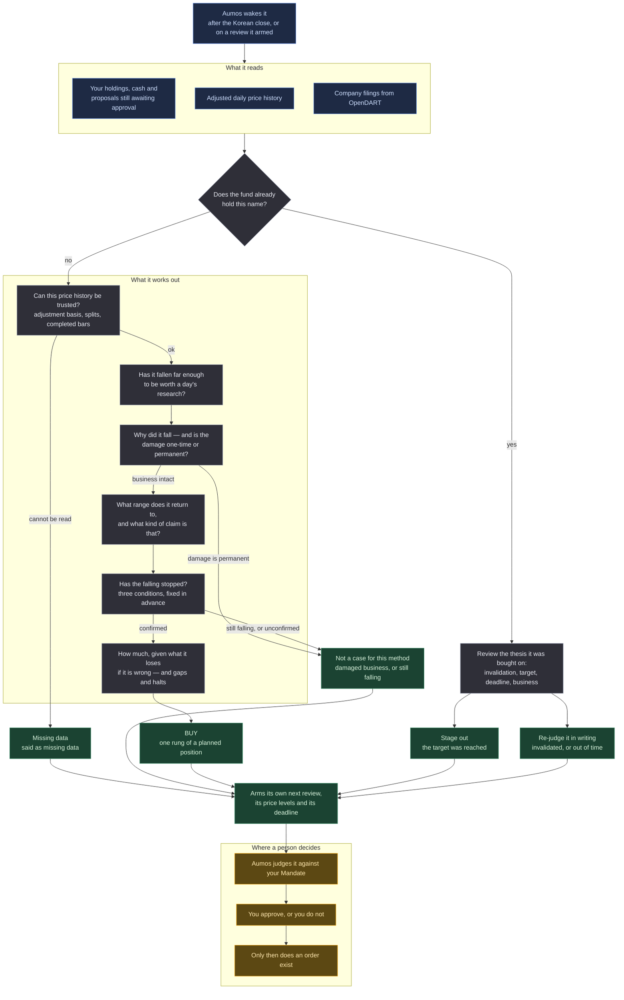

# Fundamental Mean Reversion

<a href="README.ko.md">한국어</a>

> Looks for Korean companies whose share price has fallen further than the harm to the
> business justifies — and refuses to buy any of them until the falling has visibly stopped.

## In one paragraph

This manager watches Korea-listed companies for large falls, and then spends its time on the
question the fall does not answer: **did the business actually get worse by as much as the
price says?** A price can fall because a company earns less than it used to, or because
something happened once and the market treated it as though it would keep happening. Only the
second is worth buying, and telling them apart means reading the company's filings rather than
its chart. When the answer is that the business is intact, it still waits — because a cheap
share that is still falling is not yet an opportunity — and it buys only after a set of
conditions, written down in advance, say the fall has stopped. It sizes what it buys by what it
loses if it is wrong, sells back into the recovery in pieces, and gives every position a
deadline it cannot quietly extend.

## The methodology

**Mean reversion, with the emphasis on the reason rather than the shape.** The claim being
tested is that the market sometimes takes a temporary shock and extrapolates it as permanent,
and that a price which fell on that extrapolation returns toward its normal range when the
shock turns out to have been temporary. Everything here is machinery for telling that case
apart from the case where the market was simply right.

*Words this page uses, in plain terms:*

| | |
|---|---|
| **Adjusted price** | a price history corrected for splits and dividends, so that a 2-for-1 split does not look like a 50% crash |
| **Drawdown** | how far the price is below its highest point over some period |
| **RSI** | a 0–100 number summarising how one-sided recent moves have been. Low usually means "sold hard recently" |
| **200-day average** | the average closing price over roughly the last ten months. A common shorthand for where the price has been living |
| **Oversold** | sold hard and quickly. It describes the selling; it says nothing about the company |
| **Impairment** | a one-time writedown of something the company owns. It lowers the reported profit without lowering the cash the business earns |
| **Invalidation** | the condition, written before buying, that would mean the reasoning was wrong |
| **Staged entry** | buying a planned position in pieces, each piece waiting for something specific |

Six rules do the work.

**1 — The chart chooses what to research; the business decides what to buy.** A fall of 30% or
more, with either a low RSI or a price well under the 200-day average, puts a name on the
research list. That is all it does. No position in this methodology has ever rested on those
numbers, and a run that offers them as a reason is describing the order it worked in.

**2 — Take the fall apart before explaining it.** A missed quarter, a whole-sector de-rating,
an index exclusion, a regulatory headline and a share issue are five different causes with five
different half-lives, and a big fall usually has more than one. The thesis names them, then
names the test that separates a one-time charge from a business that now earns less — and the
test is named before its answer is known.

**3 — Oversold is never an entry.** The conditions that open one are fixed in advance: the
lowest price of the last 120 sessions must be at least 15 sessions old, the price must be at
least 5% above it, and the RSI must have come back above 35. Three separate outcomes are kept
apart — *still making new lows*, *a base that has not finished*, and *the reading could not be
taken* — because they call for three different things, and only one of them is about the
company.

**4 — Say which kind of target it is.** A recovery target is a historical price band, a moving
average, or a valuation range built from normalised earning power — and the package derives the
kind of claim from the basis rather than accepting a label. A bounce's plausibility is not an
independent valuation result, and this is the one confusion that makes a technical guess sound
like arithmetic. It also never assumes the old high is recovered.

**5 — A stop price is not a fill.** Position sizes come from what the position loses on the way
to its invalidation, plus a haircut for the session that opens straight through it. On the
Korean market the daily price limit is the mechanism rather than the protection: a limit-down
session is one in which a stop is a wish, and a trading halt is one in which it is not even
that.

**6 — Every position has a deadline, and it cannot be dissolved.** If the recovery has not
happened by the date the thesis named, the position is re-judged in writing — ended, or
restated with a new deadline and a reason. What it may not become is a long-term holding,
which is the same position with the stop and the deadline removed.

### What it deliberately does not do

- **It does not average down on price alone.** A staged addition needs the thesis and the
  stabilisation to still hold; a rung whose only trigger is a lower price is refused outright,
  because that is how a bounded position becomes an unbounded one.
- **It does not treat a fall below the 200-day average as disqualifying.** That is the ordinary
  condition of the thing it is looking for. What it does separate out is a *pullback inside an
  uptrend* — price above a still-rising average — which is a real trade belonging to a
  different method.
- **It does not read a price series it cannot vouch for.** An undeclared adjustment basis, an
  unadjusted series with a dividend in the window, or a history that steps by a factor are all
  refused as missing data. They are never read as a finding about the company.
- **It does not run a screen and stop.** A candidate is carried to a finished thesis or left
  with a stated reason and a condition for coming back to it.

## How a run works

One run, one proposal. Nothing below places an order.

**Legend** — 🟦 what it reads · ⬜ what it works out on its own · 🟩 what it hands back ·
🟧 where a person decides.

**Cadence.** It asks to run after the Korean close on weekdays, and it always reads *completed*
daily bars — a partial session is refused rather than warned about, because every reading it
takes is off the newest rows. Every decision it submits, including the ones concluding there is
nothing to do, arms the next review, the price levels that matter, and the deadline. Your Aumos
may refuse an arming, and the interval stored for an installed manager is whatever you confirm
on the install screen.

## What it needs

| | |
|---|---|
| **Market** | Korea-listed individual shares, in won. No ETFs, no baskets, no other market |
| **Connection** | a Toss login linked to this fund, for adjusted daily bars and the market calendar. A market-data-only login is sufficient; no brokerage account has to be attached |
| **Data source** | `open-dart` for company filings — the separation of a one-time charge from a genuine decline is made there and nowhere else |
| **What a key costs** | an OpenDART key is free with automatic approval from Korea's Financial Supervisory Service portal |
| **Settings** | how much of the fund one thesis may risk, how long a thesis may wait, how many it carries at once, and how many candidates one pass researches. ⚠️ Each of these can only be made **stricter**: the entry conditions themselves are not settings, and a value looser than the built-in one is refused and reported |
| **Memory** | it keeps its own staged-entry ledgers and unfinished research notes in its private folder. Your holdings, cash and fills stay with Aumos and are never copied there |
| **Your approval** | **it proposes and never trades.** Every buy, trim and exit is a proposal your Aumos judges against your Mandate and you approve or refuse |

## What it is bad at

- **A market that keeps falling.** This method buys things that have already fallen a long way,
  which is the population most likely to fall further. The stabilisation conditions delay every
  entry — including the good ones — and in a market that only bounces briefly they will produce
  entries that are then wrong.
- **Being right slowly.** A business can be intact and the price can decline to notice for
  longer than any deadline this method would accept. It will close positions that would have
  worked, and record that it ran out of time.
- **Falls that are correct and look temporary.** Structural decline arrives disguised as a
  one-off charge for two or three quarters. This is the failure it is most exposed to, and the
  one its damage test exists to slow down rather than eliminate.
- **The quiet one: it is least comfortable when it is working.** Refusing to buy something that
  is still falling looks like timidity right up until the last leg down.

**Do not install this** if you want a manager that buys weakness quickly, that will keep
averaging down while a thesis is losing, that reacts within the day, or that you expect to
override when its own stabilisation conditions say to wait — an overridden condition is the one
part of this method with no value at all.

## Notes

**Maintainer-facing material is in [`ARCHITECTURE.md`](ARCHITECTURE.md)** — what its
deterministic core computes, which modules it was derived from, the fixture inventory, and the
list of things only a running host can verify.

**Provenance.** This is a port of a private research harness,
`morethanmin/trading-harness`, at the commit named in `aumos.json`, published with its author's
permission. [`NOTICE.md`](NOTICE.md) carries the copyright line and states what was deliberately
left behind: no account data, no credentials, no order implementation, no personal ledger.

**Thresholds are pre-registered and were not fitted.** The 30% fall, the 15 sessions, the 5%
reclaim, the RSI floor of 35 and the risk budget are fixed in the pull request that added this
package, and the repository's own check pins them as literals so that moving one shows up as a
diff in a file whose only subject is that they did not move. They were **not** tuned so that
any historical case would come out as a buy. The methodology's reference case — a large-cap
Korean internet name whose fall was widely argued to be excessive — classifies as mean
reversion in the package's own fixtures and reaches **WATCH**, because the stabilisation
evidence available at that instant was not there. That is the intended behaviour and it was
not adjusted.

**Withdrawn claim.** The harness's author reported a favourable outcome on the trades this
methodology was drawn from. That figure was never re-audited — no fill or exit ledger was
recomputed for this port — so it is **not** an edge this package has been shown to have, and it
appears nowhere in it. Aumos shows no returns for this package until it has measured some from
actual runs.

**Known limits at first publication.** Duplicate-exposure attribution across several managers
on one book, the storage of a proposal, the re-arming of a review and the link from a decision
to a real fill are all the host's, and none of them is exercised by this repository's checks.
Until they have been verified on a running Aumos, running this alongside another manager that
can hold the same name is best done on a separate fund.
