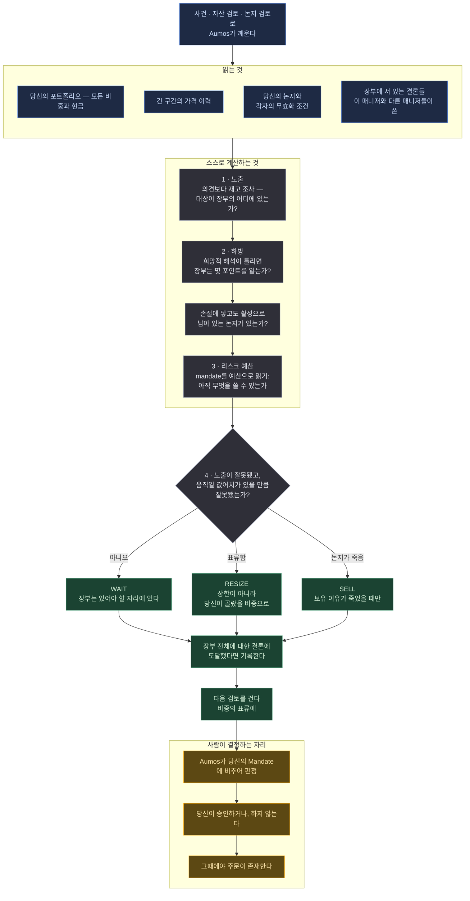

# Prudent Allocator

<a href="README.md">English</a>

> 뉴스보다 당신의 포트폴리오 전체를 먼저 읽고, 그 이야기가 그 회사에 대해 무엇을 말하는지가
> 아니라 나쁜 결과가 장부에 얼마를 물리는지를 묻는다.

## 한 문단 요약

대부분의 매니저는 자산에서 출발한다: 어떤 회사에 무슨 일이 생겼다, 좋은가 나쁜가? 이것은
**당신의 포트폴리오**에서 출발한다. 무슨 일이 생기면 그것을 검토의 주제가 아니라 검토의 계기로
다루고, 다른 질문을 던진다: 낙관적인 해석이 틀린 것으로 드러나면 *당신의 전체 자산*에서 얼마가
사라지는가? 작은 보유의 40% 하락은 큰 보유의 15% 하락보다 싸다. 40%를 읽고 멈추는 것이 이
매니저가 하지 않으려고 존재하는 실수다. 이 매니저의 흔한 답은 "할 일 없음" 아니면 "이 포지션이
조용히 너무 커졌다 — 줄여라"다.

**같은 사건을 같은 방식으로 읽는 매니저를 둘 설치하는 것은 아무것도 알려주지 않는다.** 하나의
답을 두 번 받고, 둘을 분리할 수 없는 트랙레코드를 갖게 된다. 이 패키지는 상향식 독자와 진짜로
다르기 위해 존재한다 — 같은 사건에 대해 다른 답에 도달하고, 그 이유를 한 문장으로 말할 수 있다.

| | `basic-investor` | `prudent-allocator` |
|---|---|---|
| 출발점 | 자산 | **장부** |
| 읽는 것 | 공시 · 뉴스 · 가격 · 장부 | 장부 · 가격 · 논지 · 브리프 |
| 던지는 질문 | 이 사건은 이 회사에 대해 무엇을 말하는가 | 이 사건은 이 포트폴리오의 하방에 무엇을 하는가 |
| 흔한 답 | WAIT, 또는 논지를 갖춘 BUY | WAIT, 또는 **RESIZE** |
| 걸어두는 트리거 | 가격 수준 | **비중의 표류** |

## 방법론

**하향식, 그리고 리스크 예산 우선.**

*이 페이지가 쓰는 용어를 쉬운 말로:*

| | |
|---|---|
| **장부(book)** | 전체로서의 당신 포트폴리오 — 모든 보유 자산과 현금 |
| **비중(weight)** | 전체에서 어떤 보유가 차지하는 비율 |
| **표류(drift)** | 누가 그러기로 정해서가 아니라 가격이 움직여서 바뀐 비중 |
| **Mandate** | 당신이 당신 돈에 대해 써둔 규칙: 무엇을 들 수 있고, 하나가 얼마까지 커질 수 있고, 현금을 얼마나 남길지 |
| **논지(thesis)** | 그 포지션이 존재하는 이유를 적어둔 글. 그 이유가 틀렸음을 증명할 조건까지 포함한다 |
| **RESIZE** | 보유 이유가 죽었다고 주장하지 않으면서 보유량만 바꾸는 것 |
| **하방(downside)** | 희망적인 해석이 틀렸을 때 장부 전체가 치르는 값 |

네 단계를 순서대로 읽는다.

**1 — 노출.** 의견보다 재고 조사가 먼저다. 총액과 현금, 비중 기준 상위 세 포지션, 사건의
대상이 그 순위 어디에 있는지, 자산군과 시장으로 본 장부의 모양. 그다음 상향식 독자보다 긴
구간의 가격 이력 — 질문이 *이게 좋은 가격인가*가 아니라 **이게 이미 얼마나 멀리 왔는가**이기
때문이다. 아무도 결정하지 않은 표류는 포트폴리오가 자기 mandate 바깥으로 나가는 가장 흔한
경로이고, 비중 대신 수익률을 그리는 어떤 화면에서도 보이지 않는다.

**2 — 하방.** 사건을 거꾸로 읽는다: 낙관적 해석이 틀리면 *장부*는 전체 가치의 몇 퍼센트포인트를
잃는가? 3% 포지션의 40% 하락은 1.2포인트, 22% 포지션의 15% 하락은 3.3포인트다. 두 번째가 더 큰
문제이고, 그 두 사실에 대한 모든 상향식 독법은 이것을 거꾸로 읽는다. 40%를 읽고 멈추기 때문이다.

이 단계는 당신의 논지들을 각자의 무효화 조건에 비추어 점검하기도 한다. 명시된 손절이 이미
도달했는데도 여전히 활성으로 표시된 논지는 포트폴리오가 당신에게 거짓말을 하고 있는 것이고,
결론이 WAIT인 결정 안에서라도 그것을 바로잡을 가치가 있다.

**3 — 리스크 예산.** mandate의 제약을 *예산*으로 읽는다: 한 종목이 아직 얼마나 더 커질 수
있는지, 현금을 아직 얼마나 쓸 수 있는지, 애초에 무엇을 들 수 있는지. 여기서 세 규칙이 나오고,
세 번째가 제안되는 내용을 바꾼다 — **표류**로 소진된 예산은 상한이 아니라 *당신이 골랐을*
비중으로 되돌리는 `RESIZE`다. 정확히 상한으로 되돌리면 다음 좋은 한 주에 같은 문제가 다시
장전되기 때문이다.

**4 — 판정.** 하나의 행동, 더 작은 도구 쪽으로 기울여서. `RESIZE`와 `SELL`이 둘 다 그 발견을
다룬다면, `RESIZE`는 당신의 원래 판단을 지키고 표류한 부분만 고친다. `SELL`은 논지가 죽었다는
주장이고, 그건 다른 주장이다.

## 실행 흐름

한 번의 실행에 하나의 제안. 아래 어느 것도 주문을 내지 않는다.

**범례** — 🟦 읽는 것 · ⬜ 스스로 계산하는 것 · 🟩 돌려주는 것 · 🟧 사람이 결정하는 자리.

**주기.** 다른 모든 매니저처럼 달력이 아니라 사건으로 깨어나고, 걸어두는 트리거는 가격 수준이
아니라 **비중의 표류**다 — 그것이 포트폴리오가 자기 mandate에서 서서히 벗어나는 것을 알아채는
매니저로 만든다.

## 필요한 것

| | |
|---|---|
| **시장** | 미국 상장 주식과 ETF (`XNAS`, `XNYS`) |
| **데이터** | `source:passthrough` — 보유 종목별 가격 이력. 이 기계가 자격증명을 들고 있는 시장 벤더에 묻는다. 답은 벤더의 것이고 Aumos는 읽지 않는다 |
| **장부** | `portfolio:read` — 장부가 주제다. 모든 판단은 추상적인 자산이 아니라 이 포트폴리오의 노출에 관한 것이다 |
| **당신의 논지** | `thesis:read` — 이미 적어둔 무효화 조건. 포지션을 그것을 잡은 이유에 비추어 판단하기 위해 |
| **장부의 메모** | `brief:read`와 `brief:write` — 포트폴리오 전체에 대한 결론(국면 판단, 섹터 견해, 신규 진입 보류)은 붙일 자산이 없으므로 여기 산다. 같은 장부의 다른 매니저들이 읽을 수 있다 |
| **설정** | 가격 이력을 얼마나 읽을지, 상한에 얼마나 가까우면 집중으로 볼지, 제안할 가치가 있는 최소 변화가 얼마인지. 어느 것도 당신의 Mandate를 느슨하게 만들 수 없다 |
| **당신의 승인** | **제안할 뿐 거래하지 않는다.** 모든 판단은 당신의 승인 대기열로 들어가고 사람이 승인한다 |

**상향식 독자보다 적게 요구하고, 그게 핵심이다.** `fundamentals:read`도 `news:read`도 없다.
`basic-investor`는 둘 다 갖고 있다. Aumos는 각 매니저의 도구함을 선언된 권한으로 짓기 때문에,
이 매니저의 세션에는 공시 도구도 뉴스 도구도 아예 들어 있지 않다. **공시를 읽을 수 없다.**
판단이 공시에 달린 곳에서는 그 사실을 자신의 불확실성 진술에 적도록 프롬프트가 요구한다 — 더
좁은 매니저가 당신에게 진 빚이고, 아무것도 설치되기 전에 설치 화면이 보여주는 것이다.

거래하는 권한을 쓸 방법은 없다. 프로토콜에 그런 권한이 존재하지 않는다 — 나중에 예외를 받을 수
있는 거부가 아니라, 철자 자체의 부재다.

## 약한 지점

- **리스크 모델이 아니다.** VaR도, 공분산도, 팩터 분해도 없다. 2단계는 자릿수 수준의 크기를
  묻고 그렇다고 말한다. 가격 시계열과 그럴듯한 이야기에서 뽑아낸 소수점 셋째 자리 숫자는 흰
  가운을 입은 조작된 숫자다.
- **리밸런서가 아니다.** 달력으로 돌지 않고 목표 비중을 관례적으로 복원하지 않는다. 다른 모든
  매니저처럼 사건에 깨어나며, `REBALANCE`는 가장 드물게 도달하는 답이다.
- **세컨드 오피니언 서비스가 아니다.** 다른 매니저가 무슨 결론을 냈는지 듣지 않고, 알려줄
  방법도 없다. 두 매니저가 한 사건을 독립적으로 판단하는 것이 비교를 의미 있게 만든다. 한쪽에
  다른 쪽의 답을 보여주면 단계만 늘어난 하나의 매니저가 된다.
- **공시를 읽을 수 없다.** 답이 공시에 달린 곳에서는 모른다고 말할 것이다.

**설치하지 마라** — 새로운 아이디어를 찾아주는 매니저를 원하는데 이것이 유일한 매니저라면.
이 매니저의 주제는 이미 갖고 있는 노출이다.

## 덧붙임

**설치하기.** Aumos에서 카탈로그를 둘러보고, 장부에 대해 설치하고, 위의 권한들에 동의하면
된다 — 아무것도 설치되기 전에 화면에 보여준다.

LIVE는 제안이 당신의 실제 장부에 대한 승인 대기열로 들어간다는 뜻이다. **한 장부에 LIVE
매니저가 여럿일 수 있고**, Aumos는 그들을 병합하지 않는다: 한 장부에 대해 충돌하는 목표를
제안하는 두 매니저에게는 해소 규칙이 없고, 규칙을 지어내는 것은 아무도 승인하지 않은 무언가를
Aumos가 결정하는 일이 된다. 그래서 각자 자기 판단을 봉인하고, 각자 자기 이름을 달고 승인
목록에 도착하며, 순서는 당신이 정한다 — 하지 않기로 정하는 것까지 포함해서. 이것을 다른 것
옆에 설치하는 것이 둘을 비교하는 방법이고, **shadow**는 어떤 것도 주문에 닿지 않은 채 비교하는
모드다. shadow 장부는 인스턴스가 만들어진 순간의 당신 장부 복사본으로 열린다. 그 순간부터 둘은
갈라지고, 그 갈라짐이 측정이다.

Aumos는 이 패키지가 실적을 쌓기 전까지 어떤 수익률도 보여주지 않는다. 포워드 트랙레코드는
연산이 아니라 달력 시간을 요구하고, 이 페이지의 어떤 것도 트랙레코드가 아니다.
