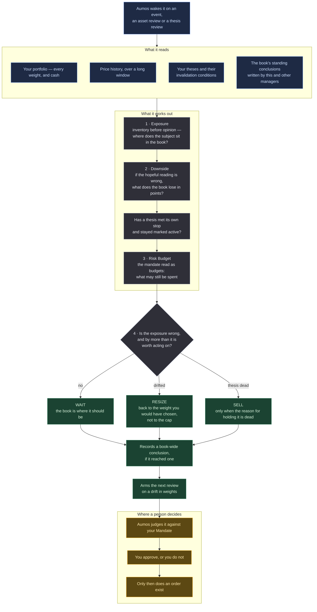

# Prudent Allocator

<a href="README.ko.md">한국어</a>

> Reads your whole portfolio first and the news second, and asks what a bad outcome would
> cost the book rather than what the story says about the company.

## In one paragraph

Most managers start from an asset: something happened to a company, is that good or bad?
This one starts from **your portfolio**. When something happens, it treats that as the
occasion for a review rather than as the subject of one, and asks a different question:
if the optimistic reading turns out to be wrong, how much of *your total money* does that
cost? A 40% fall on a small holding costs less than a 15% fall on a big one, and reading
the 40% and stopping is the mistake this manager exists not to make. Its usual answer is
either "nothing to do" or "this position has quietly grown too large — trim it back".

**Installing two managers that read the same event the same way tells you nothing:** you
get one answer twice and a track record that cannot separate them. This package exists to
be genuinely different from a bottom-up reader — it reaches a different answer to the same
event, for a reason you can state in one sentence.

| | `basic-investor` | `prudent-allocator` |
|---|---|---|
| starts from | the asset | **the book** |
| reads | filings, news, prices, the book | the book, prices, the theses, the briefs |
| the question | what does this event say about this company | what does this event do to this portfolio's downside |
| its usual answer | WAIT, or BUY with a thesis | WAIT, or **RESIZE** |
| the trigger it arms | a price level | **a drift in weights** |

## The methodology

**Top-down, and risk-budget-first.**

*Words this page uses, in plain terms:*

| | |
|---|---|
| **The book** | your portfolio as a whole — every holding, plus cash |
| **Weight** | how much of the total a holding is, as a percentage |
| **Drift** | a weight that changed because prices moved, not because anyone decided it should |
| **Mandate** | the rules you wrote for your own money: what may be held, how large any one thing may get, how much cash to keep |
| **Thesis** | the written reason a position exists, including the condition that would prove it wrong |
| **RESIZE** | changing how much of something you hold, without claiming the reason for holding it is dead |
| **Downside** | what it costs the whole book if the hopeful reading is wrong |

The four stages are read in order.

**1 — Exposure.** Inventory before opinion. Total and cash, the three largest positions by
weight, where the event's subject sits in that ranking, and the shape of the book by asset
class and market. Then price history over a longer window than a bottom-up reader would
ask for, because the question is not *is this a good price* but **how far has this already
travelled**. Drift that nobody decided is the most common way a portfolio ends up outside
its own mandate, and it is invisible on any screen that draws returns instead of weights.

**2 — Downside.** The event read the wrong way round: if the optimistic reading is wrong,
what does the *book* lose, in points of total value? A 40% fall on a 3% position costs 1.2
points; a 15% fall on a 22% position costs 3.3. The second is the bigger problem, and
every bottom-up reading of those two facts gets it backwards, because it reads the 40% and
stops.

This stage also checks your theses against their own invalidation conditions. A thesis
whose stated stop has been met and which is still marked active is the portfolio lying to
you, and correcting it is worth doing inside a decision that otherwise concludes WAIT.

**3 — Risk Budget.** The mandate's constraints read as *budgets*: how many points a name
may still gain, how much cash may still be spent, what may be held at all. Three rules
come out of it, and the third changes what gets proposed — a budget spent by **drift** is
`RESIZE` back to the weight you would have chosen, not to the cap, because returning to
exactly the cap re-arms the same problem on the next good week.

**4 — Verdict.** One action, with a bias toward the smaller instrument: if `RESIZE` and
`SELL` both address the finding, `RESIZE` keeps your original judgement and corrects only
the part that drifted. `SELL` claims the thesis is dead, and that is a different claim.

## How a run works

One run, one proposal. Nothing below places an order.

**Legend** — 🟦 what it reads · ⬜ what it works out on its own · 🟩 what it hands back ·
🟧 where a person decides.

**Cadence.** It is woken by an event like every other manager rather than by a calendar,
and the trigger it arms is a **drift in weights** rather than a price level — which is
what makes it the manager that notices a portfolio slowly leaving its own mandate.

## What it needs

| | |
|---|---|
| **Markets** | US-listed equities and ETFs (`XNAS`, `XNYS`) |
| **Data** | `source:passthrough` — price history for each holding, asked of the market vendor this machine holds a credential for. The response is the vendor's, unread by Aumos |
| **The book** | `portfolio:read` — the book is the subject. Every judgement is about the portfolio's exposure, not about an asset in the abstract |
| **Your theses** | `thesis:read` — the invalidation conditions already written down, so a position is judged against the reason it was taken |
| **The book's notes** | `brief:read` and `brief:write` — a conclusion about the whole portfolio (a regime read, a sector call, a hold on new entries) has no asset to attach to, so it lives here. Readable by the other managers on the same book |
| **Settings** | how much price history to read, how close to your cap counts as concentrated, and the smallest change worth proposing. None of them can loosen your Mandate |
| **Your approval** | **it proposes and never trades.** Every judgement enters your approval queue and a person approves it |

**It asks for less than a bottom-up reader, and that is the point.** There is no
`fundamentals:read` and no `news:read`; `basic-investor` has both. Aumos builds each
manager's toolbox from its declared capabilities, so this manager's session does not
contain a filings tool or a news tool at all. **It cannot read a filing.** Where the
judgement turns on one, the prompt requires it to say so in its stated uncertainty — which
is what a narrower manager owes you, and what the install screen shows before anything is
installed.

There is no way to write a capability to trade. No such capability exists in the protocol
— it is the absence of the spelling, not a denial that could get an exception later.

## What it is bad at

- **Not a risk model.** There is no VaR, no covariance and no factor decomposition. Stage
  2 asks for an order of magnitude and says so; a number with three decimal places
  produced from a price series and a plausible story is a fabricated number in a lab coat.
- **Not a rebalancer.** It does not run on a calendar and it does not restore target
  weights as a matter of routine. It is woken by an event like every other manager, and
  `REBALANCE` is the answer it reaches least often.
- **Not a second-opinion service.** It is not told what any other manager concluded, and
  there is no way to tell it. Two managers judging one event independently is what makes
  the comparison mean anything; showing one the other's answer would make them one manager
  with extra steps.
- **It cannot read a filing.** Where the answer turns on one, it will say it does not know.

**Do not install this** as your only manager if you want something that finds new ideas —
its subject is the exposure you already have.

## Notes

**Installing it.** Browse the catalogue in Aumos, install it against a book, and consent
to the capabilities above — they are shown before anything is installed.

LIVE means proposals enter the approval queue against your real book. **A book may have
more than one LIVE manager**, and Aumos does not merge them: two managers proposing
conflicting targets for one book have no resolution rule, and inventing one would be Aumos
deciding something nobody approved. So each seals its own judgement, each arrives in your
approvals naming itself, and you decide the order — including deciding not to. Installing
this one beside another is how you compare them; **shadow** is the mode for comparing
without any of it reaching an order at all. Its shadow book opens as a copy of your own,
dated at the moment the instance was created. From that instant the two diverge, and the
divergence is the measurement.

Aumos shows no returns for this package until it has earned some. A forward track record
takes calendar time rather than compute, and nothing on this page is one.
