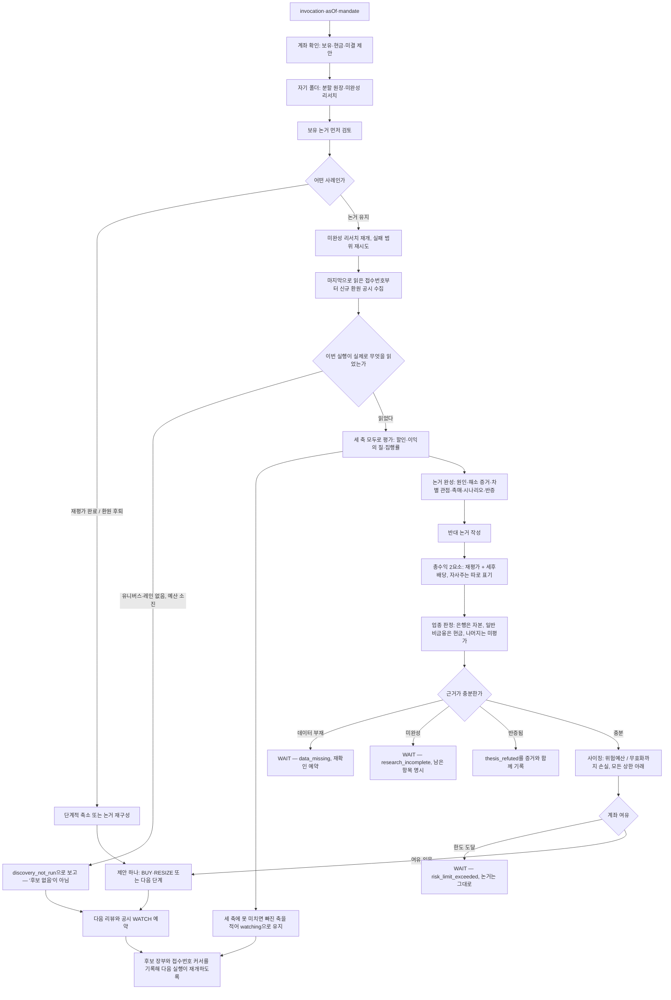

# 주주환원 리레이팅

<a href="README.md">English</a>

## 한 문단 요약

이 매니저는 배당·자사주 매입·소각으로 주주에게 돈을 돌려주고 있으면서, 실제 벌어들이는 이익과
보유한 자본으로 그것을 계속할 수 있는 한국 상장기업을 찾습니다. 걸고 있는 것은 "주가가 싸다"가
아닙니다. 이 일을 공개적으로 반복하는 회사는 결국 제 값에 가깝게 평가받고, 지금 가격과 그 가치의
차이가 인내심 있는 보유자에게 돌아오는 몫이라는 것입니다. 보유기간은 대개 6~12개월이며, 내놓는
모든 판단은 세 가지를 분리해서 말합니다. 할인이 축소되면 얼마인지, 배당이 **투자자에게** 얼마인지,
회사의 자사주 매입이 **회사에게** 얼마인지. 이 패키지는 제안만 하며, 모든 포지션은 투자자가
승인합니다. 주문은 넣지 않습니다.

## 방법론

**할인이 줄어들 기전이 눈에 보여야 합니다.** 싼 회사는 많습니다. 이 매니저가 원하는 것은 *할인이
축소될 이유*가 있는 회사이고, 그 이유로 인정하는 것은 실제로 집행되고 있는 주주환원 정책입니다.
그래서 높은 배당수익률만으로, 낮은 PBR만으로, 큰 주가 하락만으로는 어떤 종목도 선정되지 않습니다.

**발표와 집행은 다른 사실입니다.** 자사주 매입을 발표하고 거의 사지 않을 수 있습니다. 이 매니저는
프로그램이 스스로 정한 기간이 얼마나 지났는지에 견주어 얼마나 집행되었는지를 계산하고, 자기 일정의
절반에도 못 미치는 프로그램은 "발표가 있었다"는 근거일 뿐 그 이상이 아닌 것으로 다룹니다.

**은행·보험·증권·공장은 다르게 읽고, 그중 둘만 여기서 읽습니다.** 은행·은행계 금융지주에서 질문은
자본입니다. 회사가 스스로 지키겠다고 공표한 비율 위에 얼마가 남아 있는가 — 배당과 자사주는 거기서
나옵니다. 일반 비금융에서 질문은 현금입니다. 미룰 수 없는 투자를 하고 나서 무엇이 남는가. 조선사에
CET1 비율을 묻는 것은 아무것도 가리키지 않는 숫자를 만드는 일이고, 이 패키지는 그 계산을 수행하는
대신 거부합니다.

**보험사·증권사·복합기업은 은행과 구분되고, 그다음에는 건드리지 않습니다.** 보험사의 지급여력은
K-ICS로, 증권사는 NCR로 측정합니다. 서로 다른 비율이고, 서로 다른 질문에 답하며, 배분 가능한 자본의
계산 방식도 다릅니다. 이 매니저는 은행과 일반 비금융의 산술만 구현하므로, 회사가 다섯 분류 중
무엇인지 말하고 그 판정의 근거가 된 공시를 남긴 다음, 나머지 셋은 낯선 비율을 은행 공식에 밀어넣는
대신 **미평가**로 보고합니다. 이유가 적힌 대기이지 회사에 대한 기각이 아니며, «금융이다»라는 것은
그 자체로 은행처럼 읽힐 이유가 되지 않습니다.

**«섹터»라고 불리는 것이 둘이고, 주인이 다릅니다.** 하나는 펀드 위험관리용 섹터입니다. 계좌 전체에
일관되게 적용되는 Mandate의 분류이고, «한 업종에 25%까지» 같은 한도는 이것 위에서 계산됩니다. 이것은
호스트의 것이고 이 매니저는 읽기만 합니다. 다른 하나는 회사가 어떤 사업을 하는가이며, 어떤 자본
산술이 의미를 갖는지를 결정합니다. 이것은 이 매니저가 공시로, 한 회사씩 판단합니다. **Mandate에
업종 한도가 있는데 그 업종의 계좌 합계를 구할 수 없으면 — 후보의 분류가 없거나, 계좌 어딘가의
보유·미결 제안의 분류가 없어서 — 포지션을 늘리지 않습니다.** 대기하고, 분류하지 못한 행이 무엇인지
말합니다. 보유·분석·축소는 평소대로 계속됩니다. 검증할 수 없는 한도가 보류하는 것은 그 한도가
제약하는 행위뿐입니다.

**세 개의 수익률은 하나가 아닙니다.** 기대수익은 정확히 두 조각입니다. 주가 재평가의 몫과, 세후
현금배당. 회사의 자사주 매입은 그 어느 쪽도 아닙니다. 투자자에게 직접 지급되는 것이 없고, 투자자
몫의 가치는 이미 첫 번째 조각 안에 들어 있습니다. 이것을 배당수익률에 더하면 같은 돈을 두 번 세는
것이고, 이 패키지의 산술은 그 덧셈을 조용히 받아들이지 않고 거부합니다.

**의도적으로 하지 않는 것.** 과매도나 200일선 상회를 요구하지 않습니다 — 환원을 집행하며 주가가
오르는 좋은 회사야말로 찾는 대상입니다. 가격이 떨어졌다는 이유만으로 더 사지 않습니다. 모든 분할
단계는 논거, 남은 할인 여유, 남은 위험예산을 다시 확인합니다. 바스켓을 운용하거나 스크리닝 목록을
내놓지 않습니다. 실행당 완성된 판단 하나, 아니면 왜 없는지에 대한 설명입니다.

짧은 용어 설명

- **재평가(re-rating)** — 사업이 달라지지 않은 채로 주가가 가치에 가까워지는 것.
- **자사주 매입 / 소각** — 회사가 자기 주식을 사는 것, 그것을 영구히 없애는 것이 소각입니다. 사서
  보유한 주식은 다시 시장에 나올 수 있고 소각한 주식은 나올 수 없습니다.
- **배당성향** — 배당을 이익으로 나눈 값. 1을 넘으면 번 것보다 많이 주고 있다는 뜻입니다.
- **CET1 비율** — 은행이 보유한 손실흡수 자본의 핵심 지표. 은행은 대개 규제 최저치보다 높은 자체
  목표 비율을 공표합니다.
- **무효화까지의 손실** — 논거가 더 이상 성립하지 않는 가격까지 갔을 때 포지션이 잃는 몫. 포지션
  크기는 이 숫자로 계산됩니다.
- **Mandate** — 투자자가 정한 한도. 한 종목·한 업종에 계좌의 몇 %까지, 위험에 얼마까지.

## 실행 흐름

**어디서부터 찾기 시작하는가.** 이미 아는 종목 목록에서 시작하지 않습니다. 지난 실행이 끝난 뒤
회사들이 **접수한 공시**에서 시작합니다 — 배당 결정, 자기주식 취득 결정, 실제로 얼마를 샀는지 적은
결과보고서, 소각 결정, 그리고 그 모든 것이 정책이라고 주장하는 기업가치 제고 계획. 어디서 멈췄는지를
기록하므로 중간에 실패한 실행은 처음부터가 아니라 이어서 재개되고, 읽지 못한 범위는 새로 수집하기
전에 먼저 재시도됩니다.

**주기.** 평일 한국 장 마감 후 가격·위험 검토, 보유 논거는 약 한 달마다 전면 재검토, 보유·조사
중인 종목의 실적·환원정책·소각 공시에 대한 WATCH. 대기를 포함한 모든 판단이 다음 실행을 예약하므로
실패한 실행 뒤에도 돌아올 경로가 있습니다.

## 필요한 것

- **시장.** 한국 상장 개별주식(XKRX), 원화.
- **데이터.** OpenDART의 공시 — 배당·자사주 취득 결정, 취득 결과·소각 보고, 분기·사업보고서. 가격,
  기업행동, 거래대금은 투자자 본인의 증권 연결을 통해서. 회사가 공표한 환원 정책은 보통 공시가 아닌
  IR 자료에 있으므로, 날짜와 출처를 붙인 관측으로 기록하며 벤더가 준 사실처럼 다루지 않습니다.
- **어떻게 읽는가.** 공시는 매 실행마다 다시 가져오는 대신 Aumos가 이미 보관하는 OpenDART 저장본에서
  읽습니다 — 저장본을 읽고, 뒤처져 있으면 갱신하고, 자기 폴더에 두 번째 사본을 만들지 않습니다. 회사의
  IR 자료는 웹에서 읽되, 웹에서 읽은 것이 Aumos에 영수증으로 남는 유일한 경로로 기록합니다. 자기
  폴더에 남기는 것은 문서가 아니라 가리키는 주소와 남은 질문입니다.
- **키 비용.** OpenDART는 등록 후 무료입니다. 증권 연결은 이미 쓰고 있는 것이며, Aumos가 벤더의
  응답을 그대로 전달하고 자격증명은 이 패키지에 노출되지 않습니다.
- **설정.** 아홉 가지이며 모두 선택입니다. 보유 논거를 전면 재검토하는 주기, 이 인스턴스가 동시에 드는
  논거 수, 최소 개시 규모 — 금액과 그 금액의 통화, 또는 계좌 대비 비중 — 배당 원천징수율, 그리고 한
  아이디어에 거는 위험예산, 한 실행이 수집을 멈추고 조사를 시작하기까지 읽는 공시 수, 그리고 반쯤 읽다
  마는 대신 끝까지 마쳐야 하는 후보 수. 어떤 것도 Mandate를 느슨하게 만들 수 없고, 위험예산은 낮출
  수만 있습니다.
- **계좌가 원화가 아니라면.** 최소 개시 규모는 **금액**이고, 이 패키지가 게시한 500,000원은 한국
  거래소에 대한 사실입니다. 다른 통화로 표시된 장부에서는 그 바닥이 적용되지 않습니다 — 실행이 그
  사실을 말하고, 나머지는 아무것도 달라지지 않습니다. 바닥이 필요하면 직접 적으십시오: 금액과 그
  통화, 또는 계좌 대비 비중.
- **승인 지점.** 전부입니다. 실행당 결정 하나를 제안하고, 투자자가 승인하면 Aumos가 수량과 주문을
  처리합니다. 이 패키지에는 주문을 낼 수 있는 capability가 없습니다.
- **Mandate가 반드시 담아야 하는 것.** 단일종목 상한, 즉 집중도 한도입니다. 이 패키지는 그것의
  기본값을 갖지 않으므로, 적지 않은 계좌에서는 누군가 임의로 고른 크기 대신 대기와 설명이 나옵니다.
  **위험예산**은 이 패키지가 스스로 답합니다 — 한 아이디어에 계좌의 1% — 어느 Mandate에도 그 칸이
  없고, 그것 없이 거절하는 패키지는 한 번도 거래하지 않기 때문입니다. 설정에서 낮출 수 있고 높일 수는
  없습니다. 업종 한도는 선택입니다 — 적지 않으면 업종 축은 «해당 없음»이 되고, 적으면 검사합니다. 계좌의 업종 분류가
  불완전하면 매수는 그것이 채워질 때까지 기다립니다.

## 약한 지점

- **할인이 끝내 축소되지 않는 시장.** 논거 전체가 "환원이 결국 가격을 바꾼다"에 걸려 있습니다.
  지배구조 할인이 배당에도 불구하고 수년간 유지되는 시장·업종에서는 회사에 대한 판단이 맞아도 천천히
  손실이 납니다.
- **경기 정점.** 정점의 경기민감주는 막대한 현금, 낮은 배당성향, 낮은 멀티플을 보여줍니다. 이
  패키지는 반복이익·중기 사이클 커버리지·비율 대 절대금액 정책으로 강하게 밀어내지만, 여전히 가장
  속기 쉬운 형태입니다.
- **빠른 시장.** 6~12개월 보유와 월 단위 심층 검토는 급격한 악화를 늦게 알게 됩니다. 트레이딩
  시스템이 아니며 그렇게 행동하지 않습니다.
- **공시 구간을 읽지 못한 실행.** 공시 경로가 막혔거나, 대상 종목 집합을 선언하지 못했거나, 보유
  검토가 실행 예산을 다 썼다면 «후보를 찾지 못했다»가 아니라 **그 사실 자체를** 그대로 보고합니다.
  둘은 화면에서 똑같이 보이지만 정반대의 사실이고, 이 매니저가 가장 많은 장치를 들여 막는 실패가
  그것입니다. 이 매니저가 «조건 통과 없음»이라고 말했다면, 선언된 목록을 실제로 훑었고 필요한 경로를
  모두 읽었으며 그럼에도 통과한 것이 없었다는 뜻입니다.
- **발표를 결과로 인정하지 않는 점.** 자사주 매입을 발표하고 거의 사지 않은 회사는 포지션이 아니라
  관찰 목록에 남습니다. 그래서 정말로 집행이 막 시작되려는 프로그램에 대해서는 구조적으로 느리고,
  앞질러 가는 대신 느리다는 사실을 말합니다.
- **공시가 적은 회사.** 근거가 공시입니다. 적게 공시하는 회사에 대해서는 "판단할 수 없었다"는 정직한
  답이 반복됩니다.
- **보험사·증권사·복합기업.** 은행과 구분할 수는 있고 환원 여력을 계산할 수는 없습니다. 이 업종에
  대해서는 판정이 아니라 명시적인 «미평가»가 나온다는 것을 알고 설치하십시오.
- **설치하지 않는 편이 나은 경우.** 하나의 매니저로 넓은 분산을 원하는 경우 — 소수의 조사된 포지션만
  듭니다. 매일 답을 원하는 경우. 정량 스크리너를 원하는 경우. 그리고 아래의 과거 사례를 약속으로
  기대하는 경우.

## 덧붙임

- **출처.** 개인 리서치 방법론을
  [`morethanmin/trading-harness`](https://github.com/morethanmin/trading-harness)의 `aumos.json`에
  적힌 커밋에서 이식했으며, 저작권자의 요청으로 공개했습니다. 라이선스 고지는 `NOTICE.md`에
  있습니다. 원본 저장소의 주문 코드, 자격증명, 데이터베이스, 개인 계좌 원장은 함께 오지 않았습니다.
- **⚠️ 실적 기록은 없으며, 철회된 주장이 하나 있습니다.** 이 방법론은 과거 한 국내 금융지주에
  적용되었고 투자자가 긍정적인 결과를 보고했습니다. **그 결과는 재검산되지 않았고, 검증된 엣지가
  아니며, 이 패키지의 성과가 아닙니다.** 이 패키지 어디에도 수익률이나 백테스트를 인용하지 않으며,
  그 사례가 잘 나오도록 임계값을 고르지 않았습니다. Aumos는 누군가의 기억이 아니라 실제 실행에서
  패키지의 행동을 측정합니다.
- **알려진 한계.** 한 시장만 읽습니다. 한 번에 한 회사를 판단하며, 업종 한도 외에 포지션 간
  상관관계에 대한 관점이 없습니다. 문서화되지 않은 신용 상태나 경영진의 의중은 볼 수 없습니다.
- **다른 매니저와 함께 설치할 때.** 노출은 계좌 전체 — 모든 매니저의 실제 보유와 미승인 제안 — 를
  합쳐 계산하며, 적용되는 한도 중 가장 작은 것이 구속합니다. 두 매니저의 한도가 더해져 더 큰 한도가
  되는 일은 없습니다. 한 계좌에서 여러 매니저를 돌릴 예정이라면
  [`ARCHITECTURE.md`](ARCHITECTURE.md)를 먼저 읽으십시오. 이 패키지가 소유하는 상태와 호스트가
  소유하는 상태, 그리고 그 구성이 안전하려면 호스트가 무엇을 지원해야 하는지가 적혀 있습니다.
- **유지보수자용 문서.** [`ARCHITECTURE.md`](ARCHITECTURE.md)에 상태 소유권 표, 결정론적 모듈과 각
  모듈의 역할, fixture 목록, 그리고 고정된 모든 임계값의 공식과 근거가 있습니다.
