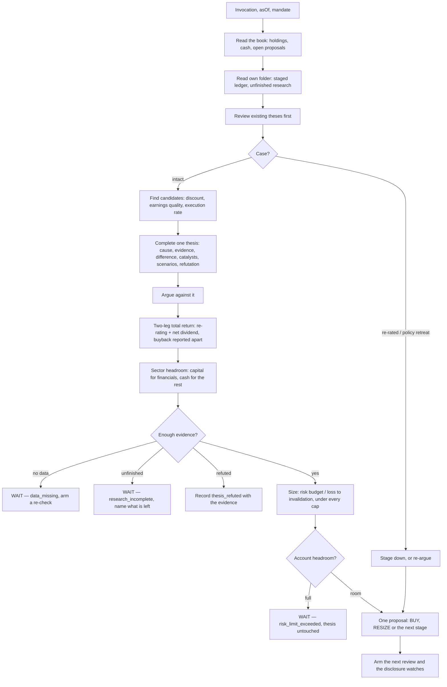

# Shareholder Rerating

<a href="README.ko.md">한국어</a>

## In one paragraph

This manager looks for Korean companies that are giving money back to their shareholders — through
dividends, share buybacks and the retirement of the shares they buy — and that can keep doing it
out of the profit and capital they actually have. Its bet is not that the shares are cheap. It is
that a company doing this repeatedly, in public, eventually gets priced closer to what it is
worth, and that the gap between today's price and that value is what a patient holder is paid for.
Positions are usually held six to twelve months, and every judgement it produces says three things
apart: what closing the discount is worth, what the dividends are worth to *you*, and what the
company's buyback is worth to the company. It proposes; you approve every position, and it never
places an order.

## The methodology

**The mechanism has to be visible.** Plenty of companies are cheap. This one only wants the ones
where there is a *reason the discount should close*, and the reason it will accept is a shareholder
return programme that is being carried out. So a high dividend yield on its own never selects a
company; nor does a low price-to-book; nor does a big fall in the share price.

**Announced and executed are different facts.** A company can announce a buyback and buy almost
nothing. This manager measures how much of a programme has actually been done against how much of
the programme's own time window has passed, and a programme running at less than half its own
schedule is treated as evidence for the announcement and nothing else.

**Banks and factories are read differently.** For a bank or a financial holding company the
question is capital: how much sits above the ratio the company itself has promised to hold, which
is what a dividend or a buyback is paid out of. For everything else the question is cash: what is
left after the investment the business cannot skip. Asking a bank ratio of a shipbuilder produces a
number about nothing, and the package refuses to do it rather than produce one.

**Three yields are not one yield.** The expected return has exactly two parts — what re-rating is
worth, and the cash dividend after tax. A company's buyback is in neither: it pays you nothing
directly, and what it is worth to you is already inside the first part. Adding it to a dividend
yield counts the same money twice, and the arithmetic in this package refuses the addition rather
than quietly accepting it.

**What it deliberately does not do.** It does not require a share to be "oversold" or to be above a
moving average — a good company executing a return programme into a rising price is exactly what it
is looking for. It does not buy more simply because the price fell; every stage of a position
re-checks the reasoning, the remaining discount and the remaining risk budget. It does not run a
basket or output a screen: one completed judgement per run, or a stated reason there is none.

A short glossary

- **Re-rating** — the price moving closer to what the business is worth, without the business
  changing.
- **Buyback / cancellation** — the company buying its own shares; retiring them permanently is
  cancellation. Bought-and-kept shares can come back onto the market, retired ones cannot.
- **Payout ratio** — the dividend divided by earnings. Above 1 means paying out more than was
  earned.
- **CET1 ratio** — the core measure of how much loss-absorbing capital a bank holds. Every bank
  states a target it runs to, usually above what the regulator demands.
- **Loss to invalidation** — how much of a position is lost if the price reaches the level at which
  the reasoning is no longer true. It is what the position's size is calculated from.
- **Mandate** — the limits you set: how much of your account may go into one name, one sector, and
  how much may be put at risk.

## How a run works

**Cadence.** A price and risk review after the Korean close on weekdays, a deeper re-argument of
each held thesis about monthly, and a watch on results, return-policy and cancellation
disclosures for anything held or being researched. Every judgement — including a wait — arms what
wakes the manager next, so a failed run has a defined way back.

## What it needs

- **Market.** Korea-listed single equities (XKRX), priced in won.
- **Data.** Corporate filings through OpenDART — dividend and buyback resolutions, treasury
  acquisition and cancellation receipts, quarterly and annual statements. Prices, corporate actions
  and traded value through your own broker connection. A company's stated return policy usually
  lives in its investor-relations material rather than in a filing, so it is filed as a dated,
  cited reading rather than treated as a fact from a vendor.
- **What a key costs.** OpenDART is free and requires registration. The broker connection is one
  you already have; Aumos relays the vendor's answer and never exposes the credential to this
  package.
- **Settings.** Four, all optional: how often a held thesis is fully re-argued, how many theses this
  instance carries at once, the smallest position worth opening in won, and your dividend
  withholding rate. Nothing in them can loosen your Mandate.
- **Where you approve.** Everywhere. It proposes one decision per run; you approve it, Aumos sizes
  and routes the order. There is no capability in this package that can place one.
- **What your Mandate must state.** A risk budget and a single-name cap. This package carries no
  default for either, so an account that states neither gets a wait and an explanation rather than
  a size somebody guessed.

## What it is bad at

- **A market that never closes discounts.** The whole thesis is that a return programme eventually
  changes the price. In a market or a sector where governance discounts persist for years despite
  the payouts, this manager is right about the company and still loses money, slowly.
- **Cyclical peaks.** A cyclical company at the top of its cycle shows enormous cash, a small payout
  ratio and a low multiple. The package pushes hard against this — recurring earnings, mid-cycle
  coverage, ratio-versus-amount policies — and it is still the shape most likely to fool it.
- **Fast markets.** A six-to-twelve-month holding period with a monthly deep review learns about a
  sharp deterioration late. It is not a trading system and it will not behave like one.
- **Companies with little disclosure.** Its evidence is filings. A company that discloses little
  gives it little, and the honest answer it produces is "I could not tell", repeatedly.
- **Who should not install it.** Anyone wanting broad diversification from one manager — it holds a
  small number of researched positions; anyone who wants an answer every day; anyone who wants a
  quantitative screen. And anyone expecting the historical example below to be a promise.

## Notes

- **Provenance.** This is a port of a personal research methodology from
  [`morethanmin/trading-harness`](https://github.com/morethanmin/trading-harness), at the commit
  named in `aumos.json`, published with its copyright holder's request. `NOTICE.md` carries the
  licence notice. None of the source repository's order code, credentials, database or personal
  position ledger came with it.
- **⚠️ No track record, and one withdrawn claim.** The methodology was used historically on a
  Korean financial holding company, and the investor reported a positive outcome. **That result was
  never re-audited, it is not a validated edge, and it is not this package's performance.** Nothing
  in this package quotes a return or a backtest, no threshold in it was chosen to make that case
  come out well, and Aumos measures a package's behaviour from actual runs rather than from
  anybody's recollection.
- **Known limits.** It reads one market. It judges one company at a time and has no view on how its
  positions correlate with each other beyond the sector limit. It cannot see private credit quality
  or a management intention that has not been written down anywhere.
- **Installed beside other managers.** Exposure is measured across the whole account — real
  holdings and unapproved proposals from every manager — and the binding limit is always the
  smallest that applies. Two managers' limits never add up into a bigger one. If several managers
  will run on one book, read
  [`ARCHITECTURE.md`](ARCHITECTURE.md) first: it states which state this package owns, which the
  host owns, and what the host has to support for the arrangement to be safe.
- **For maintainers.** [`ARCHITECTURE.md`](ARCHITECTURE.md) carries the state-ownership table, the
  deterministic modules and what each is for, the fixture inventory, and every fixed threshold with
  its formula and its rationale.
