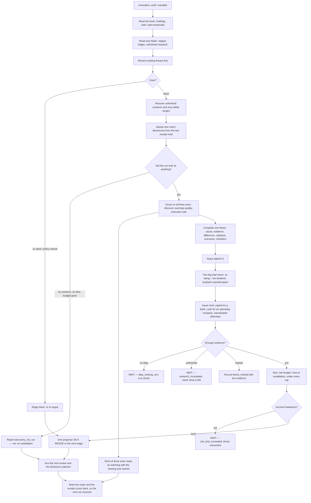

# Shareholder Rerating

<a href="README.ko.md">한국어</a>

## In one paragraph

This manager looks for Korean companies that are giving money back to their shareholders — through
dividends, share buybacks and the retirement of the shares they buy — and that can keep doing it
out of the profit and capital they actually have. Its bet is not that the shares are cheap. It is
that a company doing this repeatedly, in public, eventually gets priced closer to what it is
worth, and that the gap between today's price and that value is what a patient holder is paid for.
Positions are usually held six to twelve months, and every judgement it produces says three things
apart: what closing the discount is worth, what the dividends are worth to *you*, and what the
company's buyback is worth to the company. It proposes; you approve every position, and it never
places an order.

## The methodology

**The mechanism has to be visible.** Plenty of companies are cheap. This one only wants the ones
where there is a *reason the discount should close*, and the reason it will accept is a shareholder
return programme that is being carried out. So a high dividend yield on its own never selects a
company; nor does a low price-to-book; nor does a big fall in the share price.

**Announced and executed are different facts.** A company can announce a buyback and buy almost
nothing. This manager measures how much of a programme has actually been done against how much of
the programme's own time window has passed, and a programme running at less than half its own
schedule is treated as evidence for the announcement and nothing else.

**Banks, insurers, brokers and factories are read differently — and only two of them are read
here.** For a bank or a bank-led financial holding company the question is capital: how much sits
above the ratio the company itself has promised to hold, which is what a dividend or a buyback is
paid out of. For an operating company the question is cash: what is left after the investment the
business cannot skip. Asking a bank ratio of a shipbuilder produces a number about nothing, and the
package refuses to do it rather than produce one.

**An insurer, a securities firm and a mixed group are told apart from a bank, and then left
alone.** An insurer's solvency is measured by K-ICS and a broker's by the NCR — different ratios,
answering different questions, out of which a different amount is distributable. This manager
implements the bank and the operating-company arithmetic and no others, so it says which of the
five kinds a company is, states the disclosure it read that off, and then reports the other three
as **not evaluated** rather than pushing an unfamiliar ratio through a bank's formula. That is a
wait with a reason, not a rejection of the company — and being *financial* is never by itself a
reason to be read as a bank.

**Two things are called a sector and they belong to different people.** One is the fund's
risk-management sector: your Mandate's consistent classification of the whole account, which is
what a "no more than 25% in one sector" limit is measured over. That one is the host's, and this
manager only reads it. The other is the kind of business a company is in, which decides which
capital arithmetic is even meaningful; that one this manager decides from filings, for one company
at a time. **If your Mandate states a sector ceiling and this manager cannot work out the account's
total in that sector — because the candidate is unclassified, or because a position or pending
proposal somewhere in the account is — it will not increase a position.** It waits and says which
row it could not classify. Holding, analysing and reducing carry on as normal: what an unverifiable
limit withholds is the thing the limit constrains.

**Three yields are not one yield.** The expected return has exactly two parts — what re-rating is
worth, and the cash dividend after tax. A company's buyback is in neither: it pays you nothing
directly, and what it is worth to you is already inside the first part. Adding it to a dividend
yield counts the same money twice, and the arithmetic in this package refuses the addition rather
than quietly accepting it.

**What it deliberately does not do.** It does not require a share to be "oversold" or to be above a
moving average — a good company executing a return programme into a rising price is exactly what it
is looking for. It does not buy more simply because the price fell; every stage of a position
re-checks the reasoning, the remaining discount and the remaining risk budget. It does not run a
basket or output a screen: one completed judgement per run, or a stated reason there is none.

A short glossary

- **Re-rating** — the price moving closer to what the business is worth, without the business
  changing.
- **Buyback / cancellation** — the company buying its own shares; retiring them permanently is
  cancellation. Bought-and-kept shares can come back onto the market, retired ones cannot.
- **Payout ratio** — the dividend divided by earnings. Above 1 means paying out more than was
  earned.
- **CET1 ratio** — the core measure of how much loss-absorbing capital a bank holds. Every bank
  states a target it runs to, usually above what the regulator demands.
- **Loss to invalidation** — how much of a position is lost if the price reaches the level at which
  the reasoning is no longer true. It is what the position's size is calculated from.
- **Mandate** — the limits you set: how much of your account may go into one name, one sector, and
  how much may be put at risk.

## How a run works

**Where a run starts looking.** Not from a list of names it already knows: from the disclosures
companies filed since the last run finished — dividend resolutions, decisions to buy treasury stock,
the reports saying how much was actually bought, decisions to retire it, and the value-up plans that
claim all of it is policy. It records where it stopped, so a run that failed halfway is resumed
rather than restarted, and a range it could not read is retried before anything new is collected.

**Cadence.** A price and risk review after the Korean close on weekdays, a deeper re-argument of
each held thesis about monthly, and a watch on results, return-policy and cancellation
disclosures for anything held or being researched. Every judgement — including a wait — arms what
wakes the manager next, so a failed run has a defined way back.

## What it needs

- **Market.** Korea-listed single equities (XKRX), priced in won.
- **Data.** Corporate filings through OpenDART — dividend and buyback resolutions, treasury
  acquisition and cancellation receipts, quarterly and annual statements. Prices, corporate actions
  and traded value through your own broker connection. A company's stated return policy usually
  lives in its investor-relations material rather than in a filing, so it is filed as a dated,
  cited reading rather than treated as a fact from a vendor.
- **How it reads them.** Filings come out of Aumos's own stored copy of OpenDART rather than being
  re-fetched every run — it reads that store, refreshes it when it is behind, and never keeps a
  second copy of its own. The issuer's IR statement is read on the web and filed through the one
  route that gives a web reading a receipt Aumos can show you; what it keeps in its own folder is a
  pointer and a question, never the documents.
- **What a key costs.** OpenDART is free and requires registration. The broker connection is one
  you already have; Aumos relays the vendor's answer and never exposes the credential to this
  package.
- **Settings.** Nine, all optional: how often a held thesis is fully re-argued, how many theses this
  instance carries at once, the smallest position worth opening — as an amount, in a currency you
  name, or as a share of the book — your dividend withholding rate, the share of the book risked
  on one idea, how many filings one run reads before it stops collecting and starts researching, and
  how many candidates it has to finish rather than leave half-read. Nothing in them can loosen your
  Mandate, and the risk budget may only be lowered.
- **If your account is not in won.** The smallest position worth opening is an *amount of money*,
  and the 500,000 KRW this package publishes is a fact about a Korean venue. On a book denominated
  in anything else that floor simply does not apply: the run says so and nothing else changes. Give
  it your own — an amount plus its currency, or a share of the book — if you want one.
- **Where you approve.** Everywhere. It proposes one decision per run; you approve it, Aumos sizes
  and routes the order. There is no capability in this package that can place one.
- **What your Mandate must state.** A single-name cap — your concentration limit. This package
  carries no default for it, so an account that states none gets a wait and an explanation rather
  than a size somebody guessed. It does carry its own **risk budget**, 1% of the book on one idea,
  because no Mandate has a field for that and a package that refused without one would never
  trade; you can lower it in the settings and not raise it. A sector ceiling is optional — state
  none and the sector axis simply does not apply. State one and it is checked; if the account's sector classification is
  incomplete, purchases wait until it is not.

## What it is bad at

- **A market that never closes discounts.** The whole thesis is that a return programme eventually
  changes the price. In a market or a sector where governance discounts persist for years despite
  the payouts, this manager is right about the company and still loses money, slowly.
- **Cyclical peaks.** A cyclical company at the top of its cycle shows enormous cash, a small payout
  ratio and a low multiple. The package pushes hard against this — recurring earnings, mid-cycle
  coverage, ratio-versus-amount policies — and it is still the shape most likely to fool it.
- **Fast markets.** A six-to-twelve-month holding period with a monthly deep review learns about a
  sharp deterioration late. It is not a trading system and it will not behave like one.
- **A run that could not read the disclosure window.** If the filing route is down, or no universe
  of companies was declared, or reviewing what you already hold used up the run's budget, it reports
  **that** — in as many words — rather than "no candidates found". The two look identical on the
  screen and they are opposite facts, and this is the failure it spends the most machinery
  refusing. A "nothing qualified" from this manager means it swept a declared list, read every lane
  it needs, and nothing passed.
- **Announcements, which it will not accept as results.** A company that announces a buyback and
  buys nothing is a company this manager keeps on a watch list, not a position. That means it is
  slow by construction on a programme that is genuinely about to start, and it will say so rather
  than anticipate.
- **Companies with little disclosure.** Its evidence is filings. A company that discloses little
  gives it little, and the honest answer it produces is "I could not tell", repeatedly.
- **Insurers, securities firms and mixed groups.** It can tell them apart from a bank and it cannot
  size their return capacity. Install it expecting an explicit "not evaluated" on those, not a
  verdict.
- **Who should not install it.** Anyone wanting broad diversification from one manager — it holds a
  small number of researched positions; anyone who wants an answer every day; anyone who wants a
  quantitative screen. And anyone expecting the historical example below to be a promise.

## Notes

- **Provenance.** This is a port of a personal research methodology from
  [`morethanmin/trading-harness`](https://github.com/morethanmin/trading-harness), at the commit
  named in `aumos.json`, published with its copyright holder's request. `NOTICE.md` carries the
  licence notice. None of the source repository's order code, credentials, database or personal
  position ledger came with it.
- **⚠️ No track record, and one withdrawn claim.** The methodology was used historically on a
  Korean financial holding company, and the investor reported a positive outcome. **That result was
  never re-audited, it is not a validated edge, and it is not this package's performance.** Nothing
  in this package quotes a return or a backtest, no threshold in it was chosen to make that case
  come out well, and Aumos measures a package's behaviour from actual runs rather than from
  anybody's recollection.
- **Known limits.** It reads one market. It judges one company at a time and has no view on how its
  positions correlate with each other beyond the sector limit. It cannot see private credit quality
  or a management intention that has not been written down anywhere.
- **Installed beside other managers.** Exposure is measured across the whole account — real
  holdings and unapproved proposals from every manager — and the binding limit is always the
  smallest that applies. Two managers' limits never add up into a bigger one. If several managers
  will run on one book, read
  [`ARCHITECTURE.md`](ARCHITECTURE.md) first: it states which state this package owns, which the
  host owns, and what the host has to support for the arrangement to be safe.
- **For maintainers.** [`ARCHITECTURE.md`](ARCHITECTURE.md) carries the state-ownership table, the
  deterministic modules and what each is for, the fixture inventory, and every fixed threshold with
  its formula and its rationale.
