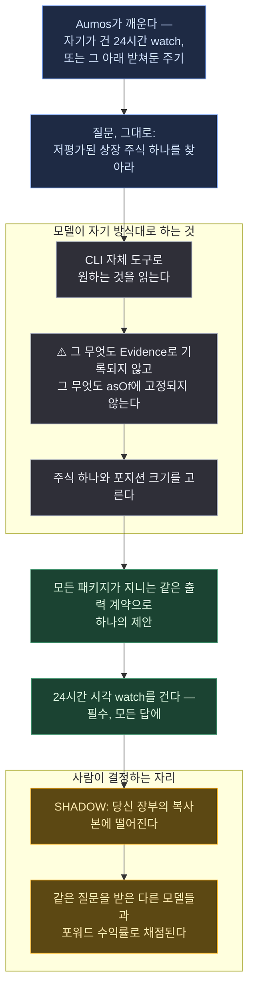

# Undervalued Now

<a href="README.md">English</a>

> 지금 저평가된 상장 주식 하나를 찾아서, 거기에 잡을 포지션을 제안하라.

## 한 문단 요약

위의 저 한 문장이 방법론 전부다. 데이터 수집 단계도, 리스크 예산 단계도, 애널리스트 페르소나
패널도, 권한 목록도 없다. 이 카탈로그의 다른 모든 패키지는 **방법론**을 측정하려고 존재하는데,
이것은 **모델**을 측정하려고 존재한다 — 같은 한 줄짜리 질문을 서로 다른 네 모델 앞에 놓고, 각자
무엇을 샀는지 채점하면, 그 비교가 벤치마크다. 투자판의 *"자전거 탄 펠리컨을 그려봐"*다.

Aumos에 아무것도 요구하지 않기 때문에, Aumos에 무언가를 요구해서 얻는 것도 전부 포기한다. 이
페이지의 대부분이 그 맞바꿈에 관한 것이고, 다른 것 대신 이것을 설치하기 전에 읽어야 하는 부분이다.

## 방법론

없다. 그리고 그게 의도다. 프롬프트가 질문이고, 포워드 수익률이 답이다.

*이 페이지가 쓰는 용어를 쉬운 말로:*

| | |
|---|---|
| **shadow 모드** | 매니저가 당신 장부의 복사본에 대해 돌고, 제안한 어떤 것도 주문에 닿지 못한다 |
| **Evidence** | 매니저가 실제로 무엇을 가져왔는지 Aumos가 남기는 기록 — 출처, 어느 시점에 대해 물었는지, 무엇이 돌아왔는지 |
| **`asOf`** | 판단이 고정된 시각. 나중에 "무엇을 알 수 있었나"를 답할 수 있게 만드는 것 |
| **걸어둔 watch** | 매니저가 자기 답에 붙여 다음 실행을 깨우는 조건 |
| **cadence(주기)** | Aumos가 매니저를 다시 돌리는 간격. 설치할 때 당신이 확인한다 |

| | |
|---|---|
| 프롬프트 | 한 문단, 그리고 모든 패키지가 지니는 출력 계약 |
| 권한 | **없음.** Aumos에 아무것도 요구하지 않는다 |
| 도구 | 코딩 CLI가 싣고 있는 무엇이든 — 웹, 셸, 파일. 매니페스트 필드가 없고 Aumos는 어느 것도 회수하지 않는다 |
| 모드 | SHADOW, 그리고 구조적으로 그 외의 쓸모 있는 무엇도 될 수 없다 |
| 주기 | **24시간마다. 고르는 게 아니라 패키지에 적혀 있다** — 그것도 두 겹으로: 모든 답에 거는 watch, 그리고 매니페스트의 `cadence` 요청 |

그 프롬프트가 이미지 모델 벤치마크가 된 것은 누가 펠리컨 그리는 법을 규정해서가 아니라, 모두가
같은 문장을 다른 모델에 돌리고 돌아온 것을 비교할 수 있었기 때문이다. 각자가 어떻게 거기
도달했는지는 각자의 일이다: 매니저가 스스로 읽을 때 데이터 파이프라인은 **매니저의 일부**이므로,
더 나은 출처를 찾아 더 많이 번 모델은 교란된 측정이 아니라 더 나은 시스템이다.

**답에 대해 지시받는 단 하나.** 다른 모든 패키지는 다음 검토 조건을 스스로 제안한다. 투자자의
매니저에게는 그것이 *판단의 일부*이기 때문이다. 이것은 지시받는다: **행동이 무엇이든, 모든
답에, 판단한 순간으로부터 정확히 24시간 뒤의 시각 watch 하나.** 매니저와 계측기의 차이다.
그것이 없으면 행이 멈춘다 — 걸어둔 watch만이 다음 실행을 깨우고, 이 패키지가 쌓으려는 자산은
흘러간 시간이다. 간격을 *고르게* 하면 축이 교란된다 — 측정 대상이 자기가 얼마나 자주 측정될지
정하게 하면, 실행 기록이 담아내지 못하는 바로 그 차원에서 두 행을 비교할 수 없게 된다.

## 실행 흐름

한 번의 실행에 하나의 제안. 아래 어느 것도 주문을 내지 않는다 — 이 패키지의 경우, 낼 수도 없다.

**범례** — 🟦 주어지는 것 · ⬜ 관측되지 않은 채 모델이 하는 것 · 🟩 돌려주는 것 · 🟧 사람이
결정하는 자리.

**주기.** 매니페스트가 `"cadence": { "days": 1 }`을 싣고 있다. 그것은 **요청이지 보장이
아니다**: 설치 화면의 칸을 미리 채워줄 뿐이고, 지배하는 것은 투자자가 거기서 확인한 값이다.
걸어둔 24시간 watch가 여전히 주된 장치이고 — 그것이 간격을 *판단*의 속성으로 만든다 — 주기는
실행이 실패해서 아무것도 걸지 못했을 때를 받치는 그물이다. 실패한 실행은 그러면 행의 나머지가
아니라 하루를 잃는다.

## 필요한 것

| | |
|---|---|
| **시장** | 미국 상장 주식과 ETF (`XNAS`, `XNYS`) |
| **데이터 소스** | **없음.** Aumos에 아무것도 요구하지 않고 설치할 것도 없다 |
| **설정** | 없음 |
| **모드** | **SHADOW.** 구조적으로 그 외의 쓸모 있는 무엇도 될 수 없다 |
| **활성 증권사 로그인** | 요구사항이 아니라 차단 사유다. 당신 계정으로 매니저를 돌리는 기계는 증권사 로그인을 들고 있는 동안 이것을 아예 돌리지 않는다 |

⚠️ **증권사 자격증명 없이 실행되며, 이유는 모델을 믿지 못해서가 아니다.** 이 매니저는 셸을
갖고 있고, 셸은 키체인을 읽을 수 있으며, 주문을 승인하는 사람은 근거 문단 한복판의 API 키를
알아보지 못한다. 이것이 읽는 페이지가 이것에게 무엇을 하라고 시킬 수 있다.

## 약한 지점

Aumos를 통해 읽는 패키지가 얻는 전부. ⚠️ #258 이후로 *앞의 둘*은 이 패키지가 아니라 모든
패키지가 포기한 것이다 — Aumos는 어떤 세션에서도 도구를 회수하지 않는다 — 그럼에도 여기 남겨둔
것은, Aumos에 아무것도 요구하지 않음으로써 그것들을 가장 먼저, 일부러 포기한 패키지가 이것이기
때문이다.

- **Evidence 없음.** Aumos를 통한 요청은 기록된다 — 출처, 어느 시점에 대해 물었는지, 무엇이
  돌아왔는지. 이 패키지는 Aumos에 아무것도 요구하지 않으므로, 그 Decision은 대신 모델이 쓴
  문단을 인용한다. 모델은 출처를 통째로 지어내므로, 포지션이 손실을 낼 때 나쁜 출처인지 좋은
  출처에 대한 나쁜 독해인지 구별할 방법이 없다.
- **어떤 시점에도 고정되지 않음.** Aumos를 통한 요청은 어느 시점에 대해 물었는지를 지니고,
  그것이 없는 요청은 거부된다 — 그것이 *무엇을, 언제에 대해 물었는가*를 나중에 답할 수 있게
  만든다. 여기엔 그것을 답하는 것이 없다. 이 패키지는 역사를 재생하는 데도, 새 매니저에게 지난
  분기를 물어보는 데도 쓸모가 없다. 그리고 그 대가인 재현성은 애초에 제공되지도 않았다(모델은
  화요일에 다르게 답한다).
- **실행 중 증권사 자격증명 없음.** ⚠️ #258 이후로 그 포트폴리오는 증권사 계좌를 *가질 수*
  있다 — 그것을 막던 거부는 지금은 존재하지 않는 매니페스트 필드를 읽고 있었다.

**설치하지 마라** — 돈을 굴려주기를 기대한다면. 이것은 모델을 비교하는 계측기이고, 자기
페이지가 그렇게 말하고 있다.

## 덧붙임

**포기하지 않은 것.**

- **승인 게이트.** 이것이 제안하는 어떤 것도 사람 없이 주문에 닿지 않는다.
- **거래할 방법 없음.** 프로토콜에 요청할 수 있는 broker-write 권한이 없고, 세션에 주문을 낼 수
  있는 도구가 없다.
- **출력 계약.** 자유는 방법에 있지 프로토콜에 있지 않다 — Aumos는 한 가지 모양의 답만 봉인하고
  채점할 수 있으므로, 이 패키지의 출력 절은 모든 패키지가 지니는 그 계약이다.
- **자기만의 행.** 모든 실행은 어떤 조건에서 이뤄졌는지를 기록하므로, 같은 패키지라도 다른
  조건에서 이뤄진 실행들이 트랙레코드의 한 줄로 평균될 수 없다. ⚠️ 예전엔 lane도 기록했는데,
  #258이 lane 자체와 함께 그 항목을 지문에서 빼갔다.

**✅ 0.1.3부터 사슬만이 이것을 떠받치지 않는다.** 여기 서 있던 문단은 사슬이 한 번에 한 고리라고
적었다 — *봉인 전에 실패한 실행은 아무것도 걸지 못하고, 그 행의 시계는 누가 손으로 다시 시작할
때까지 멈춘다* — 그리고 받지 못하고 있던 수정을 이름 붙였다: *실패한 실행을 견디는, mandate가
소유하는 주기 … 는 벤치마크를 위해 만들어지고 있지 않다.* 그것은 만들어졌고(#257), 이것을 위해서가
아니라 일반적인 이유로 만들어졌으므로 이 패키지는 그냥 요청하면 된다. #286에서 매니페스트 스키마가
모르는 키를 거부하지 않게 되기 전까지는 `cadence.json` 파일이었다.

⚠️ 그 주기는 #355 전까지 **상한**이기도 했다. 지배하는 기간은 `max(이 값, 장부의
minReviewIntervalDays)`였으므로, 이 패키지는 장부가 요구하는 것보다 *덜* 자주 보이기를 요청할 수
있었을 뿐 더 자주는 못 했다. #355가 mandate의 간격을 없앴고 — 일정은 돈의 속성이 아니라 방법론의
속성이다 — 그래서 설치 시 확인된 이 숫자가 답의 전부다. #356이 모든 패키지에 대해 그 분업을 적어둔
곳이고, `AMP_MANAGER_INSTRUCTIONS` §Schedule이 모든 매니저가 그에 대해 읽는 것이다. 아무것도 걸려
있지 않으면 리더보드는 여전히 스스로를 강등하고 그 행의 이름을 댄다.

Aumos는 이 패키지가 실적을 쌓기 전까지 어떤 수익률도 보여주지 않는다. 포워드 트랙레코드는
연산이 아니라 달력 시간을 요구하고, 이 페이지의 어떤 것도 트랙레코드가 아니다.
