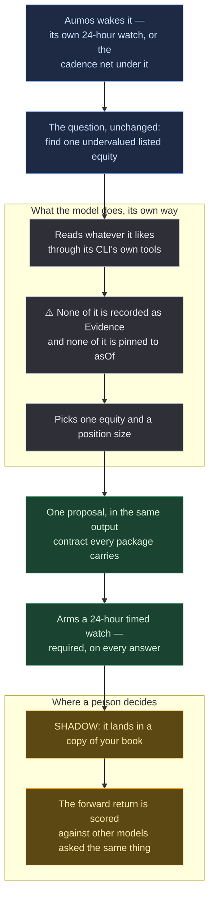

# Undervalued Now

<a href="README.ko.md">한국어</a>

> Find one listed equity that is undervalued right now, and propose the position you would
> take in it.

## In one paragraph

That sentence above is the entire methodology. There is no data-gathering stage, no
risk-budget step, no panel of analyst personas and no list of permissions. Every other
package in this catalogue exists to measure **a methodology**; this one exists to measure
**the model** — put the same one-line question in front of four different models, score
what each one bought, and the comparison is the benchmark. It is the *"draw a pelican
riding a bicycle"* of investing.

Because it asks Aumos for nothing, it also gives up everything asking Aumos for something
buys. That trade is the subject of most of this page, and you should read it before
installing this rather than one of the others.

## The methodology

There isn't one, and that is deliberate. The prompt is the question; the forward return
is the answer.

*Words this page uses, in plain terms:*

| | |
|---|---|
| **Shadow mode** | the manager runs against a copy of your book, and nothing it proposes can reach an order |
| **Evidence** | a record Aumos keeps of what a manager actually fetched — the source, the moment asked about, what came back |
| **`asOf`** | the instant a judgement is pinned to. It is what makes "what could it have known?" answerable later |
| **Armed watch** | a condition the manager sets on its own answer that wakes the next run |
| **Cadence** | the interval Aumos re-runs a manager on, confirmed by you at install |

| | |
|---|---|
| prompt | one paragraph, plus the output contract every package carries |
| capabilities | **none.** It asks Aumos for nothing |
| tools | whatever the coding CLI ships — the web, a shell, files. There is no manifest field, and Aumos withholds none of them |
| mode | SHADOW, and structurally unable to be anything else useful |
| cadence | **every 24 hours, stated in the package rather than chosen** — twice over: an armed watch on every answer, and a `cadence` request in the manifest |

That prompt became an image-model benchmark not because anyone specified how to draw a
pelican, but because everybody could run the same sentence against a different model and
compare what came back. How each one got there is its own business: when the manager does
its own reading, the data pipeline is **part of the manager**, so a model that found
better sources and made more money is the better system rather than a confounded
measurement of one.

**The one thing it is told to answer.** Every other package proposes its own next review
condition, because for an investor's manager that *is* part of the judgement. This one is
told: **one timed watch, exactly 24 hours after the instant it judged, on every answer
whatever the action.** It is the difference between a manager and an instrument. Without
it the row stops — an armed watch is the only thing that wakes the next run, and the asset
this package exists to accumulate is elapsed time. With a *chosen* interval the axis is
confounded — letting the thing being measured decide how often it is measured makes two
rows incomparable in the one dimension the run record cannot capture.

## How a run works

One run, one proposal. Nothing below places an order — and in this package's case,
nothing below can.

**Legend** — 🟦 what it is given · ⬜ what the model does unobserved · 🟩 what it hands
back · 🟧 where a person decides.

**Cadence.** The manifest carries `"cadence": { "days": 1 }`. That is a **request, not a
guarantee**: it pre-fills a box on the install screen and what governs is what the
investor confirms there. The armed 24-hour watch is still the primary thing — it is what
makes the interval a property of *the judgement* — and the cadence is the net under it for
when a run fails and arms nothing. A failed run then costs a day rather than the rest of
the row.

## What it needs

| | |
|---|---|
| **Markets** | US-listed equities and ETFs (`XNAS`, `XNYS`) |
| **Data sources** | **none.** It asks Aumos for nothing and there is nothing to install |
| **Settings** | none |
| **Mode** | **SHADOW.** It is structurally unable to be anything else useful |
| **A live broker login** | is a blocker, not a requirement. A machine that runs managers under your own account refuses to run this at all while it holds one |

⚠️ **It runs no broker credential, and the reason is not distrust of the model.** This
manager has a shell, a shell can read a keychain, and the person approving an order would
not recognise an API key in the middle of a paragraph of rationale. A page it reads can
tell it what to do.

## What it is bad at

Everything a package that reads through Aumos gets. ⚠️ Since #258 the *first two* are
given up by every package rather than by this one — Aumos withholds no tool from any
session — and they are still listed here because this is the package that gave them up
first and on purpose, by asking Aumos for nothing at all.

- **No Evidence.** A request made through Aumos is recorded — the source, the moment it
  was asked about, what came back. This package asks Aumos for nothing, so its Decision
  cites a paragraph the model wrote instead. Models invent sources wholesale, so when the
  position loses money there is no way to tell a bad source from a bad reading of a good
  one.
- **Nothing pinned to a moment.** A request through Aumos carries the instant it asked
  about, and a request without one is refused — which is what makes *what did it ask, and
  about when* answerable afterwards. Nothing here answers it. The package is worthless for
  replaying history and for asking a new manager about last quarter, and the reproduction
  that costs was never really on offer (a model answers differently on Tuesday).
- **No broker credential in the run.** ⚠️ Its portfolio *is* allowed a broker account
  since #258 — the refusal that stopped that read a manifest field which no longer exists.

**Do not install this** expecting it to manage money. It is an instrument for comparing
models, and its own page says so.

## Notes

**What it does not give up.**

- **The approval gate.** Nothing this proposes reaches an order without a person.
- **No way to trade.** There is no broker-write capability in the protocol to ask for, and
  no tool in the session that could place an order.
- **The output contract.** The freedom is in the method, not the protocol — Aumos can only
  seal and score one shape of answer, so this package's output section is the same
  contract every package carries.
- **Its own row.** Every run records the conditions it was made under, so runs of the same
  package made under different ones can never average into one line of the track record.
  ⚠️ It used to record the lane too, and #258 took that term out of the fingerprint along
  with the lane itself.

**✅ Since 0.1.3 the chain is no longer the only thing holding it up.** The paragraph that
stood here said the chain is one link at a time — *a run that fails before sealing arms
nothing, and that row's clock stops until somebody starts it by hand* — and named the fix
it was not getting: *a cadence the mandate owns, which would survive a failed run … is not
being built for a benchmark's sake.* It was built, for a general reason rather than for
this one (#257), so this package can simply ask for it. It was a `cadence.json` file until
#286, when the manifest schema stopped refusing unknown keys.

⚠️ The cadence was also a **ceiling** until #355. The period that governed was
`max(this, the book's minReviewIntervalDays)`, so this package could ask to be looked at
*less* often than its book required and never more. #355 removed the mandate's interval —
a schedule is a property of a methodology rather than of money — so this number, confirmed
at install, is the whole answer. #356 is where that division of labour is written down for
every package, and `AMP_MANAGER_INSTRUCTIONS` §Schedule is what every manager reads about
it. The leaderboard still demotes itself and names the row when nothing is armed.

Aumos shows no returns for this package until it has earned some. A forward track record
takes calendar time rather than compute, and nothing on this page is one.
